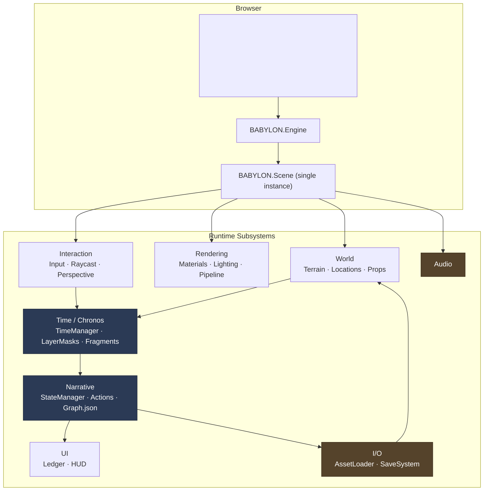
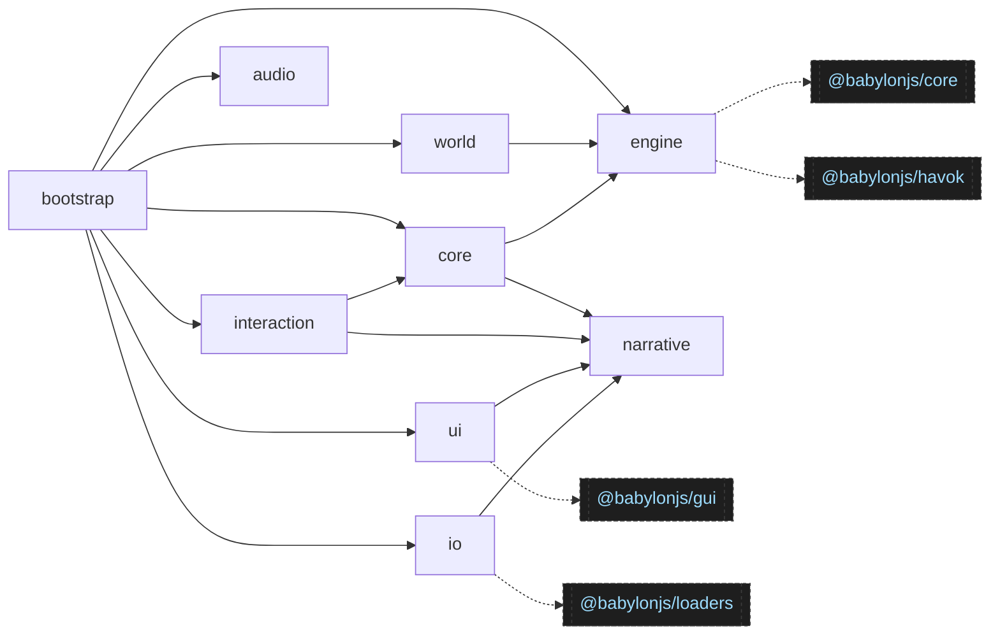
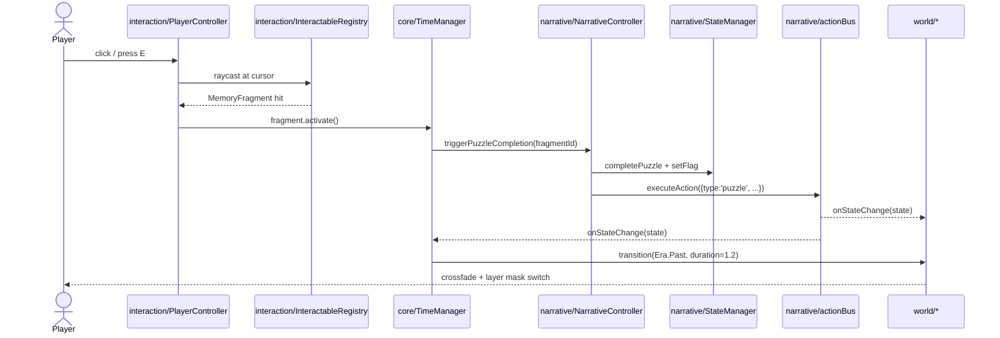
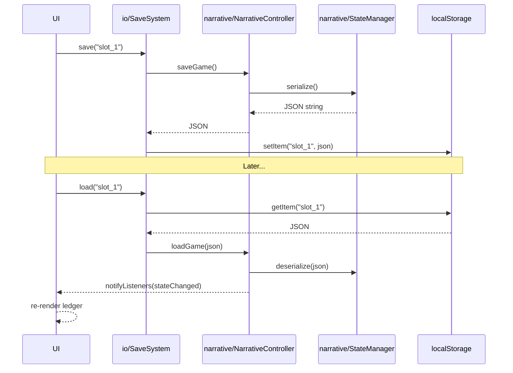

# Witness Interactive 3D — System Architecture

- **Status:** Draft
- **Last updated:** 2026-04-17
- **Owners:** @royceshannon2

This document describes the target runtime architecture. For repo inventory and subsystem ownership, see [`docs/design-docs/MASTER.md`](docs/design-docs/MASTER.md). For the current prototype's actual shape, see [`docs/current-state/PROTOTYPE_AUDIT.md`](docs/current-state/PROTOTYPE_AUDIT.md).

---

## 1. System overview

Witness Interactive 3D is a single-page WebGL application. One `BABYLON.Engine` drives one `BABYLON.Scene`. The scene holds every mesh from every era; an era is selected via camera `layerMask` rather than by swapping scenes. All narrative state is persisted in memory via a serializable `StateManager` and surfaced to the scene via an event bus.

The core design commitment: **narrative, time, and rendering are three independent subsystems that communicate only through events.** The narrative layer does not know what Babylon is. The rendering layer does not know what a flag is. The time layer mediates.



---

## 2. Module dependency graph

Arrows point from *importer* to *importee*. No cycles permitted.



**Rules:**
- `narrative/` imports nothing from elsewhere in the app. It is the root of the dependency tree.
- `engine/` imports only Babylon.
- `world/` imports `engine/` (for materials and scene). It does **not** import `narrative/` or `core/`.
- `core/` imports `narrative/` and `engine/` and orchestrates era switches. It is the bridge.
- `interaction/` imports `core/` and `narrative/`. It emits events; it never mutates world state directly.
- `ui/` imports `narrative/` for read/subscribe. It never imports `world/` or `engine/`.
- `io/` imports `narrative/` for save/load, Babylon loaders for GLB.
- `bootstrap/` is the only module allowed to import from every other module.

---

## 3. Runtime data flow

### 3.1 Player interacts with a Memory Fragment



### 3.2 Save / Load



---

## 4. Era representation (Chronos)

Full spec in [`docs/design-docs/CHRONOS_SWITCH.md`](docs/design-docs/CHRONOS_SWITCH.md). This section names the contract.

Every mesh in the scene is tagged with a layer-mask bit at creation:

```typescript
// src/core/LayerMasks.ts
export const LAYER_PRESENT = 0x10000000;
export const LAYER_PAST    = 0x20000000;
export const LAYER_SHARED  = 0x40000000;  // terrain, skybox, era-agnostic landmarks
```

`camera.layerMask` is the single source of truth for "what era am I in." `TimeManager.transition(Era.Past)` sets the camera mask and runs a post-fx crossfade.

Every location in `src/world/locations/*` exports two build functions:

```typescript
buildPresent(scene): Mesh[]   // ruined / overgrown / desaturated
buildPast(scene): Mesh[]      // intact / populated / saturated
buildShared(scene): Mesh[]    // terrain, roads — visible in both
```

Lights get the same mask treatment: a Past DirectionalLight with 1994's hot afternoon, a Present DirectionalLight with 2026's overcast grey. Neither is ever disabled; both are always in the scene, culled by mask.

---

## 5. Subsystem contracts

### 5.1 `narrative/`
**Responsibility:** hold the canonical game state; emit events when it changes.

**Public API** (already implemented in skeleton form):
- `narrativeController.triggerPuzzleCompletion(id, metadata?)`
- `narrativeController.triggerBranchChoice(branchId, metadata?)`
- `narrativeController.unlockPath(pathId)`
- `narrativeController.subscribe(listener) → unsubscribe`
- `narrativeController.saveGame() → string`
- `narrativeController.loadGame(json) → void`
- `narrativeController.getFlag(key) → boolean`

**Invariants:**
- `GameState` is fully serializable (JSON-safe).
- State mutations go through `NarrativeController` only. Never touch `globalState` from outside `narrative/`.
- The `Graph.json` is the canonical DAG — no node progression is coded imperatively elsewhere.

### 5.2 `core/`
**Responsibility:** own the Era state and the fragment registry.

**Public API** (to be implemented):
- `timeManager.currentEra: Era`
- `timeManager.transition(era, duration?) → Promise<void>`
- `timeManager.registerFragment(fragment) → void`
- `timeManager.tagMesh(mesh, era) → void`
- `timeManager.subscribe(listener) → unsubscribe` (event: `era_changed`)

**Invariants:**
- Exactly one era is active at any time (`LAYER_PRESENT ^ LAYER_PAST`, never both).
- `LAYER_SHARED` is always in the active camera mask.
- A transition in progress blocks re-entry (reject overlapping calls).
- Fragments are registered at scene build time; never created mid-transition.

### 5.3 `engine/`
**Responsibility:** Babylon scene lifecycle, rendering pipeline, materials, physics.

**Public API:**
- `SceneFactory.create(engine, canvas) → Scene`
- `RenderingPipeline.attach(scene, camera, profile: 'present' | 'past') → void`
- `Lighting.build(scene) → { sun, sky, rim }`
- `Materials.library → { laterite, brick, tinRoof, ... }`
- `Physics.init(scene) → Promise<void>`

**Invariants:**
- No imports from `narrative/`, `core/`, `world/`, `interaction/`, `ui/`, `io/`.
- All PBR materials live in the shared library; locations reference by name.

### 5.4 `world/`
**Responsibility:** build all meshes for the Bisesero environment.

**Public API:**
- Each location exports: `build(scene, timeManager) → void`
- Internally: `buildPresent`, `buildPast`, `buildShared`
- `Terrain.build(scene, config) → { ground, getHeight, isFlat }`

**Invariants:**
- Every created mesh is tagged via `timeManager.tagMesh` before first render.
- Location modules may depend on `engine/` and `core/`. They never depend on `narrative/`.

### 5.5 `interaction/`
**Responsibility:** player input, raycasting, interactable pickup, perspective-mode modifiers.

**Public API:**
- `PlayerController.attach(scene, camera) → void`
- `InteractableRegistry.register(mesh, handler) → void`
- `Perspective.setMode('protector' | 'hidden') → void`

**Invariants:**
- Input never directly mutates world geometry. It triggers narrative events or fragment activations.

### 5.6 `ui/`
**Responsibility:** GUI — ledger pages, HUD, reflection prompts, branch-choice dialog.

**Public API:**
- `HUD.attach(scene)`
- `LedgerUI.open() / LedgerUI.close()`
- `BranchChoiceDialog.present(options) → Promise<choice>`

**Invariants:**
- UI subscribes to narrative events; it never writes to narrative state except via `narrativeController.triggerBranchChoice`.

### 5.7 `io/`
**Responsibility:** load GLB assets, save/load game state.

**Public API:**
- `AssetLoader.loadGlb(url) → Promise<AssetContainer>`
- `SaveSystem.save(slot) / SaveSystem.load(slot) / SaveSystem.list()`

**Invariants:**
- `SaveSystem` persists only what `narrativeController.saveGame()` returns. Nothing in `world/` or `core/` has private state that must be serialized.

### 5.8 `bootstrap/`
**Responsibility:** wire everything together on page load.

Single `main.ts` that:
1. Creates the canvas + engine.
2. Calls `SceneFactory.create`.
3. Initializes physics, materials, lighting.
4. Builds terrain, then locations (each location self-registers fragments with TimeManager).
5. Attaches interaction, audio, UI.
6. Starts the render loop.

No game logic lives in `bootstrap/`. If it starts to, it belongs in a subsystem.

---

## 6. Cross-cutting concerns

### 6.1 Configuration
Per-environment constants (ground size, fog density, shadow map resolution) live in `src/engine/config.ts` as a frozen object. Dev-only tunables go behind `import.meta.env.DEV`.

### 6.2 Logging
A thin `src/log.ts` wrapper with levels. `console.log` is banned in committed code — use `log.info` / `log.warn` / `log.error`. In production builds, `log.debug` is stripped.

### 6.3 Error handling
Fail loud in development (throw), fail soft in production (log + degrade). Asset load failures must not crash the engine — the scene renders without the missing asset and logs a warning.

### 6.4 Testing
- `narrative/` is pure TypeScript and fully unit-testable.
- `core/` is mostly pure; mock the scene with `NullEngine`.
- `world/`, `engine/`, `interaction/` are integration-tested via Playwright against a real canvas.

---

## 7. Change log

Architectural decisions that invalidate assumptions in this doc go in `docs/decisions/adrs/`. Incremental implementation updates go in `docs/decisions/CHANGELOG_DETAILED.md`.
