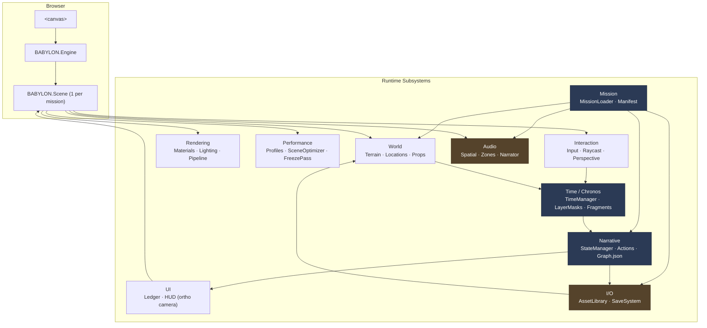
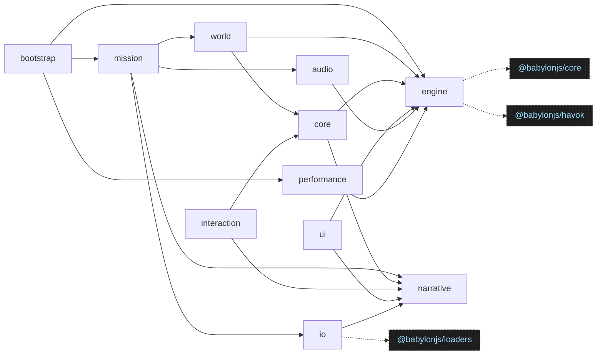
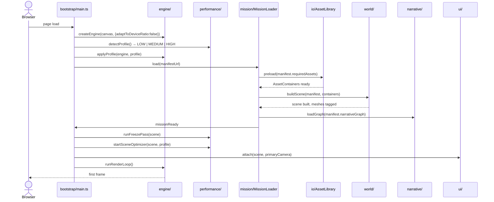
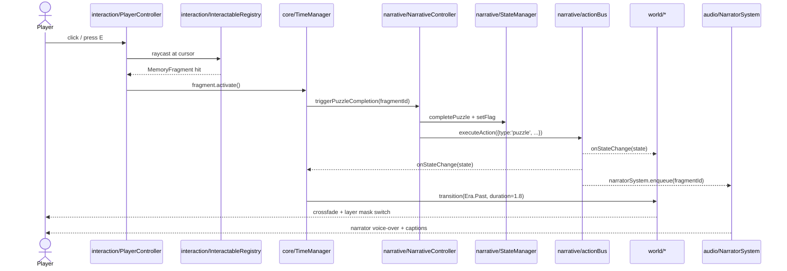
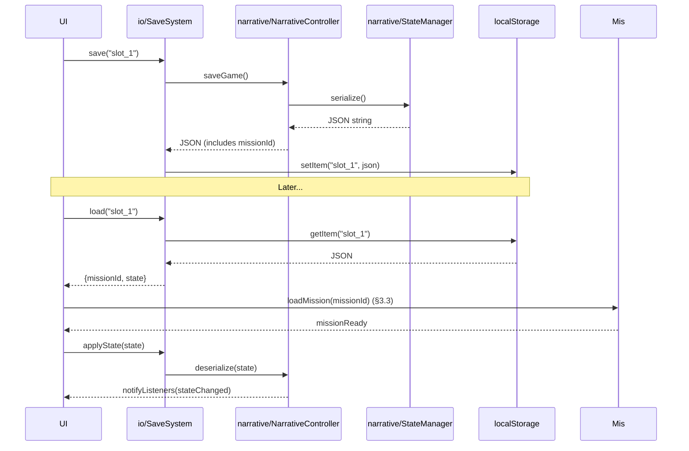

# Witness Interactive 3D — System Architecture

- **Status:** Draft
- **Last updated:** 2026-05-20
- **Owners:** @royceshannon2

This document describes the target runtime architecture. For repo inventory and subsystem ownership, see [`docs/design-docs/MASTER.md`](docs/design-docs/MASTER.md). For the current prototype's actual shape, see [`docs/current-state/PROTOTYPE_AUDIT.md`](docs/current-state/PROTOTYPE_AUDIT.md). For the template/reuse model that this architecture is designed to support, see [`SCALABILITY_PLAN.md`](SCALABILITY_PLAN.md).

---

## 1. System overview

Witness Interactive 3D is a single-page WebGL / WebGPU application that renders **one mission at a time** from a data-driven **Mission Manifest**. One `BABYLON.Engine` drives one primary `BABYLON.Scene` plus one small orthographic UI camera. The scene holds every mesh from every era of the currently loaded mission; an era is selected via camera `layerMask`, not by swapping scenes. All narrative state is persisted in memory via a serializable `StateManager` and surfaced to runtime subsystems via an event bus. All audio is pre-recorded and baked; no runtime synthesis.

Three commitments shape every decision in this doc:

1. **Narrative, time, and rendering are three independent subsystems that communicate only through events.** The narrative layer does not know what Babylon is. The rendering layer does not know what a flag is. The time layer mediates.
2. **The engine is a template.** Every mission-specific concern lives in `public/missions/<mission-id>/` as data (manifest + `Graph.json` + assets + audio). Adding a second mission is a data operation, not a code operation. See [`SCALABILITY_PLAN.md`](SCALABILITY_PLAN.md).
3. **The performance floor is a school Chromebook, not a workstation.** Every subsystem supplies a **LOW / MEDIUM / HIGH** profile; the runtime picks at boot and the `SceneOptimizer` re-picks if FPS drifts. The workstation profile (§6) is opt-in for contributors, not the target bar.


```mermaid
graph TB
  subgraph Browser
    Canvas["&lt;canvas&gt;"]
    Engine["BABYLON.Engine"]
    Scene["BABYLON.Scene (1 per mission)"]
  end

  subgraph Runtime Subsystems
    Narrative["Narrative<br/>StateManager · Actions · Graph.json"]
    Time["Time / Chronos<br/>TimeManager · LayerMasks · Fragments"]
    Mission["Mission<br/>MissionLoader · Manifest"]
    World["World<br/>Terrain · Locations · Props"]
    Rendering["Rendering<br/>Materials · Lighting · Pipeline"]
    Performance["Performance<br/>Profiles · SceneOptimizer · FreezePass"]
    Interaction["Interaction<br/>Input · Raycast · Perspective"]
    Audio["Audio<br/>Spatial · Zones · Narrator"]
    UI["UI<br/>Ledger · HUD (ortho camera)"]
    IO["I/O<br/>AssetLibrary · SaveSystem"]
  end

  Canvas --> Engine
  Engine --> Scene
  Mission --> IO
  Mission --> World
  Mission --> Narrative
  Mission --> Audio
  IO --> World
  Scene --> World
  Scene --> Rendering
  Scene --> Interaction
  Scene --> Audio
  Scene --> Performance
  Interaction --> Time
  Time --> Narrative
  Narrative --> UI
  Narrative --> IO
  World --> Time
  UI --> Scene

  classDef core fill:#2b3a55,color:#fff,stroke:#1a2438
  classDef io fill:#55432b,color:#fff,stroke:#3a2c1a
  class Narrative,Time,Mission core
  class IO,Audio io
```

---

## 2. Module dependency graph

Arrows point from *importer* to *importee*. No cycles permitted.


```mermaid
graph LR
  bootstrap --> engine
  bootstrap --> performance
  bootstrap --> mission

  mission --> io
  mission --> world
  mission --> narrative
  mission --> audio

  world --> engine
  world --> core
  core --> engine
  core --> narrative
  interaction --> core
  interaction --> narrative
  ui --> narrative
  ui --> engine
  audio --> engine
  io --> narrative
  performance --> engine

  engine -.-> BabylonCore[["@babylonjs/core"]]
  engine -.-> Havok[["@babylonjs/havok"]]
  io -.-> BabylonLoaders[["@babylonjs/loaders"]]

  classDef pkg fill:#1e1e1e,color:#9cdcfe,stroke:#3c3c3c,stroke-dasharray:3 3
  class BabylonCore,Havok,BabylonLoaders pkg
```

**Rules:**
- `narrative/` imports nothing from elsewhere in the app. It is the root of the dependency tree.
- `engine/` imports only Babylon.
- `performance/` imports `engine/` only. It observes FPS and mutates scene/engine state; it never touches content.
- `mission/` is the **content orchestrator**. It reads a manifest, tells `io/` what to load, tells `world/` what to place, tells `narrative/` which graph to use, tells `audio/` which zones to arm. It never renders.
- `world/` imports `engine/` and `core/` (for era tagging helpers). Never `narrative/`.
- `core/` imports `narrative/` and `engine/`; the bridge between narrative events and visibility masks.
- `interaction/` imports `core/` and `narrative/`. Emits events; never mutates world state directly.
- `ui/` imports `narrative/` for read/subscribe and `engine/` to attach its ortho camera. Never `world/`.
- `audio/` imports `engine/` (for Sound registration) and subscribes to narrative events. Never mutates world state.
- `io/` imports `narrative/` for save/load, Babylon loaders for GLB/KTX2/Draco.
- `bootstrap/` is the only module allowed to import from every other module.

---

## 3. Runtime data flow

### 3.1 Boot → first playable frame


```mermaid
sequenceDiagram
  actor Browser
  participant BS as bootstrap/main.ts
  participant Eng as engine/
  participant Perf as performance/
  participant Mis as mission/MissionLoader
  participant IO as io/AssetLibrary
  participant World as world/
  participant Narr as narrative/
  participant UI as ui/

  Browser->>BS: page load
  BS->>Eng: createEngine(canvas, {adaptToDeviceRatio:false})
  BS->>Perf: detectProfile() → LOW | MEDIUM | HIGH
  BS->>Eng: applyProfile(engine, profile)
  BS->>Mis: load(manifestUrl)
  Mis->>IO: preload(manifest.requiredAssets)
  IO-->>Mis: AssetContainers ready
  Mis->>World: buildScene(manifest, containers)
  World-->>Mis: scene built, meshes tagged
  Mis->>Narr: loadGraph(manifest.narrativeGraph)
  Mis->>BS: missionReady
  BS->>Perf: runFreezePass(scene)
  BS->>Perf: startSceneOptimizer(scene, profile)
  BS->>UI: attach(scene, primaryCamera)
  BS->>Eng: runRenderLoop()
  Eng-->>Browser: first frame
```

### 3.2 Player interacts with a Memory Fragment


```mermaid
sequenceDiagram
  actor Player
  participant Input as interaction/PlayerController
  participant Registry as interaction/InteractableRegistry
  participant TM as core/TimeManager
  participant NC as narrative/NarrativeController
  participant SM as narrative/StateManager
  participant AB as narrative/actionBus
  participant Scene as world/*
  participant NS as audio/NarratorSystem

  Player->>Input: click / press E
  Input->>Registry: raycast at cursor
  Registry-->>Input: MemoryFragment hit
  Input->>TM: fragment.activate()
  TM->>NC: triggerPuzzleCompletion(fragmentId)
  NC->>SM: completePuzzle + setFlag
  NC->>AB: executeAction({type:'puzzle', ...})
  AB-->>Scene: onStateChange(state)
  AB-->>TM: onStateChange(state)
  AB-->>NS: narratorSystem.enqueue(fragmentId)
  TM->>Scene: transition(Era.Past, duration=1.8)
  Scene-->>Player: crossfade + layer mask switch
  NS-->>Player: narrator voice-over + captions
```

### 3.3 Mission teardown and switch

```mermaid
sequenceDiagram
  participant UI
  participant Mis as mission/MissionLoader
  participant IO as io/AssetLibrary
  participant Scene as BABYLON.Scene
  participant Perf as performance/

  UI->>Mis: loadMission("nuremberg-1945")
  Mis->>Scene: blockfreeActiveMeshesAndRenderingGroups = true
  Mis->>IO: dispose(currentMissionContainers)
  IO->>Scene: container.removeAllFromScene(); container.dispose()
  Mis->>Scene: blockfreeActiveMeshesAndRenderingGroups = false
  Mis->>Mis: load("nuremberg-1945")
  Note over Mis: sequence continues as §3.1 from manifestUrl
```

### 3.4 Save / Load


```mermaid
sequenceDiagram
  participant UI
  participant SS as io/SaveSystem
  participant NC as narrative/NarrativeController
  participant SM as narrative/StateManager
  participant LS as localStorage

  UI->>SS: save("slot_1")
  SS->>NC: saveGame()
  NC->>SM: serialize()
  SM-->>NC: JSON string
  NC-->>SS: JSON (includes missionId)
  SS->>LS: setItem("slot_1", json)

  Note over UI,LS: Later...
  UI->>SS: load("slot_1")
  SS->>LS: getItem("slot_1")
  LS-->>SS: JSON
  SS-->>UI: {missionId, state}
  UI->>Mis: loadMission(missionId) (§3.3)
  Mis-->>UI: missionReady
  UI->>SS: applyState(state)
  SS->>NC: deserialize(state)
  NC-->>UI: notifyListeners(stateChanged)
```

---

## 4. Era representation (Chronos)

Full spec in [`docs/design-docs/CHRONOS_SWITCH.md`](docs/design-docs/CHRONOS_SWITCH.md). This section names the contract.

Every mesh in the scene is tagged with a layer-mask bit at creation:

```typescript
// src/core/LayerMasks.ts
export const LAYER_PRESENT = 0x10000000;
export const LAYER_PAST    = 0x20000000;
export const LAYER_SHARED  = 0x40000000;  // terrain, skybox, era-agnostic landmarks
export const LAYER_HUD     = 0x80000000;  // reserved for a future ortho UI camera; unused while HUD is DOM-based
```

`camera.layerMask` is the single source of truth for "what era am I in." `TimeManager.transition(Era.Past)` sets the primary camera's mask and runs a post-fx crossfade. `LAYER_HUD` is defined for completeness and future use (e.g. if any 3D billboard or in-world UI element is added); the current DOM-based HUD does not use it and no second camera exists at runtime.

Every location in `src/world/locations/*` exports two build functions:

```typescript
buildPresent(scene): Mesh[]   // ruined / overgrown / desaturated
buildPast(scene): Mesh[]      // intact / populated / saturated
buildShared(scene): Mesh[]    // terrain, roads — visible in both
```

Lights get the same mask treatment: a Past DirectionalLight with 1994's hot afternoon, a Present DirectionalLight with 2026's overcast grey. Neither is ever disabled; both are always in the scene, culled by mask.

**Why `layerMask` over `setEnabled(false)`:** `setEnabled(false)` suppresses rendering, physics, and raycasting. `layerMask` suppresses only rendering; physics and picks continue on the camera's active mask. We want picking to work across era boundaries (the player's cursor must never "miss" a shared prop). See [`docs/design-docs/CHRONOS_SWITCH.md §6.D`](docs/design-docs/CHRONOS_SWITCH.md#d-per-mesh-layermask-vs-per-mesh-metadataera--runtime-enable) for the full trade-off analysis.

---

## 5. Subsystem contracts

> **Module status (2026-05-21 — M21 complete; Archival Solemnity UI system; Higgs tokenizer fix):**
>
> The game's full narrative loop runs end-to-end: all four Acts, all three paths, the Remembrance
> sequence, and New Game+. All cinematic systems are wired. Audio infrastructure is in place with
> stub-safe fallbacks; the narrator generation script is now runnable after the Higgs tokenizer
> schema fix (2026-05-21).
>
> **What is fully implemented and passing `npm run build`:**
>
> | Module | Status | Added |
> |---|---|---|
> | `narrative/StateManager.ts` | skeleton | original |
> | `narrative/NarrativeController.ts` | skeleton | original |
> | `narrative/Graph.json` | production (35 nodes, 4 acts, 3 paths) | original |
> | `narrative/LedgerStore.ts` | production | M10 |
> | `narrative/BanterLibrary.ts` | production (50 banter + 4 vista + 4 breather + 3 reflection + 16 ledger entries) | M17 |
> | `core/TimeManager.ts` | production | M5 |
> | `core/LayerMasks.ts` | production | M5 |
> | `core/MemoryFragment.ts` | production | M5 |
> | `core/PastSceneController.ts` | production | M5 |
> | `core/AnimationDirector.ts` | production | M13 |
> | `core/EchoProfiles.ts` | production (15 per-fragment profiles) | M14 |
> | `core/CinematicDirector.ts` | production (multi-beat sequencer) | M15 |
> | `core/VistaSystem.ts` | production | M15 |
> | `engine/SceneFactory.ts` | skeleton | M5 |
> | `engine/RenderingPipeline.ts` | production (memoryDissolve, fadeToEra, setEraProfile) | M13 |
> | `engine/Lighting.ts` | skeleton | M5 |
> | `engine/Materials.ts` | skeleton | M5 |
> | `engine/Physics.ts` | stub (Havok not installed) | M5 |
> | `world/locations/FamilyCompound.ts` | prototype (primitives, 15 TODO(asset-pipeline) annotations) | M5–M11 |
> | `world/locations/LakeShore.ts` | prototype | M5 |
> | `world/locations/Ravine.ts` | prototype | M5 |
> | `interaction/PlayerController.ts` | skeleton | M5 |
> | `interaction/InteractableRegistry.ts` | production (incl. `hasNearby()`) | M5/M16 |
> | `interaction/InteractableHighlight.ts` | production | M13 |
> | `interaction/Perspective.ts` | stub | M5 |
> | `audio/AudioManager.ts` | production (delegates to AmbienceEngine + NarratorSystem) | M5/M16/M21 |
> | `audio/AmbienceEngine.ts` | production (stub-safe; awaits M20 audio) | M21 |
> | `audio/NarratorSystem.ts` | production (stub-safe; awaits M19 audio) | M16 |
> | `ui/HUD.ts` | production (DOM overlay; compass + echo distance + Archival Solemnity design system) | M5/M10/M20 |
> | `ui/LedgerUI.ts` | production (DOM modal; grid + detail panel; Archival Solemnity) | M10/M17/M20 |
> | `ui/CaptionOverlay.ts` | production (speaker name; italic emphasis; setSpeaker()) | M16/M20 |
> | `io/AssetLibrary.ts` | skeleton | M5 |
> | `io/SplatLibrary.ts` | skeleton | M5 |
> | `io/TilesetMount.ts` | skeleton | M5 |
> | `io/SaveSystem.ts` | skeleton | M5 |
> | `mission/MissionLoader.ts` | skeleton | M5 |
> | `performance/PerformanceManager.ts` | skeleton | M5 |
> | `performance/SceneOptimizerFactory.ts` | skeleton | M5 |
> | `bootstrap/IntroSequence.ts` | production | M13 |
> | `bootstrap/LedgerOpening.ts` | production | M13 |
> | `bootstrap/ChoiceOverlay.ts` | production (with path descriptions) | M7/M17 |
> | `bootstrap/RemembranceSequence.ts` | production | M8 |
> | `bootstrap/BreatherSequences.ts` | production | M15 |
> | `bootstrap/main.ts` | production (full narrative wiring, autosave) | M5–M17 |
>
> **Tools ready to run:**
>
> | Script | Purpose | Status |
> |---|---|---|
> | `tools/witness.py generate` | User-facing entry point; wraps `asset_pipeline.py` with Phase F auto-retry (3 attempts, seed stride 10000). `--skip-generate` resumes post-processing from an existing GLB. `--real-views <dir>` feeds real multi-angle photos (background-removed + framed) in place of Zero123++ synthesis; `--no-refine-ref` skips stage 0.25 (use a real ref as-is). | production |
> | `tools/witness_gui.py` | PySide6 GUI; "Generate" runs the full pipeline, "Post-process" runs `--skip-generate` checkpoint resume. Per-asset preset auto-applies on selection (`ASSET_PRESET` override > `CATEGORY_PRESET`), including a hero **"Hands"** preset (multi-view on, refine off) mapped to `figure_grandfather_hands`. Exposes the skip-refine checkbox (`--no-refine-ref`) and a real-views directory picker (`--real-views`) for the real-photo input path. | production |
> | `tools/asset_pipeline.py` | Full Hunyuan3D orchestrator; Phase E multi-seed ensemble (N=3 default) + Gates 1/2/3/5 wired. `_run_generate_and_texture()` extracted as helper; `branch_mesh` routes to it or to checkpoint-resume path via `--skip-generate`. | production |
> | `tools/validate_fragments.py` | Cross-check fragments vs Graph.json | production (exit 0) |
> | `tools/validate_geometry.py` / `validate_views.py` / `validate_pbr.py` | Gate validators emitting JSON sidecars | production |
> | `tools/diagnostic_report.py` | Aggregates sidecars; emits `recommended_action` ∈ {pass, retry_with_new_seed, halt_and_fix_pipeline} consumed by the retry harness | production |
> | `tools/generate_narrator_audio.py` | M19 — Higgs-Audio v2, 77 narrator clips | **ready to run** |
> | `tools/generate_ambient_audio.py` | M20 — AudioCraft beds + SFX | not yet written |
>
> **`tools/validate_fragments.py`** reports 15 fragments / 15 bindings, exit 0. `npm run build` completes without TypeScript errors. Real GLB binaries, baked narrator audio, Playwright integration coverage, and the M20 ambient audio pass remain pending.

### 5.1 `narrative/`
**Responsibility:** hold the canonical game state; emit events when it changes. Also owns all authored text (banter, ledger content, path descriptions, reflections) and the in-session ledger collection.

**Public API:**
- `narrativeController.triggerPuzzleCompletion(id, metadata?)`
- `narrativeController.triggerBranchChoice(branchId, metadata?)`
- `narrativeController.unlockPath(pathId)`
- `narrativeController.subscribe(listener) → unsubscribe`
- `narrativeController.saveGame() → string`
- `narrativeController.loadGame(json) → void`
- `narrativeController.getFlag(key) → boolean`
- `ledgerStore.add(key, text, body?) → void` — idempotent; duplicate keys are silently dropped.
- `ledgerStore.onChanged(fn) → unsubscribe` — fires after every new add; passes current count.
- `ledgerStore.entries: readonly LedgerEntry[]` — ordered oldest-first; `LedgerEntry` has `{ key, text, body?, unlockedAt }`.
- `BANTER_LINES`, `VISTA_LINES`, `BREATHER_LINES`, `CHOICE_DESCRIPTIONS`, `REFLECTION_LINES` — exported typed constants from `BanterLibrary.ts`. These are the **single source of truth** for all narrator text in the game; `PassiveBanter` (M23), `VistaSystem`, `BreatherSequences`, `ChoiceOverlay`, and `RemembranceSequence` all import from here.

**Invariants:**
- `GameState` is fully serializable (JSON-safe).
- State mutations go through `NarrativeController` only.
- The `Graph.json` is the canonical DAG — no node progression is coded imperatively elsewhere.
- The active graph is loaded by `mission/` at mission boot; `narrative/` never reads from disk.
- Graph nodes that anchor a Memory Fragment carry a `"fragmentId": "<id>"` field. The validator (`tools/validate_fragments.py`) requires that the matching fragment exists in code and that its declared `unlocksFlag` is in the node's `unlocksFlags`.
- `LedgerStore` is separate from `StateManager` — entries are display artefacts, not narrative state. Entries survive autosave rehydration because `main.ts` re-adds them from `LEDGER_ENTRIES` for each flag already set in `globalState`.
- `BanterLibrary.ts` text and audio keys are duplicated verbatim into `tools/generate_narrator_audio.py`. When text changes, both files must be updated; the generation script must be re-run for the affected keys.

### 5.2 `core/`
**Responsibility:** era state, fragment lifecycle, Past-scene return trigger, cinematic animation primitives, multi-beat sequencer, vista moments, and per-fragment echo profiles.

**Public API:**
- `timeManager.currentEra: Era`
- `timeManager.transition(target, durationSec?) → Promise<void>` — emits `transitionStarted` / `transitionMidpoint` / `transitionCompleted` with `durationSec` so subscribers tween between Started and Completed.
- `timeManager.attach(camera) / detach()`
- `timeManager.recordPastChange(key, value?) / hasPastChange(key)`
- `timeManager.subscribe(listener) → unsubscribe`
- `tagNode(mesh, scope) / tagLight(light, scope)` from `LayerMasks.ts`.
- `MemoryFragment` constructor + `bindInteraction(register)` + `activate()`.
- `pastSceneController.begin(spec) / cancel()` — runs the timed echo return + records `past_<key>` + sets the `unlocksFlag` on completion. Audio + UI hooks come in via spec callbacks (`onEnterPast`, `onReturnToPresent`) so `core/` keeps no `audio/` / `ui/` imports.
- `cameraDolly(scene, camera, { position, target? }, { durationSec, easing? })` — keyframed position + computed rotation via Babylon `beginDirectAnimation`. Returns a Promise.
- `fovTween(scene, camera, targetFov, durationSec, easing?)` — single-prop fov keyframe animation. Returns a Promise.
- `meshMove(scene, node, targetPos, durationSec, easing?)` / `meshRotate(scene, node, targetQuat, durationSec, easing?)` — prop choreography for pickup sequences.
- `waitFrames(scene, durationSec)` — render-loop-paced sleep tied to the engine; pauses with the engine instead of `setTimeout`.
- **`CinematicDirector`** — multi-beat sequencer (M15). `new CinematicDirector(scene)` creates an instance; `director.play(beats: Beat[]) → Promise<void>` executes an ordered sequence of typed beat objects and resolves when complete. `director.cancel()` stops the in-progress sequence. Beats are discriminated unions: `CameraDollyBeat | CameraApproachBeat | FovBeat | AudioPlayBeat | AudioEffectBeat | WaitBeat | OverlayTextBeat | OverlayHideBeat | ControlLockBeat | ControlUnlockBeat | ParallelBeat`. `ParallelBeat` groups beats that run simultaneously and waits for all to complete. The director respects `prefers-reduced-motion`: animation beats snap to their end state, wait beats are skipped. **Used by:** `BreatherSequences`, `bootstrap/IntroSequence`, `bootstrap/LedgerOpening`, `bootstrap/RemembranceSequence`.
- **`VistaSystem`** — quiet lookout moments (M15). `vistaSystem.register(def: VistaDef)` registers a vista anchor (`{ id, position, radius, narratorKey, era? }`). `vistaSystem.attach(scene, camera, registry)` starts the per-frame proximity probe. When the player stands within `radius` of a registered vista for 5 s without moving, a slow camera pan begins and `narratorSystem.enqueue(narratorKey, ...)` plays the vista line. Automatically exits when the player moves. **Narrator text source:** `VISTA_LINES` from `BanterLibrary.ts`.
- **`EchoProfiles`** — `ECHO_PROFILES: Record<string, EchoPrerollProfile>` (15 entries, one per Memory Fragment). `getEchoProfile(fragmentId) → EchoPrerollProfile` returns the per-fragment preroll parameters (`{ fovPullDeg, fovDurationSec, dissolveEnabled, dissolveDurationSec }`). Each fragment's `activate()` call reads its profile to run an era-transition preroll (asymmetric FOV pull + optional `memoryDissolve` burst) before the layer mask flips.

**Invariants:**
- Exactly one era is active at any time (`LAYER_PRESENT ^ LAYER_PAST`, never both).
- `LAYER_SHARED` is always in the active camera mask.
- A transition in progress blocks re-entry (reject overlapping calls).
- Camera mask flips at transition midpoint (`durationSec / 2`).
- Animation primitives use Babylon's `beginDirectAnimation` — they obey engine pause and cancel cleanly on `scene.dispose()`.
- Fragments are registered at scene build time; never created mid-transition.
- On mission teardown, all registered fragments are cleared.
- Every authored Memory Fragment has a paired `pastSceneController.begin({...})` spec **and** a `fragmentId`-tagged node in `Graph.json` whose `unlocksFlags` contains the spec's `unlocksFlag`. Bidirectional cross-check enforced by `tools/validate_fragments.py`.
- `CinematicDirector` is instantiated per-use; it does not hold scene state between sequences. `BreatherSequences.ts` creates a new instance for each breather call.
- `VistaSystem` is a module-level singleton (`vistaSystem`); all locations register their vistas at scene build time.

### 5.3 `engine/`
**Responsibility:** Babylon scene lifecycle, rendering pipeline, materials, physics.

**Public API:**
- `SceneFactory.create(engine, canvas) → Scene`
- `RenderingPipeline.attach(scene, camera, profile) → RenderingPipeline`
- `pipeline.setEraProfile(era)` — snap exposure/contrast/vignette to the era's coefficients.
- `pipeline.fadeToEra(era, durationSec) → Promise<void>` — smooth lerp of exposure/contrast/vignette.
- `pipeline.memoryDissolve(durationSec) → Promise<void>` — symmetric burst of chromatic aberration + grain that peaks at midpoint and returns to baseline. Call in parallel with `fadeToEra` for the era flip's "moment of dissociation."
- `Lighting.build(scene, quality) → { sun, sky, rim }`
- `Materials.library → { laterite, brick, tinRoof, ... }`
- `Physics.init(scene) → Promise<void>`

**Invariants:**
- No imports from `narrative/`, `core/`, `world/`, `interaction/`, `ui/`, `io/`, `mission/`, `audio/`, `performance/`.
- All PBR materials live in the shared library; locations reference by name.
- Materials are frozen (`material.freeze()`) at registration; see §7.

### 5.4 `world/`
**Responsibility:** build all meshes for the active mission's environment.

**Public API:**
- Each location exports a `build*(scene, ...) → LocationHandle` function.
  Implemented today: `buildFamilyCompound(scene, materials) →
  FamilyCompoundHandle` (terrain + cellarLatch anchor + familyRecords anchor
  + gateAnchor + ledgerBook + grouped per-era mesh arrays); `buildRavine(scene, materials)
  → RavineHandle` (outcrop + cairn + observerJournal anchor + grouped per-era
  mesh arrays + the `RAVINE_VANTAGE_POSITION` const for proximity callers);
  and `buildLakeShore(scene, materials) → LakeShoreHandle` (water + dock
  planks + pilings + boatPaddle anchor + grouped per-era mesh arrays + the
  `LAKE_DOCK_POSITION` const). Per-era variants are constructed inline in
  the same module so primitives → GLB swap is a single-call edit. The local
  `mkBox` / `mkCyl` / `deriveMat` helpers are duplicated across all three
  modules deliberately; the 2026-05-09 vertical-slice memo set the hoist
  threshold at the fourth location.
- `buildTerrain(scene, config) → { ground, getHeight, getFootprintMinHeight, isFlat }`.

**Asset-pipeline swap manifest (Phase 1, 2026-05-13):**
Every primitive cluster in `world/locations/FamilyCompound.ts` is annotated
with a `TODO(asset-pipeline): <id>` comment naming the canonical asset id
that will replace it (15 ids total — see [`docs/design-docs/PHASE1_ASSET_LIST.md`](docs/design-docs/PHASE1_ASSET_LIST.md)).
Prompt templates live at `prompts/asset-templates/<id>.md`; per-id reference
images drop at `prompts/asset-templates/<id>/ref.png`; the orchestrator
(`tools/asset_pipeline.py`) is the single entry point. The swap is
mechanical — primitive `mk*` → `assetLibrary.instantiate("<id>")` — with
era tags and anchor identities preserved.

**Invariants:**
- Every created mesh is tagged via `tagNode(mesh, scope)` before first render.
- Every created mesh is either flagged `interactive = true` or frozen in the freeze pass (§7.1).
- Every primitive in `world/` carries a `TODO(asset-pipeline): <id>` annotation per `.claude/rules/asset-pipeline.md §5`.
- Location modules may depend on `engine/` and `core/`. They never depend on `narrative/`.

### 5.5 `interaction/`
**Responsibility:** player input, raycasting, interactable pickup,
proximity highlight outline, perspective-mode modifiers.

**Public API:**
- `PlayerController.attach(scene, camera) → void`
- `InteractableRegistry.register(mesh, handler) → void`
- `InteractableRegistry.unregister(mesh) → void`
- `InteractableHighlight.attach(scene)` — builds the shared `HighlightLayer` and starts the per-frame outline pulse.
- `InteractableHighlight.setHovered(mesh | null)` — cream-outline a single mesh; the per-frame proximity probe in `bootstrap/main.ts` decides the input.
- `Perspective.setMode('investigator' | 'protector' | 'hidden') → void`

**Invariants:**
- Input never directly mutates world geometry. It triggers narrative events or fragment activations.
- `scene.skipPointerMovePicking = true` on LOW/MEDIUM profiles; picking is done only on click. See §7.3.

### 5.6 `ui/`
**Responsibility:** GUI — ledger pages, HUD, proximity prompts, narrator captions. All UI is **DOM-based**; no `@babylonjs/gui` imports exist in this module (see §9 for rationale).

**Public API:**
- `hud.attach(scene, primaryCamera)` — appends the DOM HUD overlay to `document.body`. The `scene` and `primaryCamera` params are accepted for future use (e.g. heading readout) but are currently unused; the HUD is pure DOM.
- `hud.setDateLabel(text) / hud.setLocationLabel(text)` — update compass location label and coordinate display.
- `hud.setProximity(active, prompt?, key?)` — toggles the centre prompt chip (e.g. key="E" prompt="to remember"). Wired from interaction-layer proximity probes.
- `hud.showLedgerToast(text, durationMs?)` — bottom-centre toast; auto-fades after `durationMs` (default 5 s). Strips leading "Ledger entry unlocked:" prefix.
- `hud.setLedgerCount(count, total?)` — updates the top-right ledger badge; pulses "+1" badge for 2 s on increase. `total` renders as "N of M traces" when provided.
- `hud.setHeading(degrees)` — rotates the compass SVG needle (0 = north, CW). Not yet wired to `PlayerController`; call when heading changes.
- `hud.setEchoDistance(meters | null, cardinalLabel?)` — shows/hides the echo proximity indicator and updates compass target tick. Pass `null` to hide.
- `hud.detach(scene)` — removes the HUD DOM tree and clears all timers.
- `ledgerUI.open(entries) / ledgerUI.close()` — full-screen DOM modal: 4-column thumbnail grid + detail panel. Renders `entry.body ?? entry.text`. Keyboard navigation (↑/↓, Enter, Esc). Triggered by J key; blocked in Past era and during transitions.
- **`captionOverlay`** — DOM singleton for narrator captions (M16/M20). Fixed bottom-of-screen `div`, `role="status"`, `aria-live="polite"`, `z-index:2200`. Speaker name + brass dot + serif caption line. Shown above all other overlays.
  - `captionOverlay.playCues(cues: VttCue[]) → cancelFn` — starts a VTT cue sequence; each cue's `text` appears at its `start` time and clears at `end`. Returns a cancel function. Used by `NarratorSystem` alongside audio playback.
  - `captionOverlay.showText(text, durationSec?) → void` — fallback for lines without a `.vtt` file; shows plain text for `durationSec` (default derived from word count at 130 WPM).
  - `captionOverlay.setSpeaker(name | null) → void` — sets the speaker name label above the caption line. Pass `null` to hide.
  - `captionOverlay.setEnabled(on) → void` — persists preference to `sessionStorage["captions_enabled"]`. Default ON.
  - `parseCues(vttText: string) → VttCue[]` — exported parser for WebVTT text. `fetchCues(url) → Promise<VttCue[]>` — fetches and parses a `.vtt` file; resolves `[]` on 404 so missing files are silent.

**Invariants:**
- UI subscribes to narrative events; it never writes to narrative state except via `narrativeController.triggerBranchChoice`.
- All UI elements are DOM nodes. They are unaffected by Babylon scene rendering, era layer-mask changes, and post-fx passes.
- `CaptionOverlay`, `HUD`, and `LedgerUI` are all DOM — none import `@babylonjs/gui`. The `@babylonjs/gui` package remains in `package.json` for potential future use but is not imported by any runtime module.
- Caption preference (`captions_enabled`) defaults ON and is session-scoped — it resets between browser sessions so players on shared devices see captions by default.

### 5.7 `io/`
**Responsibility:** load every asset kind produced by `tools/asset_pipeline.py`, hold their runtime handles, save/load game state. There are three runtime owners — one per pipeline kind — plus the save system. See [`.claude/rules/asset-pipeline.md`](.claude/rules/asset-pipeline.md) for the normative rule that mandates this single-entry-point design.

**Public API:**
- `AssetLibrary.preload(ids: string[]) → Promise<void>` — GLB containers (mesh + animated kinds).
- `AssetLibrary.get(id) → AssetContainer`
- `AssetLibrary.instantiate(id, era, transform) → InstantiatedEntries`
- `AssetLibrary.dispose(ids: string[]) → void`
- `SplatLibrary.load(id, { flipY? }) → Promise<LoadedSplat>` — Gaussian splats (`.ply`/`.splat`/`.spz`/`.sog`).
- `SplatLibrary.get(id) → LoadedSplat`
- `SplatLibrary.dispose(ids?) → void`
- `TilesetMount.mount(id) → Promise<MountedTileset>` — 3D Tilesets via 3DTilesRendererJS.
- `TilesetMount.detachAll() → void`
- `SaveSystem.save(slot) / SaveSystem.load(slot) / SaveSystem.list()`

**Invariants:**
- `AssetLibrary` is the **only** module that calls `LoadAssetContainerAsync`. `SplatLibrary` is the **only** module that calls `ImportMeshAsync` with the splat plugin. `TilesetMount` is the **only** module that imports the 3D Tiles adapter.
- A container / splat / tileset is loaded at most once per mission lifetime; subsequent requests return the cached handle.
- `dispose()` (or `detachAll()` for tilesets) is called on mission teardown; nothing leaks across missions.
- `SaveSystem` persists only what `narrativeController.saveGame()` returns plus `missionId`. Nothing in `world/` or `core/` has private state that must be serialized.
- The 3D Tiles dependency is dynamically imported via `_3dTilesAdapter.ts`; missions that don't use tilesets are not blocked by a missing `3d-tiles-renderer` package.

### 5.8 `bootstrap/`
**Responsibility:** wire everything together on page load; own mission-specific cinematic sequences and content definitions that are too entangled with the full wiring to belong in a subsystem.

**`main.ts`** orchestrates boot:
1. Creates the canvas + engine.
2. Detects hardware profile (§6) and applies engine-level settings.
3. `?resume=1` URL param applies autosave before scene construction.
4. Calls `MissionLoader.load(manifestUrl)` for the default or last-played mission.
5. Runs the freeze pass (§7.1) after the scene is built.
6. Starts `SceneOptimizer` with the profile's preset.
7. Attaches interaction, audio, UI (including the HUD ortho camera), `narratorSystem`, `captionOverlay`, `vistaSystem`.
8. Starts the render loop.
9. `recordEcho(flag?)` centralises three responsibilities: `ledgerStore.add(flag, toast, body)`, `hud.showLedgerToast(...)`, and `saveSystem.save()`. Called from every `onReturnToPresent` callback.
10. `J` key toggles `ledgerUI`; `F5` manual save; `F9` manual restore. All blocked during transitions and inside the Past era.

**Cinematic sequence modules** (all in `src/bootstrap/`):
- **`IntroSequence.ts`** — the page-load camera lift from elevated wide pose down to spawn position. Runs before the first frame is interactive. Dollies with `CinematicDirector`; respects `prefers-reduced-motion` (snaps immediately).
- **`LedgerOpening.ts`** — Act 1 closing cinematic triggered when `act_1_complete` fires. Camera dolly + FOV tween into reading pose → ledger mesh lifts/rotates → DOM modal → player presses Space → settle. Sets `act_1_complete` which gates all four Act 2 evidence anchors.
- **`ChoiceOverlay.ts`** — full-screen branch-choice UI. `ChoiceOverlay.present(options) → Promise<PathFlag>`. Each `PathOption` renders a title, a one-paragraph feeling description (`CHOICE_DESCRIPTIONS` from `BanterLibrary`), and a confirm button. Resolves with the chosen `PathFlag`.
- **`RemembranceSequence.ts`** — Act 4 closing sequence. Reads the chosen path flag, plays the path-specific narrator reflection (`REFLECTION_LINES`), and shows the Remembrance screen. `runRemembranceSequence(scene, path) → Promise<void>`.
- **`BreatherSequences.ts`** — three mandatory quiet interludes between act beats. Each is a `CinematicDirector` sequence that locks controls, plays a narrator line from `BanterLibrary.BREATHER_LINES`, then unlocks. Exported as `runReturnToShrineBreather`, `runMidPathVistaBreather(path)`, and `runPreRemembranceBreather`.

**`LEDGER_ENTRIES`** in `main.ts` — `Record<string, { toast: string; body: string }>` — the 16 flag-keyed journal entry definitions. `toast` is the short text surfaced in the HUD notification and the narrator audio; `body` is the full journal text shown in `LedgerUI`. Audio keys for narrator reads follow `ledger_<flag>` (e.g. `ledger_found_cellar_evidence`).

No game logic lives in subsystem `main.ts` beyond wiring. Mission-specific sequences belong in the `bootstrap/` companion modules listed above.

### 5.9 `mission/` (new)
**Responsibility:** load a Mission Manifest, orchestrate the handoffs to `io/`, `world/`, `narrative/`, and `audio/`, and tear down the previous mission cleanly.

**Public API:**
- `missionLoader.load(manifestUrl) → Promise<void>`
- `missionLoader.currentManifest: Manifest | null`
- `missionLoader.unload() → Promise<void>`
- `missionLoader.subscribe(event: 'willLoad' | 'ready' | 'willUnload' | 'unloaded', cb)`

**Invariants:**
- At most one mission is loaded at a time. `load()` while another is active calls `unload()` first.
- The manifest is fully validated (schema + asset-existence check) before any `AssetContainer` is requested.
- Mission teardown sets `scene.blockfreeActiveMeshesAndRenderingGroups = true` during bulk dispose, then restores it to `false`. Per Babylon docs, this avoids per-dispose `freeActiveMeshesAndRenderingGroups` churn.

**Schema and template rules:** see [`SCALABILITY_PLAN.md`](SCALABILITY_PLAN.md).

### 5.10 `performance/` (new)
**Responsibility:** detect the hardware profile at boot, apply engine-level settings, run the one-time freeze pass on static content, and keep FPS within target via `SceneOptimizer`.

**Public API:**
- `performanceManager.detectProfile() → 'low' | 'medium' | 'high'`
- `performanceManager.applyProfile(engine, scene, profile) → void`
- `performanceManager.runFreezePass(scene) → void`
- `performanceManager.startSceneOptimizer(scene, profile) → SceneOptimizer`
- `performanceManager.currentProfile: 'low' | 'medium' | 'high'`
- `performanceManager.subscribe(event: 'profileChanged' | 'optimizationApplied', cb)`

**Invariants:**
- Profile detection reads `navigator.hardwareConcurrency`, `navigator.deviceMemory` (where available), `engine.webGLVersion`, and a short FPS probe on a throwaway scene (see §6). Never blocks on network.
- The freeze pass is **idempotent and one-shot per mission**. It is re-run at the next `missionReady` event.
- `SceneOptimizer` degradations are logged to `performance.onOptimizationApplied` so the user (via a dev overlay) can see that quality has dropped.

### 5.11 `audio/`
**Responsibility:** spatial ambience, narrator voice, diegetic effects, era crossfades. Full spec in [`docs/design-docs/AUDIO_ARCHITECTURE.md`](docs/design-docs/AUDIO_ARCHITECTURE.md).

**Internal layout:**

- **`AudioManager`** — the public façade. Owns the Babylon `AudioEngineV2` and re-exports a stable API to the rest of the runtime. Delegates bed crossfades and ducking to `AmbienceEngine`.
- **`AmbienceEngine`** (M21) — per-location, per-era ambient bed manager. Holds exactly one active `StaticSound` bed at a time; crossfades when location or era changes; attenuates the bed when narrator playback ducks the mix. Stub-safe: missing audio files log a warning and treat the slot as silence so the narrative still runs before M20 audio is generated.
- **`NarratorSystem`** (M16) — serialises narrator playback, drives `CaptionOverlay`, calls `AudioManager.duckAmbience()` around each clip so the ambience under-mixes during speech.

**Public API:**
- `audioManager.init(scene, profile) → Promise<void>` — boots `AudioEngineV2`, attaches `AmbienceEngine`.
- `audioManager.setLocation(locationId) → void` — canonical `LocationKey` or a legacy long-form id (`"family_compound"` → `"compound"`). Delegates to `ambienceEngine.setLocation()`.
- `audioManager.transitionToEra(era, durationMs) → Promise<void>` — delegates to `ambienceEngine.setEra()`.
- `audioManager.playNarratorEntry(entryKey) → void` — looks up `/audios/narrator/<entryKey>.wav` and enqueues via `narratorSystem`. Stub-safe until M19 clips exist.
- `audioManager.playEffect(effectKey, position?) → void` — stub until M20 SFX generation.
- `audioManager.duckAmbience(duck) → void` — delegates to `ambienceEngine.setDuck()`.
- `narratorSystem.attach(scene) → void` — wires E-key skip to `scene.onKeyboardObservable`. Called once at boot from `main.ts`.
- `narratorSystem.enqueue(key, text?) → Promise<void>` — adds a narrator clip to the serialised queue. Resolves when the clip (plus the 0.8 s post-silence gap) completes or is skipped. `text` is used as caption fallback when the `.vtt` file is absent.
- `narratorSystem.skip() → void` — skip the currently playing clip.
- `ambienceEngine.setLocation(location, fadeSec?) → Promise<void>` — idempotent on same location.
- `ambienceEngine.setEra(era, fadeSec?) → Promise<void>` — idempotent on same era.
- `ambienceEngine.setDuck(duck, fadeSec?) → void` — ramps bed to `DUCK_FACTOR × base volume` (0.5) while narrator plays, then restores.
- `ambienceEngine.dispose() → void` — teardown on mission unload.

**Audio file conventions:**
- Narrator clips: `/audios/narrator/<key>.wav` — 24 kHz, s16, −16 LUFS / −1 dBTP. Generated by `tools/generate_narrator_audio.py` (M19). Manifest at `audios/narrator/manifest.json`.
- Narrator captions: `/audios/narrator/<key>.vtt` — WebVTT, cue-synced to the WAV. Generated alongside M19 clips (planned; not yet generated).
- Ambient beds: `/audios/ambience/bed_<location>_<era>.ogg` — 30 s loops, seamlessly loopable. Generated by `tools/generate_ambient_audio.py` (M20, pending).
- SFX: `/audios/sfx/<key>.ogg` — mono, 24 kHz, spatial. Generated by `tools/generate_ambient_audio.py` (M20, pending).

**Invariants:**
- Every non-narrator sound is `spatialSound: true` with `distanceModel: 'exponential'`, `panningModel: 'HRTF'`, `rolloffFactor: 2`.
- The narrator track is non-spatial (always center-panned). It never ducks below −12 dB when present.
- `AmbienceEngine` swap calls are single-flight: a second swap that arrives mid-crossfade is serialised on a private promise tail; calls never race.
- Bed ids follow `bed_<location>_<era>` (e.g. `bed_compound_present`). `AmbienceEngine` resolves these to `/audios/ambience/<id>.ogg` via a stable path convention; `AudioManager` does not know the path.
- On LOW profile, the audio engine caps simultaneous voices at 8. Excess `playEffect` calls are dropped silently.

---

## 6. Target hardware profiles

The project targets **three tiers**. The baseline target is the LOW tier — a school Chromebook. HIGH exists for creator review and archival capture.

| Dimension | LOW (Chromebook) | MEDIUM (mid-laptop) | HIGH (desktop + dGPU) |
|---|---|---|---|
| Reference device | Lenovo 100e Gen 4 / HP Fortis 11 | MacBook Air M1 / Dell XPS 13 | Desktop + RTX 3060 or better |
| Render resolution | 1280×720 internal, upscaled to fit | 1600×900 internal | Native 1920×1080+ |
| `engine.setHardwareScalingLevel` | 1.5 (render at 66%) | 1.0 (native) | 1.0 |
| Target FPS | 30 (floor), 45 (nominal) | 60 | 60 |
| MSAA / FXAA | FXAA only | FXAA | FXAA |
| Shadow map | 1024, 1 cascade | 2048 | 2048 (4096 for hero moments) |
| SSAO | Off | SSAO2 low-sample | SSAO2 full |
| Bloom | Threshold-gated only | On | On |
| Post-fx chain | Tone-map + FXAA + LUT only | + SSAO + bloom + grain | + SSAO + bloom + grain + sharpen + vignette |
| Textures (hero) | 1K KTX2 ETC1S | 2K KTX2 ETC1S | 4K KTX2 (ETC1S + UASTC normals) |
| Active mesh evaluation | `scene.freezeActiveMeshes()` after freeze pass | Frozen | Frozen |
| Thin Instance caps | Full | Full | Full |
| Dynamic physics bodies | 10 | 20 | 30 |
| Simultaneous audio voices | 8 | 12 | 16 |
| Performance priority | `Aggressive` | `Intermediate` | `BackwardCompatible` |

(Backed by Babylon's [Performance Priority Modes](docs/reference/Documentation/content/features/featuresDeepDive/scene/optimize_your_scene.md) — `Aggressive` enables `skipPointerMovePicking`, `skipFrustumClipping`, `doNotSyncBoundingInfo`, and material freezing in one switch; perfect for the LOW profile's fire-and-forget static world.)

### 6.1 Profile detection

`performanceManager.detectProfile()` at boot, in order:

1. **Override query param**: `?perf=low|medium|high` overrides everything (for classroom testing).
2. **Override in `localStorage`**: `witness:perfProfile` — set by the in-game settings menu.
3. **Heuristics**:
   - `navigator.deviceMemory < 4` → LOW.
   - `navigator.hardwareConcurrency ≤ 4` → LOW.
   - WebGL 1 only (no WebGL 2) → LOW.
   - Integrated GPU detected via `WEBGL_debug_renderer_info` `UNMASKED_RENDERER_WEBGL` (Intel HD / UHD / Iris) → MEDIUM.
   - Otherwise → HIGH, provisionally.
4. **Probe**: render a throwaway 200 ms scene (single textured quad with post-fx at target quality) and measure FPS. Demote a tier if the probe falls below the tier's floor.

Detection runs once at boot. Runtime re-promotion is possible (the `SceneOptimizer` in *improvement mode* could do this) but is not enabled by default — a quality upgrade mid-play would be visually distracting.

### 6.2 WebGL 2 vs WebGPU

WebGL 2 is the v1 target. The engine abstracts behind `new BABYLON.Engine()` (WebGL) or `new BABYLON.WebGPUEngine()` (WebGPU). The LOW profile prefers WebGL 2 — WebGPU driver support on school-issued Chromebooks is spotty. Contributors can opt into WebGPU via `?engine=webgpu` for HIGH-tier testing.

WebGPU compatibility notes per `.claude/rules/documentation-standards.md`: materials and post-fx described in [`RENDERING.md`](docs/design-docs/RENDERING.md) are cross-compatible. The one call site to watch is `DefaultRenderingPipeline` MSAA configuration — WebGL conflicts are documented in `RENDERING.md §5.5`. We stay on FXAA; both backends are happy.

---

## 7. Performance strategy

### 7.1 The freeze pass

After `mission/` reports `missionReady`, `performanceManager.runFreezePass(scene)` walks every mesh tagged `interactive = false` (i.e. everything except fragments, physics bodies, and UI) and:

```typescript
for (const mesh of scene.meshes) {
  if (mesh.metadata?.interactive) continue;
  mesh.freezeWorldMatrix();
  mesh.alwaysSelectAsActiveMesh = true;      // skip frustum test (we froze active meshes next)
  mesh.doNotSyncBoundingInfo = true;         // we never move these, so the cache is valid
  mesh.cullingStrategy = AbstractMesh.CULLINGSTRATEGY_BOUNDINGSPHERE_ONLY;
  if (mesh.material && !mesh.material.metadata?.dynamic) {
    mesh.material.freeze();
  }
}

scene.freezeActiveMeshes();
scene.skipPointerMovePicking = true;
scene.blockMaterialDirtyMechanism = true;
```

Rationale: Babylon evaluates active meshes every frame (frustum test). For a hillside with ~400 static trees, rocks, and wall segments, the CPU cost of the evaluation is the dominant bottleneck on a Chromebook. Freezing the list once after scene build turns that cost into a fixed zero at steady state. (Source: [`optimize_your_scene.md`](docs/reference/Documentation/content/features/featuresDeepDive/scene/optimize_your_scene.md) §"Freezing the active meshes".)

**Gotcha we already handle:** `scene.freezeActiveMeshes()` breaks `RenderTargetTexture` refresh if we use baked reflections. If `RENDERING.md` Q3 resolves to "use SSR on the lake," we'll need to push that RTT into `camera.customRenderTargets` per the same source doc.

### 7.2 Era switches and the freeze

The freeze pass captures both era variants because both are in the scene graph at all times; the `layerMask` decides visibility per frame. We **do not** unfreeze on era change — the active-mesh list is shared across eras. The camera's mask change alone shifts what the GPU draws.

### 7.3 Thin Instances for repeated props

Every repeated environmental prop — eucalyptus trunks, rocks on the ravine, fence posts around the compound, grass clumps — is authored as a single mesh and instantiated via `thinInstanceSetBuffer('matrix', Float32Array, 16)`.

```typescript
// world/vegetation/Eucalyptus.ts
const trunk = container.meshes.find(m => m.name === 'EucalyptusTrunk')!;
trunk.thinInstanceSetBuffer('matrix', matrixBuffer, 16, /* static */ true);
trunk.thinInstanceCount = placements.length;
trunk.freezeWorldMatrix();
trunk.material.freeze();
```

Thin instances share one draw call for thousands of positions — critical on integrated GPUs. The constraint is "all or nothing" (you can't cull an individual thin instance), which is exactly fine for scattered vegetation where the mesh's aggregate bounding box is the entire hillside anyway. (Source: [`thinInstances.md`](docs/reference/Documentation/content/features/featuresDeepDive/mesh/copies/thinInstances.md) §"Faster thin instances".)

### 7.4 SceneOptimizer — the runtime safety net

```typescript
// src/performance/SceneOptimizerFactory.ts
function buildOptions(profile: 'low'|'medium'|'high'): SceneOptimizerOptions {
  const opts = new SceneOptimizerOptions(profile === 'low' ? 30 : 60, 3000);
  // Phase 0: cosmetic — remove effects the player won't notice missing.
  opts.optimizations.push(new ShadowsOptimization(0));
  opts.optimizations.push(new LensFlaresOptimization(0));
  // Phase 1: post-fx — disables grain, bloom, vignette.
  opts.optimizations.push(new PostProcessesOptimization(1));
  opts.optimizations.push(new ParticlesOptimization(1));
  // Phase 2: texture cap — drops mips on the largest textures.
  opts.optimizations.push(new TextureOptimization(2, profile === 'low' ? 512 : 1024));
  // Phase 3: hardware scaling — last-resort pixel reduction.
  opts.optimizations.push(new HardwareScalingOptimization(3, profile === 'low' ? 2 : 1.5));
  return opts;
}
```

The optimizer runs for the first 15 s of the mission, measuring every 3 s. Once it stabilizes, it stops. It never runs in "improvement mode" (which would re-enable effects above target FPS) because we want the quality ceiling to be the profile's initial config, not a moving target.

Why graded degradations instead of one big drop: a Chromebook hitting 25 fps is almost always shader-bound, not fill-bound. Dropping shadows first (cheap visual loss, big perf win) is almost always the correct first move. Only if shadow removal doesn't reach target do we start dropping resolution. (Source: [`sceneOptimizer.md`](docs/reference/Documentation/content/features/featuresDeepDive/scene/sceneOptimizer.md) §"The Built-in Optimizations".)

### 7.5 Physics (Havok) under the profile

Per [`RENDERING.md §6.4`](docs/design-docs/RENDERING.md#64-performance-budget), the Havok budget of 30 dynamic aggregates is the HIGH profile ceiling. The LOW profile caps at 10. The `PhysicsAggregate` factory in `engine/Physics.ts` checks `performanceManager.currentProfile` and refuses to register the (budget+1)th body — the caller gets a warning and the object falls back to a static collider.

Aggregates tagged to the inactive era are frozen by setting `body.disablePreStep = true` and `body.setMotionType(PhysicsMotionType.STATIC)`, which costs ~0 in the Havok step — same pattern as the Chronos docs describe.

### 7.6 Asset VRAM budgets

| Profile | Per-mission asset VRAM budget |
|---|---|
| LOW | ≤ 200 MB (1K KTX2 hero textures, 256/512 for background) |
| MEDIUM | ≤ 500 MB |
| HIGH | ≤ 800 MB |

`io/AssetLibrary.preload` sums estimated texture memory per asset (via the registry) before loading and refuses the mission if it exceeds the budget. This is a hard fail — the user sees a "this mission needs a higher performance profile" screen and can re-enter with an override. The alternative (runtime surprise OOM) would crash the tab.

---

## 8. Asset library & mission lifecycle

Detailed lifecycle sequence in §3.1 and §3.3. This section names the contract between `mission/`, `io/`, and `world/`.

### 8.1 What the manifest declares

Per `SCALABILITY_PLAN.md`:

```json
{
  "id": "shepherds-ledger",
  "version": "1",
  "requiredAssets": ["structure_rugo_wall", "prop_jerrycan", "vegetation_eucalyptus", ...],
  "locations": [ { "id": "family_compound", "assets": [...], "audioZones": [...] }, ... ],
  "anchors": [ { "id": "cellar_door_latch", "location": "family_compound", ... }, ... ],
  "narrativeGraph": "narrative/Graph.json",
  "ai": { "relevantFlags": ["found_cellar_evidence", ...], "cacheDir": "ai-cache/" }
}
```

### 8.2 `AssetLibrary.preload`

Loads every asset the manifest declares via `LoadAssetContainerAsync`, in parallel, bounded to N=4 concurrent fetches (more saturates a school Wi-Fi link). Each `AssetContainer` is kept in the library but **not added to the scene**. Locations then call `instantiate` to place N copies at specific transforms.

```typescript
// src/io/AssetLibrary.ts
async preload(ids: string[]): Promise<void> {
  const remaining = [...ids];
  const inflight: Promise<void>[] = [];
  while (remaining.length || inflight.length) {
    while (remaining.length && inflight.length < 4) {
      const id = remaining.shift()!;
      inflight.push(this.loadOne(id));
    }
    const done = await Promise.race(inflight.map((p, i) => p.then(() => i)));
    inflight.splice(done, 1);
  }
}

private async loadOne(id: string): Promise<void> {
  if (this.cache.has(id)) return;
  const url = this.resolveUrl(id);
  const container = await LoadAssetContainerAsync(url, this.scene);
  this.cache.set(id, container);
}
```

(Source for `LoadAssetContainerAsync` API: [`loadingFileTypes.md`](docs/reference/Documentation/content/features/featuresDeepDive/importers/loadingFileTypes.md) §"LoadAssetContainerAsync".)

### 8.3 `AssetLibrary.instantiate`

Returns `InstantiatedEntries`; meshes are added to the scene at this point, tagged via `core.tagNode(mesh, era)`, and optionally frozen (see §7.1 — the freeze pass handles this after all placements are done).

### 8.4 Mission teardown

At `mission.unload()`:

```typescript
scene.blockfreeActiveMeshesAndRenderingGroups = true;
for (const id of currentMissionAssetIds) {
  const container = library.cache.get(id);
  container.removeAllFromScene();
  container.dispose();
  library.cache.delete(id);
}
scene.blockfreeActiveMeshesAndRenderingGroups = false;
scene.unfreezeActiveMeshes();        // allow next mission's freeze pass to re-run
```

`blockfreeActiveMeshesAndRenderingGroups` around bulk dispose is the Babylon-documented pattern for avoiding O(N²) cleanup (Source: [`optimize_your_scene.md`](docs/reference/Documentation/content/features/featuresDeepDive/scene/optimize_your_scene.md) §"Scene with large number of meshes"). On a Chromebook, the difference between doing this and not doing this is a 2-second vs a 12-second teardown.

### 8.5 Compression contract (from `ASSET_PIPELINE.md`)

- Geometry: Draco, compression level 7.
- Textures: KTX2 with ETC1S for albedo and metallic-roughness, UASTC for normal maps.
- LODs: 3 tiers at 15 m / 50 m distances, authored at 1.00× / 0.50× / 0.15× poly.
- Per-mission total budget: ≤ 80 MB on the wire for full LOD0 + LOD1 + LOD2 + collisions. The LOW profile may skip LOD0 downloads (use LOD1 everywhere) via a manifest flag.

---

## 9. UI rendering strategy

The existing design brief asks for a "Tactical HUD" — information-dense, clean menus, high legibility. The project's PRD binds the tonal register to **documentary/memorial**, not military-shooter. This section reconciles the two: **the HUD is clean and high-information in the sense of a well-designed archival catalog or court evidence ledger**, not in the sense of a fireteam head-up display. No quest markers, no threat indicators, no militaria vocabulary. (Compare [`MISSION_BLUEPRINT.md §7`](docs/design-docs/MISSION_BLUEPRINT.md#7-system-integration) — the HUD shows date, location name, proximity hints only.) If the user's intent was literal military-HUD styling, flag this discrepancy at review.

### 9.1 Pure DOM overlay architecture

All UI (`HUD`, `LedgerUI`, `CaptionOverlay`, `ChoiceOverlay`, `RemembranceSequence`) is implemented as **DOM elements positioned over the `<canvas>`**, not as Babylon GUI (`AdvancedDynamicTexture` / `AdvancedDynamicTexture.CreateFullscreenUI`). There is no second orthographic camera. CSS `position: fixed` / `z-index` stacking does the layering.

```
z-index stacking (high → low):
  2200  CaptionOverlay      (aria-live narrator subtitles)
  2100  ChoiceOverlay       (branch-choice full-screen)
  2000  RemembranceSequence (Act 4 ending screen)
  1500  LedgerUI            (full-screen evidence archive)
  1000  HUD                 (compass, badge, prompt, toast)
     0  <canvas>            (Babylon scene)
```

`HUD.attach(scene, primaryCamera)` appends `#wit-hud` to `document.body`. The `scene` and `primaryCamera` parameters are accepted for API compatibility and potential future use (e.g. reading camera heading for the compass needle) but are currently unused; the HUD builds and destroys its own DOM nodes.

Design tokens (`--brass`, `--dusk`, `--bone`, etc.) are CSS custom properties on `:root` sourced from `src/style.css`. All overlays share the same token set — the "Archival Solemnity" palette — giving visual consistency without any runtime coupling between modules.

### 9.2 Why DOM beats `AdvancedDynamicTexture`

`AdvancedDynamicTexture.CreateFullscreenUI` renders into a texture that is composited on the post-fx pass. This:

1. Smears grain/bloom/chromatic aberration across crisp UI text.
2. Requires the UI to be re-rendered every frame even when nothing changed (the post-fx pass is always running).
3. Precludes CSS hot-module-replacement during development — any text or layout change needs a full HMR reload of the Babylon scene.
4. Forces all typography through Babylon's own text-measurement engine instead of the browser's.

DOM elements are composited by the browser compositor *after* the WebGL backbuffer is presented. The GPU never touches the UI pixels unless the browser decides a repaint is needed. On a Chromebook this is the difference between 8 ms/frame and 11 ms/frame just for HUD compositing, with the DOM approach winning.

The one capability lost by dropping ADT is native Babylon 3D billboarding (e.g. speech bubbles that track a 3D point). This project has no such requirement — all UI is screen-space.

### 9.3 HUD content rules

Per [`MISSION_BLUEPRINT.md §7`](docs/design-docs/MISSION_BLUEPRINT.md#7-system-integration):

- Echo indicator (top-left) — dusk-coloured rings + nearest-fragment direction label and distance; hidden when no fragment is nearby.
- Ledger badge (top-right) — collected count + "+1" pulse on new entry.
- Interaction prompt (centre-low) — key chip + serif verb; activates when an interactable is in range.
- Compass (bottom-left) — SVG ring + north needle; brass target tick for nearest echo; location name + coordinate readout below.
- Toast (bottom-centre) — ledger unlock notification; auto-fades after 5 s.

Things the HUD does **not** show: quest markers, objective list, health, ammo, score, minimap, kill feed, "+10 XP" toasts, any numeric counter for anything.

### 9.4 Ledger UI (full-screen DOM modal)

`ledgerUI.open(entries)` inserts `#wit-ledger-panel` into `document.body` at `z-index: 1500`. Layout: 4-column thumbnail stripe grid on the left, selected-entry detail panel on the right, filter tabs at the top, keyboard hints footer. Keyboard navigation: ↑/↓ to move selection, Enter to expand, Esc/J to close. `ledgerUI.close()` removes the element and returns focus.

No `AdvancedDynamicTexture` is involved. The 3D scene continues rendering underneath (the canvas is visible at `opacity: 0.15` behind the modal overlay) because pausing `scene.render()` would also pause the transition animations that may still be settling when the player opens the ledger.

---

## 10. Cross-cutting concerns (revised)

### 10.1 Configuration
Per-environment constants (ground size, fog density, shadow map resolution) live in `src/engine/config.ts` as a frozen object keyed by profile. Dev-only tunables go behind `import.meta.env.DEV`.

### 10.2 Logging
A thin `src/log.ts` wrapper with levels. `console.log` is banned in committed code — use `log.info` / `log.warn` / `log.error`. In production builds, `log.debug` is stripped.

### 10.3 Error handling
Fail loud in development (throw), fail soft in production (log + degrade). Asset load failures must not crash the engine — the scene renders without the missing asset and logs a warning.

### 10.4 Testing
- `narrative/` is pure TypeScript and fully unit-testable.
- `core/`, `mission/`, `performance/` are mostly pure; mock the scene with `NullEngine`.
- `world/`, `engine/`, `interaction/`, `ui/`, `audio/` are integration-tested via Playwright against a real canvas.

### 10.5 Accessibility
Per [`AUDIO_ARCHITECTURE.md §10`](docs/design-docs/AUDIO_ARCHITECTURE.md#10-accessibility-considerations): captions for all narrator lines, visual cues paired with audio events, ambient-sound toggle in settings, low-frequency cutoff to protect hearing-sensitive players. Keyboard-only play is a first-class path — the game is primarily played with WASD + mouse, but every interaction also has a key binding.

---

## 11. Change log

Architectural decisions that invalidate assumptions in this doc go in `docs/decisions/adrs/`. Incremental implementation updates go in `docs/decisions/CHANGELOG_DETAILED.md`.
