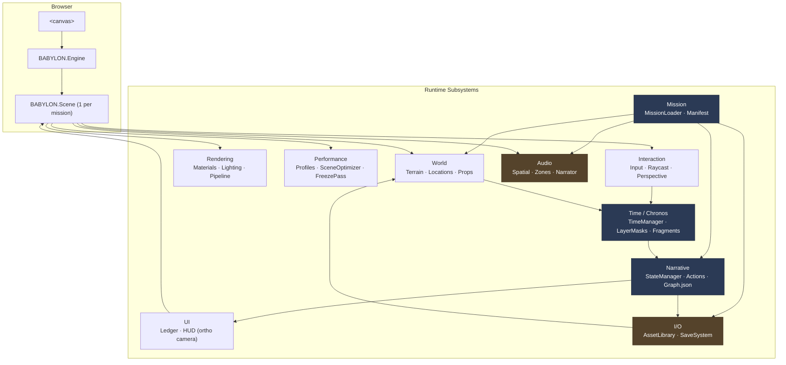
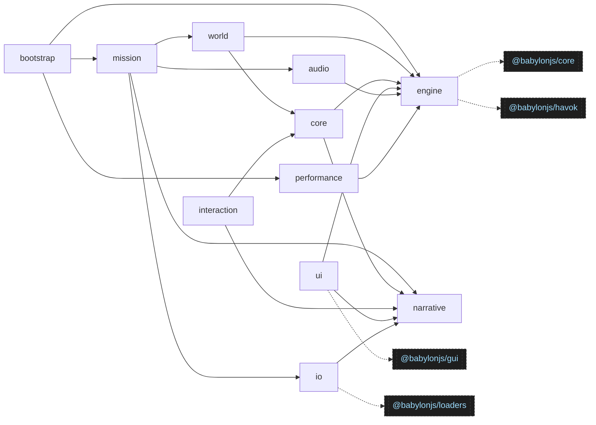
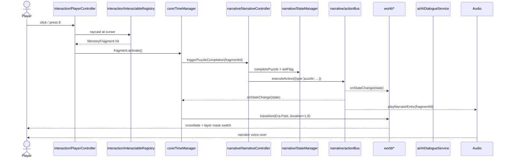
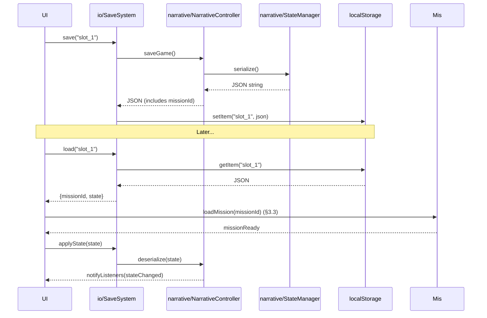

# Witness Interactive 3D — System Architecture

- **Status:** Draft
- **Last updated:** 2026-04-18
- **Owners:** @royceshannon2

This document describes the target runtime architecture. For repo inventory and subsystem ownership, see [`docs/design-docs/MASTER.md`](docs/design-docs/MASTER.md). For the current prototype's actual shape, see [`docs/current-state/PROTOTYPE_AUDIT.md`](docs/current-state/PROTOTYPE_AUDIT.md). For the template/reuse model that this architecture is designed to support, see [`SCALABILITY_PLAN.md`](SCALABILITY_PLAN.md).

---

## 1. System overview

Witness Interactive 3D is a single-page WebGL / WebGPU application that renders **one mission at a time** from a data-driven **Mission Manifest**. One `BABYLON.Engine` drives one primary `BABYLON.Scene` plus one small orthographic UI camera. The scene holds every mesh from every era of the currently loaded mission; an era is selected via camera `layerMask`, not by swapping scenes. All narrative state is persisted in memory via a serializable `StateManager` and surfaced to runtime subsystems via an event bus. All audio is pre-recorded and baked; no runtime synthesis.

Three commitments shape every decision in this doc:

1. **Narrative, time, and rendering are three independent subsystems that communicate only through events.** The narrative layer does not know what Babylon is. The rendering layer does not know what a flag is. The time layer mediates.
2. **The engine is a template.** Every mission-specific concern lives in `public/missions/<mission-id>/` as data (manifest + `Graph.json` + assets + audio). Adding a second mission is a data operation, not a code operation. See [`SCALABILITY_PLAN.md`](SCALABILITY_PLAN.md).
3. **The performance floor is a school Chromebook, not a workstation.** Every subsystem supplies a **LOW / MEDIUM / HIGH** profile; the runtime picks at boot and the `SceneOptimizer` re-picks if FPS drifts. The workstation profile (§6) is opt-in for contributors, not the target bar.


```mermaid
graph TB
  subgraph Browser
    Canvas["&lt;canvas&gt;"]
    Engine["BABYLON.Engine"]
    Scene["BABYLON.Scene (1 per mission)"]
  end

  subgraph Runtime Subsystems
    Narrative["Narrative<br/>StateManager · Actions · Graph.json"]
    Time["Time / Chronos<br/>TimeManager · LayerMasks · Fragments"]
    Mission["Mission<br/>MissionLoader · Manifest"]
    World["World<br/>Terrain · Locations · Props"]
    Rendering["Rendering<br/>Materials · Lighting · Pipeline"]
    Performance["Performance<br/>Profiles · SceneOptimizer · FreezePass"]
    Interaction["Interaction<br/>Input · Raycast · Perspective"]
    Audio["Audio<br/>Spatial · Zones · Narrator"]
    UI["UI<br/>Ledger · HUD (ortho camera)"]
    IO["I/O<br/>AssetLibrary · SaveSystem"]
  end

  Canvas --> Engine
  Engine --> Scene
  Mission --> IO
  Mission --> World
  Mission --> Narrative
  Mission --> Audio
  IO --> World
  Scene --> World
  Scene --> Rendering
  Scene --> Interaction
  Scene --> Audio
  Scene --> Performance
  Interaction --> Time
  Time --> Narrative
  Narrative --> UI
  Narrative --> IO
  World --> Time
  UI --> Scene

  classDef core fill:#2b3a55,color:#fff,stroke:#1a2438
  classDef io fill:#55432b,color:#fff,stroke:#3a2c1a
  classDef external fill:#1e1e1e,color:#9cdcfe,stroke:#3c3c3c,stroke-dasharray:3 3
  class Narrative,Time,Mission core
  class IO,Audio,AI io
  class HunyuanLLM external
```

---

## 2. Module dependency graph

Arrows point from *importer* to *importee*. No cycles permitted.


```mermaid
graph LR
  bootstrap --> engine
  bootstrap --> performance
  bootstrap --> mission

  mission --> io
  mission --> world
  mission --> narrative
  mission --> audio

  world --> engine
  world --> core
  core --> engine
  core --> narrative
  interaction --> core
  interaction --> narrative
  ui --> narrative
  ui --> engine
  audio --> engine
  io --> narrative
  performance --> engine

  engine -.-> BabylonCore[["@babylonjs/core"]]
  engine -.-> Havok[["@babylonjs/havok"]]
  ui -.-> BabylonGUI[["@babylonjs/gui"]]
  io -.-> BabylonLoaders[["@babylonjs/loaders"]]

  classDef pkg fill:#1e1e1e,color:#9cdcfe,stroke:#3c3c3c,stroke-dasharray:3 3
  class BabylonCore,Havok,BabylonGUI,BabylonLoaders pkg
```

**Rules:**
- `narrative/` imports nothing from elsewhere in the app. It is the root of the dependency tree.
- `engine/` imports only Babylon.
- `performance/` imports `engine/` only. It observes FPS and mutates scene/engine state; it never touches content.
- `mission/` is the **content orchestrator**. It reads a manifest, tells `io/` what to load, tells `world/` what to place, tells `narrative/` which graph to use, tells `audio/` which zones to arm. It never renders.
- `world/` imports `engine/` and `core/` (for era tagging helpers). Never `narrative/`.
- `core/` imports `narrative/` and `engine/`; the bridge between narrative events and visibility masks.
- `interaction/` imports `core/` and `narrative/`. Emits events; never mutates world state directly.
- `ui/` imports `narrative/` for read/subscribe and `engine/` to attach its ortho camera. Never `world/`.
- `audio/` imports `engine/` (for Sound registration) and subscribes to narrative events. Never mutates world state.
- `io/` imports `narrative/` for save/load, Babylon loaders for GLB/KTX2/Draco.
- `bootstrap/` is the only module allowed to import from every other module.

---

## 3. Runtime data flow

### 3.1 Boot → first playable frame


```mermaid
sequenceDiagram
  actor Browser
  participant BS as bootstrap/main.ts
  participant Eng as engine/
  participant Perf as performance/
  participant Mis as mission/MissionLoader
  participant IO as io/AssetLibrary
  participant World as world/
  participant Narr as narrative/
  participant UI as ui/

  Browser->>BS: page load
  BS->>Eng: createEngine(canvas, {adaptToDeviceRatio:false})
  BS->>Perf: detectProfile() → LOW | MEDIUM | HIGH
  BS->>Eng: applyProfile(engine, profile)
  BS->>Mis: load(manifestUrl)
  Mis->>IO: preload(manifest.requiredAssets)
  IO-->>Mis: AssetContainers ready
  Mis->>World: buildScene(manifest, containers)
  World-->>Mis: scene built, meshes tagged
  Mis->>Narr: loadGraph(manifest.narrativeGraph)
  Mis->>BS: missionReady
  BS->>Perf: runFreezePass(scene)
  BS->>Perf: startSceneOptimizer(scene, profile)
  BS->>UI: attach(scene, orthoCamera)
  BS->>Eng: runRenderLoop()
  Eng-->>Browser: first frame
```

### 3.2 Player interacts with a Memory Fragment


```mermaid
sequenceDiagram
  actor Player
  participant Input as interaction/PlayerController
  participant Registry as interaction/InteractableRegistry
  participant TM as core/TimeManager
  participant NC as narrative/NarrativeController
  participant SM as narrative/StateManager
  participant AB as narrative/actionBus
  participant Scene as world/*
  participant AI as ai/AIDialogueService

  Player->>Input: click / press E
  Input->>Registry: raycast at cursor
  Registry-->>Input: MemoryFragment hit
  Input->>TM: fragment.activate()
  TM->>NC: triggerPuzzleCompletion(fragmentId)
  NC->>SM: completePuzzle + setFlag
  NC->>AB: executeAction({type:'puzzle', ...})
  AB-->>Scene: onStateChange(state)
  AB-->>TM: onStateChange(state)
  AB-->>Audio: playNarratorEntry(fragmentId)
  TM->>Scene: transition(Era.Past, duration=1.8)
  Scene-->>Player: crossfade + layer mask switch
  Audio-->>Player: narrator voice-over
```

### 3.3 Mission teardown and switch

```mermaid
sequenceDiagram
  participant UI
  participant Mis as mission/MissionLoader
  participant IO as io/AssetLibrary
  participant Scene as BABYLON.Scene
  participant Perf as performance/

  UI->>Mis: loadMission("nuremberg-1945")
  Mis->>Scene: blockfreeActiveMeshesAndRenderingGroups = true
  Mis->>IO: dispose(currentMissionContainers)
  IO->>Scene: container.removeAllFromScene(); container.dispose()
  Mis->>Scene: blockfreeActiveMeshesAndRenderingGroups = false
  Mis->>Mis: load("nuremberg-1945")
  Note over Mis: sequence continues as §3.1 from manifestUrl
```

### 3.4 Save / Load


```mermaid
sequenceDiagram
  participant UI
  participant SS as io/SaveSystem
  participant NC as narrative/NarrativeController
  participant SM as narrative/StateManager
  participant LS as localStorage

  UI->>SS: save("slot_1")
  SS->>NC: saveGame()
  NC->>SM: serialize()
  SM-->>NC: JSON string
  NC-->>SS: JSON (includes missionId)
  SS->>LS: setItem("slot_1", json)

  Note over UI,LS: Later...
  UI->>SS: load("slot_1")
  SS->>LS: getItem("slot_1")
  LS-->>SS: JSON
  SS-->>UI: {missionId, state}
  UI->>Mis: loadMission(missionId) (§3.3)
  Mis-->>UI: missionReady
  UI->>SS: applyState(state)
  SS->>NC: deserialize(state)
  NC-->>UI: notifyListeners(stateChanged)
```

---

## 4. Era representation (Chronos)

Full spec in [`docs/design-docs/CHRONOS_SWITCH.md`](docs/design-docs/CHRONOS_SWITCH.md). This section names the contract.

Every mesh in the scene is tagged with a layer-mask bit at creation:

```typescript
// src/core/LayerMasks.ts
export const LAYER_PRESENT = 0x10000000;
export const LAYER_PAST    = 0x20000000;
export const LAYER_SHARED  = 0x40000000;  // terrain, skybox, era-agnostic landmarks
export const LAYER_HUD     = 0x80000000;  // ortho UI camera only — see §10
```

`camera.layerMask` is the single source of truth for "what era am I in." `TimeManager.transition(Era.Past)` sets the primary camera's mask and runs a post-fx crossfade. The HUD camera's mask is always `LAYER_HUD`; era switches do not affect it.

Every location in `src/world/locations/*` exports two build functions:

```typescript
buildPresent(scene): Mesh[]   // ruined / overgrown / desaturated
buildPast(scene): Mesh[]      // intact / populated / saturated
buildShared(scene): Mesh[]    // terrain, roads — visible in both
```

Lights get the same mask treatment: a Past DirectionalLight with 1994's hot afternoon, a Present DirectionalLight with 2026's overcast grey. Neither is ever disabled; both are always in the scene, culled by mask.

**Why `layerMask` over `setEnabled(false)`:** `setEnabled(false)` suppresses rendering, physics, and raycasting. `layerMask` suppresses only rendering; physics and picks continue on the camera's active mask. We want picking to work across era boundaries (the player's cursor must never "miss" a shared prop). See [`docs/design-docs/CHRONOS_SWITCH.md §6.D`](docs/design-docs/CHRONOS_SWITCH.md#d-per-mesh-layermask-vs-per-mesh-metadataera--runtime-enable) for the full trade-off analysis.

---

## 5. Subsystem contracts

### 5.1 `narrative/`
**Responsibility:** hold the canonical game state; emit events when it changes.

**Public API** (already implemented in skeleton form):
- `narrativeController.triggerPuzzleCompletion(id, metadata?)`
- `narrativeController.triggerBranchChoice(branchId, metadata?)`
- `narrativeController.unlockPath(pathId)`
- `narrativeController.subscribe(listener) → unsubscribe`
- `narrativeController.saveGame() → string`
- `narrativeController.loadGame(json) → void`
- `narrativeController.getFlag(key) → boolean`

**Invariants:**
- `GameState` is fully serializable (JSON-safe).
- State mutations go through `NarrativeController` only.
- The `Graph.json` is the canonical DAG — no node progression is coded imperatively elsewhere.
- The active graph is loaded by `mission/` at mission boot; `narrative/` never reads from disk.

### 5.2 `core/`
**Responsibility:** own the Era state and the fragment registry.

**Public API** (to be implemented):
- `timeManager.currentEra: Era`
- `timeManager.transition(era, duration?) → Promise<void>`
- `timeManager.registerFragment(fragment) → void`
- `timeManager.tagMesh(mesh, era) → void`
- `timeManager.subscribe(listener) → unsubscribe` (event: `era_changed`)

**Invariants:**
- Exactly one era is active at any time (`LAYER_PRESENT ^ LAYER_PAST`, never both).
- `LAYER_SHARED` is always in the active camera mask.
- A transition in progress blocks re-entry (reject overlapping calls).
- Fragments are registered at scene build time; never created mid-transition.
- On mission teardown, all registered fragments are cleared.

### 5.3 `engine/`
**Responsibility:** Babylon scene lifecycle, rendering pipeline, materials, physics.

**Public API:**
- `SceneFactory.create(engine, canvas) → Scene`
- `RenderingPipeline.attach(scene, camera, profile: 'present' | 'past', quality: 'low'|'medium'|'high') → void`
- `Lighting.build(scene, quality) → { sun, sky, rim }`
- `Materials.library → { laterite, brick, tinRoof, ... }`
- `Physics.init(scene) → Promise<void>`

**Invariants:**
- No imports from `narrative/`, `core/`, `world/`, `interaction/`, `ui/`, `io/`, `mission/`, `ai/`, `performance/`.
- All PBR materials live in the shared library; locations reference by name.
- Materials are frozen (`material.freeze()`) at registration; see §7.

### 5.4 `world/`
**Responsibility:** build all meshes for the active mission's environment.

**Public API:**
- Each location exports: `build(scene, timeManager, assetLibrary) → void`
- Internally: `buildPresent`, `buildPast`, `buildShared`
- `Terrain.build(scene, config) → { ground, getHeight, isFlat }`

**Invariants:**
- Every created mesh is tagged via `timeManager.tagMesh` before first render.
- Every created mesh is either flagged `interactive = true` or frozen in the freeze pass (§7.1).
- Location modules may depend on `engine/` and `core/`. They never depend on `narrative/`.

### 5.5 `interaction/`
**Responsibility:** player input, raycasting, interactable pickup, perspective-mode modifiers.

**Public API:**
- `PlayerController.attach(scene, camera) → void`
- `InteractableRegistry.register(mesh, handler) → void`
- `Perspective.setMode('protector' | 'hidden') → void`

**Invariants:**
- Input never directly mutates world geometry. It triggers narrative events or fragment activations.
- `scene.skipPointerMovePicking = true` on LOW/MEDIUM profiles; picking is done only on click. See §7.3.

### 5.6 `ui/`
**Responsibility:** GUI — ledger pages, investigator interface, reflection prompts, branch-choice dialog.

**Public API:**
- `HUD.attach(scene, orthoCamera)` — the HUD owns its own orthographic camera (§10).
- `LedgerUI.open() / LedgerUI.close()`
- `BranchChoiceDialog.present(options) → Promise<choice>`

**Invariants:**
- UI subscribes to narrative events; it never writes to narrative state except via `narrativeController.triggerBranchChoice`.
- All HUD elements carry `layerMask = LAYER_HUD`. The HUD camera is pushed onto `scene.activeCameras` as a second camera; the primary camera is the gameplay camera (§10).

### 5.7 `io/`
**Responsibility:** load GLB/KTX2/Draco assets, hold `AssetContainer`s, save/load game state.

**Public API:**
- `AssetLibrary.preload(ids: string[]) → Promise<void>`
- `AssetLibrary.get(id) → AssetContainer`
- `AssetLibrary.instantiate(id, era, transform) → InstantiatedEntries`
- `AssetLibrary.dispose(ids: string[]) → void`
- `SaveSystem.save(slot) / SaveSystem.load(slot) / SaveSystem.list()`

**Invariants:**
- `AssetLibrary` is the **only** module that calls `LoadAssetContainerAsync`.
- A container is loaded at most once per mission lifetime; subsequent requests return the cached container.
- `dispose()` calls `container.removeAllFromScene(); container.dispose()` and decrements the refcount; the GC-level cleanup happens at mission teardown when the cache is cleared.
- `SaveSystem` persists only what `narrativeController.saveGame()` returns plus `missionId`. Nothing in `world/` or `core/` has private state that must be serialized.

### 5.8 `bootstrap/`
**Responsibility:** wire everything together on page load.

Single `main.ts` that:
1. Creates the canvas + engine.
2. Detects hardware profile (§6) and applies engine-level settings.
3. Calls `MissionLoader.load(manifestUrl)` for the default or last-played mission.
4. Runs the freeze pass (§7.1) after the scene is built.
5. Starts `SceneOptimizer` with the profile's preset.
6. Attaches interaction, audio, UI (including the HUD ortho camera).
7. Starts the render loop.

No game logic lives in `bootstrap/`. If it starts to, it belongs in a subsystem.

### 5.9 `mission/` (new)
**Responsibility:** load a Mission Manifest, orchestrate the handoffs to `io/`, `world/`, `narrative/`, and `audio/`, and tear down the previous mission cleanly.

**Public API:**
- `missionLoader.load(manifestUrl) → Promise<void>`
- `missionLoader.currentManifest: Manifest | null`
- `missionLoader.unload() → Promise<void>`
- `missionLoader.subscribe(event: 'willLoad' | 'ready' | 'willUnload' | 'unloaded', cb)`

**Invariants:**
- At most one mission is loaded at a time. `load()` while another is active calls `unload()` first.
- The manifest is fully validated (schema + asset-existence check) before any `AssetContainer` is requested.
- Mission teardown sets `scene.blockfreeActiveMeshesAndRenderingGroups = true` during bulk dispose, then restores it to `false`. Per Babylon docs, this avoids per-dispose `freeActiveMeshesAndRenderingGroups` churn.

**Schema and template rules:** see [`SCALABILITY_PLAN.md`](SCALABILITY_PLAN.md).

### 5.10 `performance/` (new)
**Responsibility:** detect the hardware profile at boot, apply engine-level settings, run the one-time freeze pass on static content, and keep FPS within target via `SceneOptimizer`.

**Public API:**
- `performanceManager.detectProfile() → 'low' | 'medium' | 'high'`
- `performanceManager.applyProfile(engine, scene, profile) → void`
- `performanceManager.runFreezePass(scene) → void`
- `performanceManager.startSceneOptimizer(scene, profile) → SceneOptimizer`
- `performanceManager.currentProfile: 'low' | 'medium' | 'high'`
- `performanceManager.subscribe(event: 'profileChanged' | 'optimizationApplied', cb)`

**Invariants:**
- Profile detection reads `navigator.hardwareConcurrency`, `navigator.deviceMemory` (where available), `engine.webGLVersion`, and a short FPS probe on a throwaway scene (see §6). Never blocks on network.
- The freeze pass is **idempotent and one-shot per mission**. It is re-run at the next `missionReady` event.
- `SceneOptimizer` degradations are logged to `performance.onOptimizationApplied` so the user (via a dev overlay) can see that quality has dropped.

### 5.11 `audio/` (expanded)
**Responsibility:** spatial ambience, narrator voice, diegetic effects, era transitions. Full spec in [`docs/design-docs/AUDIO_ARCHITECTURE.md`](docs/design-docs/AUDIO_ARCHITECTURE.md).

**Public API:**
- `audioManager.init(scene, profile) → Promise<void>`
- `audioManager.setLocation(locationId) → void`
- `audioManager.transitionToEra(era, durationMs) → Promise<void>`
- `audioManager.playNarratorEntry(entryKey) → void`
- `audioManager.playEffect(effectKey, position?) → void`

**Invariants:**
- Every non-narrator sound is `spatialSound: true` with `distanceModel: 'exponential'`, `panningModel: 'HRTF'`, `rolloffFactor: 2` — the default for zone ambiences on the Bisesero hills so wind direction and voice direction are diegetically directional.
- The narrator track is a non-spatial sound (always center-panned) on a dedicated `SoundTrack`. It never ducks below −12 dB when present (§AUDIO_ARCHITECTURE §7).
- Audio zones are declared in the manifest (§8 and `SCALABILITY_PLAN.md`); `audioManager` instantiates them on mission ready and tears them down on unload.
- On LOW profile, the audio engine caps simultaneous voices at 8 (down from 16 on HIGH). Excess `playEffect` calls are dropped.

---

## 6. Target hardware profiles

The project targets **three tiers**. The baseline target is the LOW tier — a school Chromebook. HIGH exists for creator review and archival capture.

| Dimension | LOW (Chromebook) | MEDIUM (mid-laptop) | HIGH (desktop + dGPU) |
|---|---|---|---|
| Reference device | Lenovo 100e Gen 4 / HP Fortis 11 | MacBook Air M1 / Dell XPS 13 | Desktop + RTX 3060 or better |
| Render resolution | 1280×720 internal, upscaled to fit | 1600×900 internal | Native 1920×1080+ |
| `engine.setHardwareScalingLevel` | 1.5 (render at 66%) | 1.0 (native) | 1.0 |
| Target FPS | 30 (floor), 45 (nominal) | 60 | 60 |
| MSAA / FXAA | FXAA only | FXAA | FXAA |
| Shadow map | 1024, 1 cascade | 2048 | 2048 (4096 for hero moments) |
| SSAO | Off | SSAO2 low-sample | SSAO2 full |
| Bloom | Threshold-gated only | On | On |
| Post-fx chain | Tone-map + FXAA + LUT only | + SSAO + bloom + grain | + SSAO + bloom + grain + sharpen + vignette |
| Textures (hero) | 1K KTX2 ETC1S | 2K KTX2 ETC1S | 4K KTX2 (ETC1S + UASTC normals) |
| Active mesh evaluation | `scene.freezeActiveMeshes()` after freeze pass | Frozen | Frozen |
| Thin Instance caps | Full | Full | Full |
| Dynamic physics bodies | 10 | 20 | 30 |
| Simultaneous audio voices | 8 | 12 | 16 |
| Performance priority | `Aggressive` | `Intermediate` | `BackwardCompatible` |

(Backed by Babylon's [Performance Priority Modes](docs/reference/Documentation/content/features/featuresDeepDive/scene/optimize_your_scene.md) — `Aggressive` enables `skipPointerMovePicking`, `skipFrustumClipping`, `doNotSyncBoundingInfo`, and material freezing in one switch; perfect for the LOW profile's fire-and-forget static world.)

### 6.1 Profile detection

`performanceManager.detectProfile()` at boot, in order:

1. **Override query param**: `?perf=low|medium|high` overrides everything (for classroom testing).
2. **Override in `localStorage`**: `witness:perfProfile` — set by the in-game settings menu.
3. **Heuristics**:
   - `navigator.deviceMemory < 4` → LOW.
   - `navigator.hardwareConcurrency ≤ 4` → LOW.
   - WebGL 1 only (no WebGL 2) → LOW.
   - Integrated GPU detected via `WEBGL_debug_renderer_info` `UNMASKED_RENDERER_WEBGL` (Intel HD / UHD / Iris) → MEDIUM.
   - Otherwise → HIGH, provisionally.
4. **Probe**: render a throwaway 200 ms scene (single textured quad with post-fx at target quality) and measure FPS. Demote a tier if the probe falls below the tier's floor.

Detection runs once at boot. Runtime re-promotion is possible (the `SceneOptimizer` in *improvement mode* could do this) but is not enabled by default — a quality upgrade mid-play would be visually distracting.

### 6.2 WebGL 2 vs WebGPU

WebGL 2 is the v1 target. The engine abstracts behind `new BABYLON.Engine()` (WebGL) or `new BABYLON.WebGPUEngine()` (WebGPU). The LOW profile prefers WebGL 2 — WebGPU driver support on school-issued Chromebooks is spotty. Contributors can opt into WebGPU via `?engine=webgpu` for HIGH-tier testing.

WebGPU compatibility notes per `.claude/rules/documentation-standards.md`: materials and post-fx described in [`RENDERING.md`](docs/design-docs/RENDERING.md) are cross-compatible. The one call site to watch is `DefaultRenderingPipeline` MSAA configuration — WebGL conflicts are documented in `RENDERING.md §5.5`. We stay on FXAA; both backends are happy.

---

## 7. Performance strategy

### 7.1 The freeze pass

After `mission/` reports `missionReady`, `performanceManager.runFreezePass(scene)` walks every mesh tagged `interactive = false` (i.e. everything except fragments, physics bodies, and UI) and:

```typescript
for (const mesh of scene.meshes) {
  if (mesh.metadata?.interactive) continue;
  mesh.freezeWorldMatrix();
  mesh.alwaysSelectAsActiveMesh = true;      // skip frustum test (we froze active meshes next)
  mesh.doNotSyncBoundingInfo = true;         // we never move these, so the cache is valid
  mesh.cullingStrategy = AbstractMesh.CULLINGSTRATEGY_BOUNDINGSPHERE_ONLY;
  if (mesh.material && !mesh.material.metadata?.dynamic) {
    mesh.material.freeze();
  }
}

scene.freezeActiveMeshes();
scene.skipPointerMovePicking = true;
scene.blockMaterialDirtyMechanism = true;
```

Rationale: Babylon evaluates active meshes every frame (frustum test). For a hillside with ~400 static trees, rocks, and wall segments, the CPU cost of the evaluation is the dominant bottleneck on a Chromebook. Freezing the list once after scene build turns that cost into a fixed zero at steady state. (Source: [`optimize_your_scene.md`](docs/reference/Documentation/content/features/featuresDeepDive/scene/optimize_your_scene.md) §"Freezing the active meshes".)

**Gotcha we already handle:** `scene.freezeActiveMeshes()` breaks `RenderTargetTexture` refresh if we use baked reflections. If `RENDERING.md` Q3 resolves to "use SSR on the lake," we'll need to push that RTT into `camera.customRenderTargets` per the same source doc.

### 7.2 Era switches and the freeze

The freeze pass captures both era variants because both are in the scene graph at all times; the `layerMask` decides visibility per frame. We **do not** unfreeze on era change — the active-mesh list is shared across eras. The camera's mask change alone shifts what the GPU draws.

### 7.3 Thin Instances for repeated props

Every repeated environmental prop — eucalyptus trunks, rocks on the ravine, fence posts around the compound, grass clumps — is authored as a single mesh and instantiated via `thinInstanceSetBuffer('matrix', Float32Array, 16)`.

```typescript
// world/vegetation/Eucalyptus.ts
const trunk = container.meshes.find(m => m.name === 'EucalyptusTrunk')!;
trunk.thinInstanceSetBuffer('matrix', matrixBuffer, 16, /* static */ true);
trunk.thinInstanceCount = placements.length;
trunk.freezeWorldMatrix();
trunk.material.freeze();
```

Thin instances share one draw call for thousands of positions — critical on integrated GPUs. The constraint is "all or nothing" (you can't cull an individual thin instance), which is exactly fine for scattered vegetation where the mesh's aggregate bounding box is the entire hillside anyway. (Source: [`thinInstances.md`](docs/reference/Documentation/content/features/featuresDeepDive/mesh/copies/thinInstances.md) §"Faster thin instances".)

### 7.4 SceneOptimizer — the runtime safety net

```typescript
// src/performance/SceneOptimizerFactory.ts
function buildOptions(profile: 'low'|'medium'|'high'): SceneOptimizerOptions {
  const opts = new SceneOptimizerOptions(profile === 'low' ? 30 : 60, 3000);
  // Phase 0: cosmetic — remove effects the player won't notice missing.
  opts.optimizations.push(new ShadowsOptimization(0));
  opts.optimizations.push(new LensFlaresOptimization(0));
  // Phase 1: post-fx — disables grain, bloom, vignette.
  opts.optimizations.push(new PostProcessesOptimization(1));
  opts.optimizations.push(new ParticlesOptimization(1));
  // Phase 2: texture cap — drops mips on the largest textures.
  opts.optimizations.push(new TextureOptimization(2, profile === 'low' ? 512 : 1024));
  // Phase 3: hardware scaling — last-resort pixel reduction.
  opts.optimizations.push(new HardwareScalingOptimization(3, profile === 'low' ? 2 : 1.5));
  return opts;
}
```

The optimizer runs for the first 15 s of the mission, measuring every 3 s. Once it stabilizes, it stops. It never runs in "improvement mode" (which would re-enable effects above target FPS) because we want the quality ceiling to be the profile's initial config, not a moving target.

Why graded degradations instead of one big drop: a Chromebook hitting 25 fps is almost always shader-bound, not fill-bound. Dropping shadows first (cheap visual loss, big perf win) is almost always the correct first move. Only if shadow removal doesn't reach target do we start dropping resolution. (Source: [`sceneOptimizer.md`](docs/reference/Documentation/content/features/featuresDeepDive/scene/sceneOptimizer.md) §"The Built-in Optimizations".)

### 7.5 Physics (Havok) under the profile

Per [`RENDERING.md §6.4`](docs/design-docs/RENDERING.md#64-performance-budget), the Havok budget of 30 dynamic aggregates is the HIGH profile ceiling. The LOW profile caps at 10. The `PhysicsAggregate` factory in `engine/Physics.ts` checks `performanceManager.currentProfile` and refuses to register the (budget+1)th body — the caller gets a warning and the object falls back to a static collider.

Aggregates tagged to the inactive era are frozen by setting `body.disablePreStep = true` and `body.setMotionType(PhysicsMotionType.STATIC)`, which costs ~0 in the Havok step — same pattern as the Chronos docs describe.

### 7.6 Asset VRAM budgets

| Profile | Per-mission asset VRAM budget |
|---|---|
| LOW | ≤ 200 MB (1K KTX2 hero textures, 256/512 for background) |
| MEDIUM | ≤ 500 MB |
| HIGH | ≤ 800 MB |

`io/AssetLibrary.preload` sums estimated texture memory per asset (via the registry) before loading and refuses the mission if it exceeds the budget. This is a hard fail — the user sees a "this mission needs a higher performance profile" screen and can re-enter with an override. The alternative (runtime surprise OOM) would crash the tab.

---

## 8. Asset library & mission lifecycle

Detailed lifecycle sequence in §3.1 and §3.3. This section names the contract between `mission/`, `io/`, and `world/`.

### 8.1 What the manifest declares

Per `SCALABILITY_PLAN.md`:

```json
{
  "id": "shepherds-ledger",
  "version": "1",
  "requiredAssets": ["structure_rugo_wall", "prop_jerrycan", "vegetation_eucalyptus", ...],
  "locations": [ { "id": "family_compound", "assets": [...], "audioZones": [...] }, ... ],
  "anchors": [ { "id": "cellar_door_latch", "location": "family_compound", ... }, ... ],
  "narrativeGraph": "narrative/Graph.json",
  "ai": { "relevantFlags": ["found_cellar_evidence", ...], "cacheDir": "ai-cache/" }
}
```

### 8.2 `AssetLibrary.preload`

Loads every asset the manifest declares via `LoadAssetContainerAsync`, in parallel, bounded to N=4 concurrent fetches (more saturates a school Wi-Fi link). Each `AssetContainer` is kept in the library but **not added to the scene**. Locations then call `instantiate` to place N copies at specific transforms.

```typescript
// src/io/AssetLibrary.ts
async preload(ids: string[]): Promise<void> {
  const remaining = [...ids];
  const inflight: Promise<void>[] = [];
  while (remaining.length || inflight.length) {
    while (remaining.length && inflight.length < 4) {
      const id = remaining.shift()!;
      inflight.push(this.loadOne(id));
    }
    const done = await Promise.race(inflight.map((p, i) => p.then(() => i)));
    inflight.splice(done, 1);
  }
}

private async loadOne(id: string): Promise<void> {
  if (this.cache.has(id)) return;
  const url = this.resolveUrl(id);
  const container = await LoadAssetContainerAsync(url, this.scene);
  this.cache.set(id, container);
}
```

(Source for `LoadAssetContainerAsync` API: [`loadingFileTypes.md`](docs/reference/Documentation/content/features/featuresDeepDive/importers/loadingFileTypes.md) §"LoadAssetContainerAsync".)

### 8.3 `AssetLibrary.instantiate`

Returns `InstantiatedEntries`; meshes are added to the scene at this point, tagged via `core.tagNode(mesh, era)`, and optionally frozen (see §7.1 — the freeze pass handles this after all placements are done).

### 8.4 Mission teardown

At `mission.unload()`:

```typescript
scene.blockfreeActiveMeshesAndRenderingGroups = true;
for (const id of currentMissionAssetIds) {
  const container = library.cache.get(id);
  container.removeAllFromScene();
  container.dispose();
  library.cache.delete(id);
}
scene.blockfreeActiveMeshesAndRenderingGroups = false;
scene.unfreezeActiveMeshes();        // allow next mission's freeze pass to re-run
```

`blockfreeActiveMeshesAndRenderingGroups` around bulk dispose is the Babylon-documented pattern for avoiding O(N²) cleanup (Source: [`optimize_your_scene.md`](docs/reference/Documentation/content/features/featuresDeepDive/scene/optimize_your_scene.md) §"Scene with large number of meshes"). On a Chromebook, the difference between doing this and not doing this is a 2-second vs a 12-second teardown.

### 8.5 Compression contract (from `ASSET_PIPELINE.md`)

- Geometry: Draco, compression level 7.
- Textures: KTX2 with ETC1S for albedo and metallic-roughness, UASTC for normal maps.
- LODs: 3 tiers at 15 m / 50 m distances, authored at 1.00× / 0.50× / 0.15× poly.
- Per-mission total budget: ≤ 80 MB on the wire for full LOD0 + LOD1 + LOD2 + collisions. The LOW profile may skip LOD0 downloads (use LOD1 everywhere) via a manifest flag.

---

## 9. UI rendering strategy

The existing design brief asks for a "Tactical HUD" — information-dense, clean menus, high legibility. The project's PRD binds the tonal register to **documentary/memorial**, not military-shooter. This section reconciles the two: **the HUD is clean and high-information in the sense of a well-designed archival catalog or court evidence ledger**, not in the sense of a fireteam head-up display. No quest markers, no threat indicators, no militaria vocabulary. (Compare [`MISSION_BLUEPRINT.md §7`](docs/design-docs/MISSION_BLUEPRINT.md#7-system-integration) — the HUD shows date, location name, proximity hints only.) If the user's intent was literal military-HUD styling, flag this discrepancy at review.

### 9.1 The ortho camera layer

Two active cameras:

- **Primary camera** (`scene.activeCamera`): first-person, perspective, runs the full post-fx pipeline (SSAO, bloom, grading, grain).
- **HUD camera** (`orthoCamera`): orthographic, pushed onto `scene.activeCameras`, `layerMask = LAYER_HUD`, runs **no post-fx at all**.

```typescript
// src/ui/HUD.ts
const orthoCam = new FreeCamera('hudCamera', Vector3.Zero(), scene);
orthoCam.mode = Camera.ORTHOGRAPHIC_CAMERA;
orthoCam.layerMask = LAYER_HUD;
if (scene.activeCameras.length === 0) scene.activeCameras.push(scene.activeCamera!);
scene.activeCameras.push(orthoCam);

for (const light of scene.lights) {
  light.excludeWithLayerMask = LAYER_HUD;   // HUD is emissive only, no scene lighting cost
}
```

(Source: [`layerMasksAndMultiCam.md`](docs/reference/Documentation/content/features/featuresDeepDive/cameras/layerMasksAndMultiCam.md).)

### 9.2 Why this layout beats `AdvancedDynamicTexture.CreateFullscreenUI`

The fullscreen UI mode of Babylon GUI piggybacks on the main camera, which means it's drawn *after* the post-fx pass and gets post-processed along with the world. This:

1. Smears grain/bloom across crisp UI text.
2. Forces a second full-frame render of the UI when post-fx changes come in.
3. Doesn't isolate UI cost from world cost — any post-fx tax paid by the scene is also paid by the HUD.

The ortho-camera layout renders the world to the backbuffer with post-fx, then renders the HUD *on top* with none. On a Chromebook this is the difference between 8 ms/frame and 11 ms/frame just for the UI compositing.

### 9.3 HUD content rules

Per [`MISSION_BLUEPRINT.md §7`](docs/design-docs/MISSION_BLUEPRINT.md#7-system-integration):

- Date label (top-left) — e.g. "2026, April. Bisesero Hills."
- Location name (top-right, fades in/out on zone change).
- Proximity reticle (center, subtle) — activates when an interactable is in range.
- Ledger icon (bottom-right) — pulses once when a new entry is unlocked.

Things the HUD does **not** show: quest markers, objective list, compass, health, ammo, score, minimap, kill feed, notification toasts with "+10 XP", any numeric counter for anything.

### 9.4 Ledger UI (full-screen modal)

When the player opens the ledger, gameplay camera pauses rendering (`scene.render()` is still called but with a ledger-only active-camera list), the ortho camera stays visible, and a full-screen `AdvancedDynamicTexture` is instantiated on the HUD camera. On close, the ledger `dispose()`s and gameplay resumes.

This is one of the few places we do use `AdvancedDynamicTexture`; it's always short-lived and attached to the HUD camera (which has no post-fx to fight with).

---

## 10. Cross-cutting concerns (revised)

### 10.1 Configuration
Per-environment constants (ground size, fog density, shadow map resolution) live in `src/engine/config.ts` as a frozen object keyed by profile. Dev-only tunables go behind `import.meta.env.DEV`.

### 10.2 Logging
A thin `src/log.ts` wrapper with levels. `console.log` is banned in committed code — use `log.info` / `log.warn` / `log.error`. In production builds, `log.debug` is stripped.

### 10.3 Error handling
Fail loud in development (throw), fail soft in production (log + degrade). Asset load failures must not crash the engine — the scene renders without the missing asset and logs a warning.

### 10.4 Testing
- `narrative/` is pure TypeScript and fully unit-testable.
- `core/`, `mission/`, `performance/` are mostly pure; mock the scene with `NullEngine`.
- `world/`, `engine/`, `interaction/`, `ui/`, `audio/` are integration-tested via Playwright against a real canvas.

### 10.5 Accessibility
Per [`AUDIO_ARCHITECTURE.md §10`](docs/design-docs/AUDIO_ARCHITECTURE.md#10-accessibility-considerations): captions for all narrator lines, visual cues paired with audio events, ambient-sound toggle in settings, low-frequency cutoff to protect hearing-sensitive players. Keyboard-only play is a first-class path — the game is primarily played with WASD + mouse, but every interaction also has a key binding.

---

## 11. Change log

Architectural decisions that invalidate assumptions in this doc go in `docs/decisions/adrs/`. Incremental implementation updates go in `docs/decisions/CHANGELOG_DETAILED.md`.
