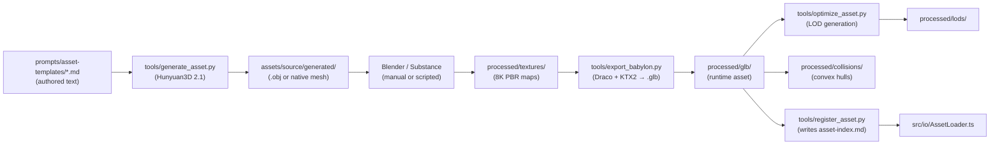

# Asset Pipeline — Design Document

- **Status:** Stub (outline only — content TBD)
- **Owner:** @royceshannon2
- **Parent:** [`MASTER.md`](MASTER.md)
- **Target code home:** `tools/` (Python generation), `witness-interactive-vite/src/io/` (runtime load)

The end-to-end path from a prompt to a runtime-ready `.glb`, executed on a local RTX 5090.

---

## 1. Objective
*(To be written.)*

Describe the pipeline's purpose, the quality bar, and the hand-off contract between authoring and runtime.

## 2. Scope
- **In scope:** Hunyuan3D 2.1 mesh generation, 8K PBR texture bake, GLB export with Draco + KTX2, runtime asset loader.
- **Out of scope:** Manual modelling, character rigging, animation authoring.

## 3. Pipeline stages

Subsections to fill:
- 3.1 Prompt authoring rules (prompts/asset-templates schema).
- 3.2 Hunyuan3D 2.1 invocation — parameters, seed strategy, reproducibility.
- 3.3 PBR bake recipe — map resolution, naming, channel packing.
- 3.4 Compression — Draco settings, KTX2 profile (UASTC vs. ETC1S per map type).
- 3.5 LOD generation — thresholds, decimation, visual validation.
- 3.6 Collision hull generation — convex decomposition, performance budget.
- 3.7 Asset registry — `docs/asset-index.md` schema, lookup at runtime.

## 4. Naming conventions
- Asset IDs: `{category}_{name}_{variant}` (e.g., `prop_jerrycan_weathered`).
- Directory structure: `processed/glb/{category}/{name}.glb`.
- *(Rest TBD.)*

## 5. Runtime loading contract
- `AssetLoader.loadGlb(id: string): Promise<AssetContainer>`
- LOD manifest: one `.glb` per LOD level; runtime picks by distance.
- Caching: single fetch per asset ID, shared across instances.

## 6. Trade-offs
- **A. Pre-bake 8K vs. generate at smaller resolution** — 8K is authoring quality; runtime downsamples via KTX2 mipmaps.
- **B. Draco vs. Meshopt** — *(TBD)*.
- **C. One GLB per asset vs. atlas bundles** — *(TBD)*.

## 7. Failure modes
- Hunyuan3D generation produces non-manifold mesh — rejected at bake stage.
- KTX2 encoder OOM on 8K atlas — fall back to per-map compression.
- Runtime loader fails — scene must continue; asset slot stays empty with warning.

## 8. Milestones
Phase 1: Install Hunyuan3D 2.1, smoke-test with one prompt, export one `.glb`, load it in the scene.
Phase 2: *(TBD)*.

## 9. Open questions
- Q1: Is there a license-audit step for generated assets? What are the provenance requirements?
- Q2: Do we accept manual authoring as a fallback, or is Hunyuan3D the only path?
- Q3: How are texture variations (weathered vs. pristine, for Chronos Switch) produced — separate bakes or shader-driven?
