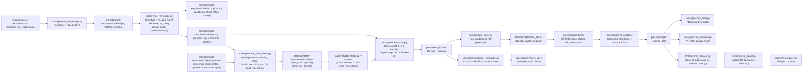

# Asset Pipeline — Design Document

- **Status:** Draft (§1–§9 filled 2026-04-18)
- **Owner:** @royceshannon2
- **Parent:** [`MASTER.md`](MASTER.md)
- **Target code home:** `tools/` (Python generation + compression), `witness-interactive-vite/src/io/` (runtime load), `witness-interactive-vite/public/assets/` (runtime-ready GLB storage).
- **Related:** [`RENDERING.md §3`](RENDERING.md#3-material-library) — PBR material contract. [`WORLD.md`](WORLD.md) — asset inventory per location.

The end-to-end path from a prompt or reference image to a runtime-ready `.glb`, executed locally on an RTX 5090. This doc defines each stage's input/output contract, the tools that perform it, and the quality bar at every hand-off.

---

## 1. Objective

Enable the project's entire 3D asset catalog to be produced locally, reproducibly, and iteratively — without relying on a cloud service for any step. The pipeline must:

- Accept a prompt or concept image as input.
- Produce a runtime-ready `.glb` with PBR textures, compressed geometry (Draco), compressed textures (KTX2), and three LOD tiers.
- Register the asset in a searchable index (`docs/asset-index.md`) with metadata (era, category, source prompt, generation date).
- Validate output (manifold geometry, valid PBR channel packing, reasonable poly count per tier).
- Be fully reproducible from the recorded prompt + seed (where supported).

**Quality bar:** each asset must meet `RENDERING.md`'s material contract (PBR maps in expected channel packing, bump present, roughness plausible). LOD0 is authoring quality; LOD2 is distance-silhouette quality. No manual cleanup should be required for 90% of generated props — the 10% that do (hero assets, signage, anything with text) are flagged at validation and handed to manual authoring.

---

## 2. Scope

**In scope:**
- Hunyuan3D 2.1 local mesh generation (via a running Docker container).
- PBR texture bake (Blender Cycles, scripted).
- GLB export with Draco mesh compression and KTX2 texture compression.
- LOD generation via decimation.
- Collision hull generation (V-HACD convex decomposition).
- Asset registration in `docs/asset-index.md`.
- Runtime asset loading (`src/io/AssetLoader.ts`).

**Out of scope:**
- Manual modelling of hero assets (documented here as a fallback only).
- Character rigging and skeletal animation (deferred; no characters in v1 at close range).
- Procedural generation of vegetation (uses `ThinInstance` + authored card sets).
- Remote/cloud asset generation (local only per PRD).

---

## 3. Pipeline stages


```mermaid
graph LR
  Prompt["prompts/asset-templates/*.md<br/>(authored text + style guide)"]
  RefGen["tools/generate_ref_image.py<br/>(ComfyUI + Flux.1 [dev])"]
  Ref["prompts/asset-templates/&lt;id&gt;/ref.png<br/>(reference photo)"]
  Refine["tools/refine_ref_image.py<br/>(ComfyUI + FLUX.2 [klein] 9B Base, img2img;<br/>always-on for mesh/animated)"]
  Archive["prompts/asset-templates/&lt;id&gt;/ref.original.png<br/>(audit copy of pre-refine source)"]
  RefRefined["prompts/asset-templates/&lt;id&gt;/ref.png<br/>(refined, Digital Diorama palette)"]
  MultiView["tools/generate_multi_views.py<br/>(rembg cut-out + framing, then<br/>Zero123++ v1.2 synth OR stage real photos)"]
  RealCaps["prompts/asset-templates/&lt;id&gt;/real_views/<br/>(real multi-angle photos, optional — wins over synth)"]
  Views["prompts/asset-templates/&lt;id&gt;/views/<br/>(view_0..N.png — bg-removed + framed)"]
  Gate1["tools/validate_views.py --indexed<br/>(pixel + all-view CLIP + cross-view colour)"]
  Gen["tools/generate_asset.py<br/>(Hunyuan3D 2.1 via FastAPI,<br/>single image OR multi-view list)"]
  Raw["processed/glb/raw/<br/>(.glb from Hunyuan)"]
  Texture["tools/texture_asset.py<br/>(view-conditioned PBR projection)"]
  Bake["tools/blender/bake_pbr.py<br/>(Blender Cycles 8K bake)"]
  Baked["processed/textures/<br/>(8K PBR maps: albedo, MR, normal, AO)"]
  Render["tools/blender/render_validation.py<br/>(3-point + HDRI turntable + hero)"]
  Renders["processed/renders/&lt;id&gt;/<br/>(turntable + hero PNG)"]
  Optimize["tools/optimize_asset.py<br/>(detached-island strip + Draco + KTX2)"]
  Final["processed/glb/<br/>(runtime .glb)"]
  LODs["tools/generate_lods.py<br/>(decimated variants)"]
  Collide["tools/generate_collision.py<br/>(V-HACD convex hulls)"]
  Export["tools/export_babylon.py<br/>(copy to public/assets/, validate naming)"]
  Register["tools/register_asset.py<br/>(append to docs/asset-index.md)"]
  Runtime["src/io/AssetLibrary.ts<br/>(Babylon runtime)"]

  Prompt --> RefGen --> Ref --> Refine --> RefRefined --> Gen --> Raw --> Texture --> Bake --> Baked --> Optimize --> Final
  Refine -.-> Archive
  RefRefined --> MultiView --> Views --> Gate1 --> Gen
  RealCaps --> MultiView
  Raw --> Render --> Renders
  Final --> LODs
  Final --> Collide
  Final --> Export --> Register --> Runtime
```

> **Stage 0.25 — Ref refinement (always on for `mesh|animated`, `--no-refine-ref` to opt out).** The hand-picked and Flux.1 [dev]-generated `ref.png` images that enter stage 0 differ wildly in palette, lighting, and stylistic alignment with Digital Diorama (some are golden-hour stock photos, some are heavily compressed JPEGs, some are clean Flux outputs that drift toward generic-African-village tropes). Stage 0.25 normalises them: `tools/refine_ref_image.py` uploads `ref.png` to ComfyUI, runs an img2img pass through **FLUX.2 [klein] 9B Base** (`prompts/_flux_workflows/refine.json`), and writes the result back over `ref.png`. The pre-refine source is preserved as `ref.original.png` (audit + rollback copy). Denoise strength is per-category — vegetation 0.60 (push palette hard, silhouette tolerance high), structure 0.40 (protect geometry), prop/figure 0.50 (mid). Idempotent: the script no-ops when `ref.original.png` already exists; re-refining requires `--refine-ref-force`. Downstream stages (multi-view, Hunyuan) read `ref.png` exactly as before — they are oblivious to whether stage 0.25 ran.

> **Stage 0.5 — Multi-view augmentation (default-on for `mesh|animated`, `--no-multi-view` to opt out).** Single-image Hunyuan shape inference occasionally produces flat caps or missing facets where the input photo couldn't see (e.g. the top of a tree) — in the worst case a low-contrast, background-laden ref fuses into a flat *slab* (the documented "triangular prism"). `tools/generate_multi_views.py` mitigates this in two steps. **(a) Pre-processing** — the ref is background-removed (rembg / u2net) and the cut-out is centred + squared at 85% fill (`frame_subject`). Zero123++'s pose conditioning is frame-centre-relative, and a stray background is the single biggest slab determinant; isolating + centring the subject is what makes the six views coherent. **(b) Synthesis** — Zero123++ v1.2 then produces six canonical 320² views (elevations alternating 30°/−20° across azimuths 30°/90°/150°/210°/270°/330°). All six are sent to Hunyuan as a list payload (`payload['images']`) via the patched `model_worker.py`; the legacy single-`image` field is still sent as a fallback so an unpatched worker still produces a (single-view) mesh. Sequential VRAM on the 5090: Flux exits ComfyUI → Zero123++ runs in its own process → Hunyuan container picks up. If rembg is not installed the cut-out no-ops with a loud warning (slab risk returns) — install `rembg onnxruntime` in the ComfyUI venv.

> **Stage 0.5 (real-view variant) — author-supplied captures (`--real-views <dir>`, or auto from `prompts/asset-templates/<id>/real_views/`).** When real multi-angle photographs are supplied they **win over synthesis**: `generate_multi_views.py --real-views` applies the same background-removal + framing to each photo and stages them as `view_0..N.png`, and Zero123++ is skipped entirely. Observed angles beat hallucinated ones for all-angle accuracy, so this is the preferred path for posed or highly specific assets — e.g. first-person hands, where the guidance-distilled FLUX text prior keeps rendering palms-up and won't produce a dorsal pose. Any view count is accepted (the validator and Hunyuan list payload are count-flexible). Because the cleanup imports rembg, this staging runs under the ComfyUI venv python (`--multi-view-python`), not the orchestrator's system python.

> **Gate 1 — pre-Hunyuan view validation.** Whether the views came from synthesis or real captures, `tools/validate_views.py --indexed` runs before the 5–10 min Hunyuan ensemble so a bad set halts the pipeline at the cheapest point. It combines per-view pixel checks (luminance / contrast / coverage) with an **all-view CLIP semantic gate** — `transformers` CLIP scores each view's soft-max mass on the asset prompt vs. failure-mode negatives (blank grey primitive, featureless block, shapeless blob, corrupted render) and fails any view below a 0.40 real-subject probability. This is the check that actually discriminates the slab (geometry Gate 2's bbox-depth ratio passed the slab at 0.447). A **cross-view foreground-colour** check (leave-one-out median, ≥5 views) additionally *warns* when one view fused a different subject/background.

> **Stage 2b-detail — Hero detail projection (optional, frontmatter-driven).** The six-view AI projection (stage 2b) averages every texel across whichever canonical views can see it. For hero regions — a face, first-person hands — that average smooths away the very micro-detail that sells the close-up (knuckles, tendons, a faded scar). When a template declares `detail_view` (§3.1), `texture_asset.py` runs one extra FLUX.2 [klein] img2img projection of that view at a lower denoise (default `0.45`, preserves more structure) and saves it as `processed/views/<id>/<view>.detail.pbr.png`. The reprojector (stage 2c) then blends it in at `detail_weight` (default `2.5×`) so it dominates the texels it covers. The init image is the optional `detail_reference` close-up — which must be framed to match the canonical view — or the view's own (always-aligned) beauty render. This is the automated analogue of an artist hand-painting a close-up reference onto the face in a projection tool, within the constraint that the local FLUX install has no reference/IP-adapter (so an off-frame close-up cannot be auto-aligned; the framing discipline is on the author).

> **Stage 2c — gap fill.** The six orthographic views never see concavities, undersides, or deep folds, so some UV texels are covered by no view. `reproject_views.py` fills those by **pull-push (pyramid) interpolation** from the covered AI-projected neighbours rather than stamping in the flat procedural albedo (which left a visible style seam). The procedural albedo is used only when *nothing* is covered. A `processed/textures/<id>_coverage.png` mask is emitted (white = view-covered, black = pull-push filled) as a diagnostic and a hook for a future generative inpaint.

The orchestrator (`tools/asset_pipeline.py`) chains every stage. Each
stage has its own runbook: [`tools/COMFY_RUNBOOK.md`](../../tools/COMFY_RUNBOOK.md)
(stage 0), [`tools/HUNYUAN_RUNBOOK.md`](../../tools/HUNYUAN_RUNBOOK.md) (stage 1).

### 3.1 Prompt authoring

**Location:** `prompts/asset-templates/*.md`. One file per prompt template, checked in.

**Schema (markdown with frontmatter):**

```markdown
---
asset_name: prop_jerrycan_weathered
category: prop
era_scope: shared
reference_image: ../references/jerrycan_1994_east_africa.jpg
seed: 847291
inference_steps: 50
target_poly_lod0: 4000
---

# Weathered yellow plastic jerrycan

A 20-liter yellow plastic jerrycan, the kind used across rural East Africa
for water collection. Surface is faded, dusty, with scratches from rope
tie-offs at the handle. A dent near the base. Cap is off, on a short cord.
Stands upright. Neutral lighting for PBR bake.

Materials: plastic (mat_metal_jerrycan). Single mesh, no rigging.
```

**Rules:**
- `reference_image` is optional but strongly preferred for shape fidelity.
- `seed` is recorded for reproducibility (Hunyuan3D 2.1 supports deterministic generation given identical input + seed).
- `era_scope` ∈ `present | past | shared` — used by downstream tagging (§3.8).
- Prompt body must describe the object in neutral terms. Absolutely no violence or militaria prompts — the project's ethical stance (PRD) applies to authoring as well as presentation.

**Optional hero detail fields (figures / close-inspection props).** These drive the stage 2b-detail pass (see the callout below §3); omit them for ordinary props.

| Field | Default | Meaning |
|---|---|---|
| `detail_view` | _(unset → no detail pass)_ | Canonical view (`front`/`back`/`left`/`right`/`top`/`bottom`) re-projected at higher blend priority so a hero region keeps its fidelity. |
| `detail_reference` | _(beauty render)_ | Optional close-up init image for the detail view's FLUX img2img. **Must be framed to match `detail_view`** (a front-on close-up for `front`), or the projection lands on the wrong region. Resolved relative to `prompts/asset-templates/`. When absent, the view's own beauty render is used (always geometry-aligned). |
| `detail_weight` | `2.5` | Blend-weight multiplier for the detail view; it wins texels it covers over the standard views. |
| `detail_denoise` | `0.45` | img2img denoise for the detail pass (lower than the standard `0.62` to preserve reference structure). |

All four are overridable per-run via `texture_asset.py --detail-view/--detail-reference/--detail-weight/--detail-denoise`.

### 3.2 Hunyuan3D 2.1 invocation

**Server:** `kechiro/hunyuan3d-2.1-cachedstart:latest` Docker container, running on port `8081`. Endpoints:

| Endpoint | Method | Body / Params | Response |
|---|---|---|---|
| `/generate` | POST | multipart: `image` (file) + `num_inference_steps` (param, 30–60) | `{ "task_id": "<uuid>" }` |
| `/status/{task_id}` | GET | — | `{ "status": "queued \| running \| complete \| error", "progress": 0–100 }` |
| `/result/{task_id}` | GET | — | binary `.glb` |

**Tool:** `tools/generate_asset.py` (already implemented — see `tools/generate_asset.py`). CLI:

```bash
python generate_asset.py <image_path> <asset_name> [--steps 50] [--server http://localhost:8081]
```

**Behavior:**
1. Validate image (PNG/JPG, ≥ 512×512).
2. POST to `/generate` with `num_inference_steps=50` (tuned for RTX 5090; 30 for iteration, 60 for final).
3. Poll `/status/{task_id}` every 5 s (max 10-minute timeout).
4. On `status=complete`, GET `/result/{task_id}`, save bytes to `processed/glb/raw/<asset_name>.glb`.
5. On `status=error`, print task_id and exit non-zero.

**Version note:** `CLAUDE.md` specifies Hunyuan3D **2.1**. The user's capability notes referenced v3.0 features (1.5M-face hero assets, FBX rigging). If the Docker image tag is `2.1-cachedstart`, then 2.1 behavior applies: output is a single GLB with PBR textures, no rigging. If v3.0 is installed locally, update this doc and `generate_asset.py`'s flags accordingly. **Action item (pre-M5):** verify installed version via `docker inspect kechiro/hunyuan3d-2.1-cachedstart:latest`.

### 3.3 PBR bake recipe

**Only needed when the raw Hunyuan output's textures are insufficient.** Hunyuan 2.1 ships PBR-ready textures with most outputs; when it does, skip this stage. When it doesn't (low-quality albedo, missing normal), `tools/bake_pbr.py` invokes Blender in headless mode with a scripted Cycles bake.

**Map resolutions:**
- Hero assets (close-camera inspection): 4K albedo + 4K metallic-roughness + 4K normal.
- Standard props: 2K × 3.
- Background / LOD2 only: 1K × 3.

**Channel packing:** Babylon's `PBRMaterial.metallicTexture` expects R=unused, G=roughness, B=metallic. The bake script enforces this packing.

**Normal map convention:** OpenGL normal (Y+ up). Blender's default is Y+; GLTF default is Y+. No flipping needed for GLTF export.

**Naming:** `<asset_name>_albedo.png`, `<asset_name>_mr.png` (metallic-roughness), `<asset_name>_normal.png`. Written to `processed/textures/`.

### 3.4 Compression — Draco + KTX2

**Tool:** `tools/optimize_asset.py` (already implemented).

**Draco (geometry):**
```bash
gltf-pipeline -i <asset_name>.glb -o <asset_name>.optimized.glb --draco.compressionLevel 7
```
Compression level 7 is the Babylon/Three.js community's balance between size and decode time. Level 10 shrinks further but decodes slower.

**KTX2 (textures):**
- **UASTC** for normal maps (lossless at the compressed cost; prevents banding on normals).
- **ETC1S** for albedo and metallic-roughness (lossy; smaller; fine for color / data-packed maps).

```bash
toktx --t2 --genmipmap --bcmp albedo.ktx2 albedo.png       # ETC1S
toktx --t2 --genmipmap --uastc normal.ktx2 normal.png      # UASTC
toktx --t2 --genmipmap --bcmp mr.ktx2 mr.png               # ETC1S
```

After compression, `tools/optimize_asset.py` re-embeds the KTX2 textures into the GLB via `gltf-pipeline`'s `--bufferCompression` path.

**Size budget:**
- Hero prop, LOD0: ≤ 4 MB total GLB.
- Standard prop, LOD0: ≤ 1.5 MB.
- Background prop, LOD0: ≤ 600 KB.
- Full location's asset bundle: ≤ 80 MB (matters for web delivery).

### 3.5 LOD generation

**Tool:** `tools/generate_lods.py` (not yet implemented — placeholder in `tools/`; scripted via Blender headless decimate).

Three tiers per asset, by poly reduction:

| LOD | Reduction | Use distance | Target polys (relative to authored) |
|---|---|---|---|
| LOD0 | 0% | 0 – 15 m | 1.00× |
| LOD1 | 50% | 15 – 50 m | 0.50× |
| LOD2 | 85% | 50 m+ | 0.15× |

One `.glb` per LOD, sibling filenames:

```
processed/glb/prop_jerrycan_weathered.glb          ← LOD0
processed/glb/prop_jerrycan_weathered.lod1.glb
processed/glb/prop_jerrycan_weathered.lod2.glb
```

`src/io/AssetLoader.ts` loads all three and sets up a Babylon `Mesh.addLODLevel(distance, mesh)` chain at instantiation.

### 3.6 Collision hull generation

**Tool:** `tools/generate_collision.py` (not yet implemented; wraps `V-HACD` CLI).

Produces a convex-decomposed collider for every asset that needs physics interaction (see `RENDERING.md §6.3` for which do). Stored in `processed/collisions/<asset_name>.glb` as a separate GLB containing one or more convex meshes.

Hull count budget per asset: ≤ 16 hulls. Hulls > 16 usually indicate a bad decomposition; re-run with higher `--maxHullVerts`.

Static architecture and terrain use simplified collision meshes (authored separately in Blender), not V-HACD output.

### 3.7 Asset registry

**Tool:** `tools/register_asset.py` (already implemented).

**File:** `docs/asset-index.md` — a markdown table, append-only, one row per registered asset:

```markdown
| Asset | Path | Era | Category | Source | Registered |
|---|---|---|---|---|---|
| prop_jerrycan_weathered | processed/glb/prop_jerrycan_weathered.glb | shared | prop | prompts/asset-templates/jerrycan.md | 2026-04-18 |
```

At runtime, `src/io/AssetLoader.ts` consults this index (pre-parsed to JSON at build time) to resolve asset IDs to file paths.

### 3.8 Runtime loading contract

**Module:** `src/io/AssetLoader.ts`.

```typescript
export interface LoadedAsset {
  rootMesh: AbstractMesh;         // LOD0
  lods: AbstractMesh[];           // [LOD1, LOD2]
  container: AssetContainer;       // Babylon container; handles dispose()
  metadata: AssetMetadata;         // era, category, source — from asset-index
}

export async function loadAsset(id: string): Promise<LoadedAsset>;
export async function preload(ids: string[]): Promise<void>;
export function instantiate(asset: LoadedAsset, scope: EraScope): InstantiatedEntries;
```

**Caching:** single fetch per asset ID; the `AssetContainer` is cached in-module and `instantiateModelsToScene()` is called per placement. No double-fetches even on hot-reload.

**Tagging:** `instantiate(asset, scope)` automatically applies `tagNode(mesh, scope)` and `tagLight(light, scope)` to the instantiated tree per `src/core/LayerMasks.ts`, using the `era_scope` from the asset's registry entry as the default. Per-placement overrides are supported.

---

## 4. Naming conventions

### 4.1 Asset IDs

Pattern: `<category>_<name>_<variant?>`.

- `<category>` ∈ `prop | structure | vegetation | terrain | material | figure | audio`.
- `<name>` is snake_case, short, descriptive.
- `<variant>` is optional, used for era or state variants (`_weathered`, `_pristine`, `_wet`, `_dry`).

Examples:
- `prop_jerrycan_weathered`
- `structure_rugo_wall_section`
- `vegetation_eucalyptus_mature`
- `figure_silhouette_farmer` (v1.1+ only)

### 4.2 File structure

```
processed/
├── glb/
│   ├── raw/                                 # Hunyuan output, unoptimized
│   ├── <asset_id>.glb                       # LOD0 runtime-ready
│   ├── <asset_id>.lod1.glb
│   └── <asset_id>.lod2.glb
├── collisions/
│   └── <asset_id>.collision.glb
└── textures/
    ├── <asset_id>_albedo.ktx2
    ├── <asset_id>_mr.ktx2
    └── <asset_id>_normal.ktx2

witness-interactive-vite/
└── public/
    └── assets/
        └── <asset_id>.glb                    # symlink or copy; runtime path
```

### 4.3 Filenames in GLB

Meshes and materials inside a GLB use PascalCase (`JerrycanBody`, `JerrycanHandle`, `Mat_PlasticYellow`). This is separate from the file-level snake_case convention; PascalCase is the Babylon asset-inspector convention.

---

## 5. Runtime loading contract

### 5.1 API

```typescript
// Fetch a single asset; caches the container.
AssetLoader.loadAsset(id: string): Promise<LoadedAsset>

// Preload many in parallel; useful at scene init.
AssetLoader.preload(ids: string[]): Promise<void>

// Instantiate a loaded asset at a position; returns root node and meshes.
AssetLoader.instantiate(
  asset: LoadedAsset,
  scope: EraScope,
  transform?: { position?: Vector3; rotation?: Quaternion; scaling?: Vector3 }
): InstantiatedEntries
```

### 5.2 LOD manifest

Resolved by pattern: on `loadAsset("prop_jerrycan_weathered")`, the loader fetches `.glb`, `.lod1.glb`, `.lod2.glb` in parallel. Missing LODs are tolerated with a warning (LOD0 used at all distances).

### 5.3 Caching

- Browser's HTTP cache + service worker handles the wire-level cache.
- `AssetLoader` caches the parsed `AssetContainer` in memory to avoid re-parsing.
- Cache is cleared on hot-reload (dev only) via Vite's HMR hook.

### 5.4 Error handling

- Missing asset (404): log error, return a placeholder cube tagged magenta (same convention as shader failure). Scene continues.
- Parse error (corrupt GLB): same fallback.
- Missing PBR channel: log warning; Babylon renders with the available channels (e.g., albedo only, unlit-looking).

---

## 6. Trade-offs

### A. Pre-bake 8K vs. generate at smaller resolution

Chose pre-bake 8K for hero assets, downsample at runtime via KTX2 mipmaps. Authoring flexibility matters more than generation time — the 5090 can afford it.

For standard props, 2K is generated directly; 8K would be wasted (the prop is never viewed at close range).

### B. Draco vs. Meshopt

Chose Draco. Better tooling support in `gltf-pipeline` and `@babylonjs/loaders`. Meshopt produces smaller files but has patchier Babylon support. Revisit in v1.1 if file-size budget becomes tight.

### C. One GLB per asset vs. atlas bundles

Chose one GLB per asset. Atlas bundles are tempting for small props (one fetch loads 20 props) but complicate per-asset LOD, per-asset collision, and per-asset era tagging. The HTTP/2 multiplexing cost of many small GLBs is negligible for desktop broadband targets.

### D. Hunyuan 2.1 vs. manual modelling

Hunyuan is the default path; manual modelling is an escape hatch for hero assets that Hunyuan gets wrong (signage with text, specific cultural artifacts that need provenance). Any manually authored asset enters the pipeline at §3.3 (PBR bake stage) with the same downstream treatment.

---

## 7. Failure modes

| Failure | Detection | Mitigation |
|---|---|---|
| Hunyuan3D produces non-manifold mesh. | `tools/validate_glb.py` (to write) detects via Trimesh manifold check. | Reject at bake stage; log. Retry with different seed, or fall back to manual. |
| KTX2 encoder OOM on 8K atlas. | `toktx` returns non-zero. | Fall back to per-map compression (albedo and normal separate), not atlas. |
| Hunyuan Docker container not reachable. | `generate_asset.py` connect error. | Clear error message with `docker ps` guidance (already implemented). |
| Runtime asset load fails. | `SceneLoader.ImportMeshAsync` rejects. | Magenta-cube placeholder; scene continues; log to console. |
| LOD transition "pops" visibly. | Manual playtest. | Add hysteresis band (±2 m) and a short (0.1 s) fade via material alpha at transition distance. |
| Collision mesh has gaps (convex hull too coarse). | Physics authoring playtest (objects fall through). | Re-run V-HACD with higher `--maxHullVerts`. |
| Asset registered in `asset-index.md` but file missing. | Runtime 404. | Treat as missing asset (above). Add pre-commit hook to validate index ↔ filesystem. |
| Normal map incorrect (Y flipped). | Visual inspection — lighting looks wrong. | Enforce OpenGL Y+ in bake pipeline; reject asset if Blender export flag is incorrect. |
| GLB contains embedded image data as PNG (bypassing KTX2). | `tools/validate_glb.py` inspects image MIME types. | Re-run `optimize_asset.py` with `--force`. |

---

## 8. Milestones

**Phase 1 — Smoke test.** Install Hunyuan3D 2.1 (confirm image tag), generate one prop (`prop_jerrycan_weathered`) from reference image, walk it through the full pipeline (raw → compressed → LOD → registry → loaded in scene). Goal: end-to-end path working, quality acceptable or not, single asset visible in the prototype Babylon scene.

**Phase 2 — First location bundle.** All Family Compound props: jerrycan, bicycle, cooking pot, water basin, cloth line, bench. Register and load. Target: 6 assets end-to-end in one session.

**Phase 3 — Structures.** Rugo wall sections, tin roof, well cover, cellar door. Hero assets — review each individually before registration.

**Phase 4 — Vegetation.** Eucalyptus, matooke (banana), elephant grass card sets. `ThinInstance` setup in scene.

**Phase 5 — Full location coverage.** All five locations per [`WORLD.md`](WORLD.md). Registry approaches 50 assets.

**Phase 6 — Tooling maturity.** Automated validation, pre-commit hooks, regression (reproducibility from seed), CI for `tools/*.py` on Python 3.11+.

---

## 9. Open questions

- Q1: **Provenance / licensing.** Hunyuan3D outputs are locally generated; the concept art inputs may be AI-generated or hand-drawn. Do we need a provenance column in `asset-index.md`? Leaning yes — record `source_image_attribution` for every asset. Pre-Phase 1 decision.
- Q2: **Manual authoring fallback — how automated?** For assets Hunyuan cannot produce (text signage, culturally specific artifacts), do we commit to a Blender authoring template? Or accept that these are one-offs that take a day each? Decide at Phase 3.
- Q3: **Era-variant production.** Do we generate two separate Hunyuan outputs for `_weathered` vs. `_pristine` variants, or take a single output and author the aging in Blender? Leaning: Hunyuan for both (input a "weathered" vs "pristine" reference), validate at Phase 1 whether the two outputs are silhouette-compatible (so one collision hull covers both). If yes, two generates. If no, one generate + Blender aging.
- Q4: **Streaming vs. preload.** Full-scene preload keeps ~80 MB in memory per location; streaming by proximity halves that. Decide at Phase 5 based on measured load time.
- Q5: **Reproducibility guarantees.** Hunyuan3D 2.1 may or may not be seed-deterministic across container versions. If we pin the Docker image tag (e.g., `2.1-cachedstart-sha256:abc...`), we get bit-reproducibility. Is that worth the tag-discipline cost? Yes for published builds; not yet for iteration.
