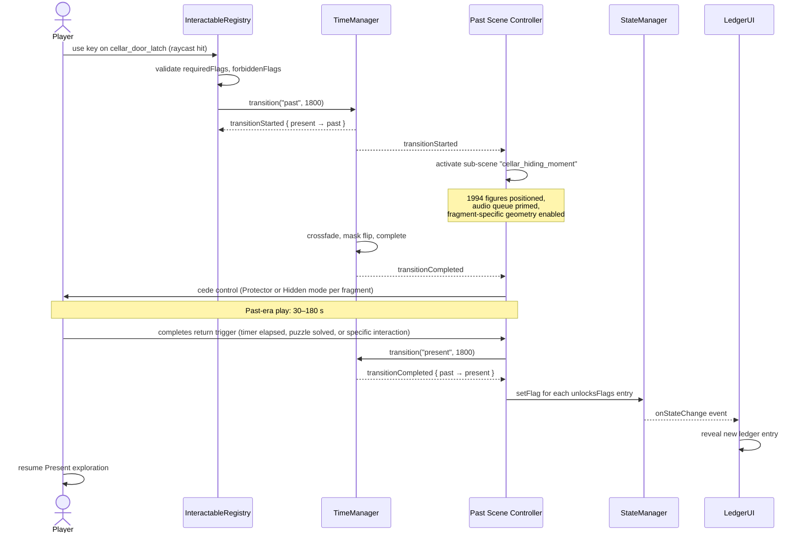

# Chronos Switch — Design Document

- **Status:** Draft (§1–§8 filled 2026-04-18)
- **Owner:** @royceshannon2
- **Parent:** [`MASTER.md`](MASTER.md) · **Architecture:** [`ARCHITECTURE.md §4`](../../ARCHITECTURE.md#4-era-representation-chronos)
- **Target code home:** `witness-interactive-vite/src/core/`
- **Related:** [`TIMELINE_SYNC.md`](TIMELINE_SYNC.md) — Past ⇄ Present state bridge (implemented) · [`RENDERING.md §5`](RENDERING.md#5-post-processing-pipeline) — per-era post-fx profile · [`AUDIO_ARCHITECTURE.md §4`](AUDIO_ARCHITECTURE.md#4-transition-audio) — transition audio.

The mechanic that returns the player between **Present (2026, investigator)** and **Past (1994, grandparent)**. One scene, two eras, crossfade-mediated. Not a scene swap. Not a time-travel adventure. An **echo**: the grandchild touches an artifact in the compound and briefly inhabits the moment the grandparent left it there. Control returns when the echo completes; the world in 2026 reflects what the player did in 1994.

---

## 1. Objective

The Chronos Switch is the project's only core mechanic. It exists to support one narrative claim:

> **The choices made in 1994 have physical, discoverable consequences in 2026.**

The player is never told what the grandparent did. They infer it by inhabiting the moment directly, then returning to a Present that has been quietly altered by their actions. The switch is the sole bridge between two otherwise-independent representations of the same place.

**What it is:**
- A per-frame visibility crossfade between two sets of meshes and lights that occupy the same world-space coordinates.
- A state bridge: see [`TIMELINE_SYNC.md`](TIMELINE_SYNC.md).
- An audio transition: see [`AUDIO_ARCHITECTURE.md §4`](AUDIO_ARCHITECTURE.md#4-transition-audio).

**What it is not:**
- A scene swap (no disposal, no reload, no loss of physics state).
- A time-travel fantasy (the player does not speak to the past; they witness it).
- Player-initiated outside of a Memory Fragment trigger (the player cannot toggle eras freely from a menu).
- A puzzle mechanic unto itself. The switch *reveals* what the Past did; it does not *ask* the player to solve puzzles by rapid era-swapping.

**Narrative purpose:** The game's PRD commits to "emotionally restrained, historically grounded" presentation. The Chronos Switch honors that by withholding: the Past is a quiet, short visit (30 s – 3 min), not a mission; the Present is the player's home base, where discoveries accumulate as traces.

---

## 2. Scope

**In scope:**
- The `TimeManager` runtime (`src/core/TimeManager.ts`, already implemented — see [`TIMELINE_SYNC.md`](TIMELINE_SYNC.md)).
- The layer-mask strategy for per-era visibility (already implemented — see `src/core/LayerMasks.ts`).
- Memory Fragment authoring, registration, and trigger mechanics.
- Per-era post-fx profile (defined here, implemented in `engine/RenderingPipeline.ts` — see [`RENDERING.md §5`](RENDERING.md#5-post-processing-pipeline)).
- Per-era lighting (defined here, implemented in `engine/Lighting.ts` — see [`RENDERING.md §4`](RENDERING.md#4-lighting-rig)).
- Transition sequence (crossfade curve, audio handoff, camera behavior).
- Perspective modes inside the Past era (`Protector`, `Hidden`).
- Return-from-Past trigger semantics.

**Out of scope:**
- Mesh/material authoring per era (see [`WORLD.md`](WORLD.md) and [`ASSET_PIPELINE.md`](ASSET_PIPELINE.md)).
- Narrative flag semantics beyond era-change events (see [`NARRATIVE.md`](NARRATIVE.md)).
- Save/load of era state (deliberately not persisted — see [`TIMELINE_SYNC.md §6`](TIMELINE_SYNC.md#6-integration-with-saveload)).
- UI for the ledger, reflection prompts, or investigator's interface (owned by `ui/`).
- Per-path scene variation (owned by `narrative/` + `world/locations/*`).

---

## 3. High-level design

### 3.1 Era model

```typescript
type Era = "present" | "past";
```

Exactly one era is active at any time. The initial era is `"present"` (the game begins with the grandchild arriving at the compound). Transitions are single-flight — overlapping `transition()` calls are rejected by the existing `isTransitioning` guard.

No era history is kept. A sequence `Present → Past → Present → Past` produces no different state than a single `Present → Past → Present`; the `StateManager` flags that accumulate are the only lasting record.

### 3.2 Layer masks

Implemented in `src/core/LayerMasks.ts`. Three masks + helpers:

| Constant | Bit | Meaning |
|---|---|---|
| `LAYER_PRESENT` | `0x10000000` | Geometry/lights visible only in 2026. |
| `LAYER_PAST` | `0x20000000` | Geometry/lights visible only in 1994. |
| `LAYER_SHARED` | `0x40000000` | Geometry visible in both (terrain, distant hills, water body). |
| `LAYER_ALL` | `LAYER_PRESENT \| LAYER_PAST \| LAYER_SHARED` | Convenience. |

Camera masks:

| Camera state | Mask | Sees |
|---|---|---|
| `CAMERA_MASK_PRESENT` | `LAYER_SHARED \| LAYER_PRESENT` | 2026 props + shared terrain. |
| `CAMERA_MASK_PAST` | `LAYER_SHARED \| LAYER_PAST` | 1994 props + shared terrain. |

**`LAYER_SHARED` semantics:** anything whose geometry and material are identical across eras. Ground mesh, distant hills, the lake body, the sky. Authors must be conservative — if a surface might gain moss, rust, or bullet holes between 1994 and 2026, it belongs in `LAYER_PAST` + `LAYER_PRESENT` variants, not `LAYER_SHARED`.

**Tagging helpers (already implemented):**
```typescript
tagNode(mesh, "past");        // mesh.layerMask = LAYER_PAST
tagNode(mesh, "present");     // mesh.layerMask = LAYER_PRESENT
tagNode(mesh, "shared");      // mesh.layerMask = LAYER_SHARED
tagLight(light, "past");      // light.includeOnlyWithLayerMask = LAYER_PAST
```

All world modules in `src/world/` must use these helpers rather than setting `layerMask` directly. Untagged geometry defaults to Babylon's `0x0FFFFFFF` and will appear in both eras — which is almost always wrong.

### 3.3 `TimeManager` class

The runtime owning era state. Already implemented — full API in [`TIMELINE_SYNC.md §3`](TIMELINE_SYNC.md#3-api). Recap:

```typescript
class TimeManager {
  attach(camera: Camera): void;
  transition(target: Era, duration?: number): Promise<void>;
  readonly currentEra: Era;
  readonly isTransitioning: boolean;
  recordPastChange(key: string, value?: boolean): void;
  hasPastChange(key: string): boolean;
  getPastChanges(): Record<string, boolean>;
  subscribe(listener: TimeListener): () => void;
}
```

**Re-entry rules:**
- `transition("past")` while `currentEra === "past"` is a no-op. No events emitted. (Same for `"present"`.)
- `transition(target)` while `isTransitioning` is a no-op and returns a resolved promise. The caller should not assume the earlier transition has completed; if it matters, it must `await` the original transition's promise.
- `attach(camera)` can be called before or after any transition. Switching cameras mid-transition is defined: the new camera receives the target mask at the end of the transition.

**Event emission order for a clean `Present → Past` transition:**
1. `transitionStarted { from: "present", to: "past" }` (synchronous, before any mask change).
2. Pipeline A fades out, pipeline B fades in over `duration` ms (§3.6).
3. Camera mask flips at crossfade midpoint (50% opacity crossover).
4. `transitionCompleted { from: "present", to: "past" }` (after `duration` ms).

### 3.4 Post-fx profiles per era

Detailed in [`RENDERING.md §5`](RENDERING.md#5-post-processing-pipeline). Summary here:

| Dimension | Present (2026) | Past (1994) |
|---|---|---|
| Saturation | -15% (overgrown, damp, muted) | +10% (vivid afternoon, warm April light) |
| Color grade | Cool, blue-green shadows | Warm, amber highlights |
| Contrast | Low (overcast, soft) | Medium-high (direct sun, hard shadows) |
| Vignette strength | 0.6 (heavier, closed in) | 0.3 (open, exposed) |
| Film grain | 0.4 (archival feel) | 0.15 (more present, less self-conscious) |
| Fog density | 0.028 (valley mist, visible at 40 m) | 0.012 (clear morning, distant hills visible) |
| Bloom threshold | 1.2 (only direct sun) | 0.9 (afternoon sun on tin roofs, water glints) |

Rationale: the 2026 Present should read as *the documentary present* — quiet, a little faded, like the light after a long absence. The 1994 Past should read as *the day as it was lived* — immediate, sharp, full of afternoon. Neither era is "stylized"; the PRD's restraint rule binds both. These curves are small.

### 3.5 Lighting strategy

**Duplication, not animation.** One `DirectionalLight` per era, one `HemisphericLight` per era. Each is created at scene init and tagged via `tagLight(light, era)`; Babylon's `includeOnlyWithLayerMask` ensures the light only influences meshes of the matching era.

| Light | Present | Past |
|---|---|---|
| Sun (Directional) | Overcast, cool (6500 K), intensity 0.6, high horizon angle | Afternoon, warm (4500 K), intensity 1.4, declining 40° |
| Sky (Hemispheric) | Muted gray-blue, intensity 0.4 | Warm amber, intensity 0.5 |
| Shadow map | PCSS, 2048 px, soft | PCSS, 2048 px, harder |
| Environment texture | Overcast `.env`, Bisesero wet-season morning | Clear `.env`, Bisesero April afternoon |

Why duplication over animation:
- Cleaner crossfade: we blend two pipelines and two light sets; no intermediate interpolation artifacts.
- Cheaper at runtime: `setEnabled` toggles; no per-frame shader params.
- Authorable: each era's lighting can be iterated independently by an artist without breaking the other.

VRAM cost: small. Two `.env` textures (~4 MB each compressed), two shadow maps (8 MB RGBA32F at 2048 px). Well within budget for a mid-range GPU.

### 3.6 Transition sequence

Total duration **1.8 s** (tuned to match AUDIO_ARCHITECTURE's 2–3 s entry envelope with 0.3 s audio headroom on each side).

```
t = 0.00 s   transitionStarted event
             camera begins slowing input (deadzone + low-pass on mouse)
             narrator voice of the grandparent fades in (-∞ → -12 dB over 0.6 s)

t = 0.00–0.90 s
             pipeline A (outgoing era) opacity: 1.0 → 0.0 (ease-in-out cubic)
             ambience A volume: 1.0 → 0.0

t = 0.45 s   crossover midpoint — camera.layerMask flips

t = 0.90–1.80 s
             pipeline B (incoming era) opacity: 0.0 → 1.0 (ease-in-out cubic)
             ambience B volume: 0.0 → 1.0 over 1.3 s
             narrator voice remains present at -12 dB

t = 1.80 s   transitionCompleted event
             input control restored
             interaction system re-enables raycast picking
             first diegetic sound allowed to play (footstep, wind gust)
```

**Crossfade curve:** ease-in-out cubic, symmetric. `f(t) = t² · (3 - 2t)` where `t ∈ [0, 1]`.

**Camera behavior:**
- Position, rotation, field of view are **preserved across transition** by default (the player's framing of the artifact is what triggered the echo; they should arrive looking at the same space from the same angle).
- This addresses MASTER.md §10 Q1 provisionally (leaning "preserve, not snap"). An override for scripted anchors is supported via a `transitionOptions.anchor` parameter to be added when needed; not yet implemented.
- Camera height adjusts silently if the ground elevation differs between era meshes by more than 0.05 m (snap to Past ground, no animation). This should be rare — shared terrain is the default.

**Audio handoff:** driven by `AudioManager` subscribing to `transitionStarted`/`transitionCompleted`. See [`AUDIO_ARCHITECTURE.md §4`](AUDIO_ARCHITECTURE.md#4-transition-audio).

**Physics:** Havok aggregates tagged to the outgoing era are disabled at `transitionStarted`; aggregates for the incoming era are enabled at `transitionCompleted`. No physics runs during the crossfade. Player character controller is frozen in place (null velocity) for the duration to prevent falls if terrain differs slightly.

---

## 4. Memory Fragments

### 4.1 What a Fragment is

A **Memory Fragment** is a Present-era interactable that, when the player engages it at close range with the use key, triggers a `Present → Past` transition. Each Fragment is tied to:

- A specific anchor object in the world (the cellar door latch, the boat paddle propped against the dock, the notebook on the shrine).
- A specific narrative flag it consumes or sets (`found_cellar_evidence`, `puzzle_a3_complete`, etc.).
- A specific Past-era scene state (camera position, active NPCs or silhouettes, audio cue, duration).
- A specific ledger entry it unlocks when the echo completes.

Fragments are the *only* way to enter the Past era in normal gameplay. There is no era-toggle menu. A debug mode may provide one for development, behind a dev-only build flag.

### 4.2 Authoring format

Fragments live in `src/world/fragments/` as TypeScript modules (one file per fragment, named by anchor). Each module exports a single `Fragment` object:

```typescript
export interface Fragment {
  id: string;                               // stable, e.g. "cellar_door_latch"
  anchorLocation: string;                   // "family_compound_cellar"
  triggerMeshName: string;                  // name of the Babylon mesh that carries the interactable
  requiredFlags: string[];                  // narrative flags required to be set
  forbiddenFlags?: string[];                // flags that disqualify (for already-consumed fragments)
  triggersPastScene: string;                // id of the Past-era scene state to activate
  unlocksFlags: string[];                   // flags set on successful echo completion
  unlocksLedgerEntry?: string;              // id of the ledger entry to reveal
  pastEraDuration: number;                  // seconds the player remains in the Past (cap, 30–180 s)
  returnTrigger: "timer" | "puzzle" | "interaction";  // see §4.3
  perspectiveMode: "protector" | "hidden";  // §5
}
```

Authoring a new Fragment is a four-step edit: create the module, register it (§4.3), add the corresponding `requiredFlags`/`unlocksFlags` to `Graph.json`, subscribe the Past-era scene to the fragment's trigger event.

### 4.3 Registration and lifecycle

`src/interaction/InteractableRegistry.ts` owns the lifecycle. At scene init:

1. Each location module in `src/world/locations/*` imports its fragments and calls `fragmentRegistry.register(fragment)`.
2. The registry attaches a pointer-over highlight on the `triggerMesh`, gated by `requiredFlags` (mesh hidden or muted if flags not met).
3. On player `use` input while raycast hits the trigger mesh:
   - Registry checks `requiredFlags` (all must be true) and `forbiddenFlags` (none may be true).
   - On pass, the registry emits `fragmentActivated` and calls `timeManager.transition("past")` with a fragment-specific duration override.
   - On fail, no error — the object is simply not reactive. (Design intent: the player should not be told *why* something isn't interactable yet; they should keep exploring.)
4. At `transitionCompleted { to: "past" }`, the Past-era scene is given the fragment's `triggersPastScene` id and activates the corresponding authored state (figure positions, audio cue, sub-scene mesh visibility).
5. When the Past era ends (§4.4), the Present's anchor mesh calls `unlocksFlags.forEach(f => globalState.setFlag(f, true))` and the corresponding ledger entry is written. The Fragment is *not* disabled by default (see Q2 in §9).

### 4.4 Interaction flow



Cross-reference: [`ARCHITECTURE.md §3.1`](../../ARCHITECTURE.md#31-interaction-sequence) shows the same flow at a higher level.

### 4.5 Link between Fragment and `Graph.json` node

Each Fragment corresponds to at most one narrative node in `Graph.json`. The mapping is:

- `Fragment.requiredFlags` ⊆ the `unlocksFlags` of some ancestor node in `Graph.json`.
- `Fragment.unlocksFlags` ⊆ the `unlocksFlags` of its target node in `Graph.json`.
- The Fragment's `triggersPastScene` id is referenced by the corresponding `act_3X_puzzle_N` node as its `pastSceneRef` (new field, to be added when the first Fragment is wired).

This gives us a bidirectional check: a fragment with no matching graph node is an authoring error (the echo would unlock nothing). A graph node with no corresponding fragment is also an error (the narrative advances with no diegetic trigger).

---

## 5. Perspective modes (inside Past era)

Within the Past era, the grandparent's body is the player's body. But the grandparent's agency varies by scene: sometimes they are actively hiding neighbors (*Protector*), sometimes frozen in a hiding place themselves (*Hidden*). The Perspective mode is a per-Fragment authoring decision, not a player choice.

### 5.1 `Protector` mode

**Movement:** full walk speed (1.4 m/s), free look, standard FOV (70°).
**Input:** all standard interactions enabled; use key active.
**Audio:** standard mix; diegetic effects position spatially.
**Visual:** no FOV clamp, no vignette modifier beyond the era's baseline.
**Duration:** typically 90–180 s.
**Return trigger:** usually `"puzzle"` (completes when a specific interaction is performed — placing an item, opening a latch, giving water).

Used for fragments where the player performs the act of protection: the Path A cellar-hiding echo, the Path B boat-loading echo.

### 5.2 `Hidden` mode

**Movement:** crouched, slow (0.5 m/s), constrained to a small volume (radius 1.5 m from spawn).
**Input:** use key disabled except on a single scripted object per scene.
**Audio:** stress cues forward (breath, heartbeat very low, distant militia clearer); ambience slightly ducked.
**Visual:** FOV clamped to 50°; soft vignette intensified to 0.5; bloom reduced.
**Duration:** typically 30–90 s — deliberately shorter than Protector.
**Return trigger:** usually `"timer"` (the player cannot choose when to return; the moment ends on its own). A `"interaction"` variant exists for one specific fragment: opening the eye of the rugo thatch to look outside ends the echo.

Used for fragments where the grandparent was the one being protected, or was frozen in witness: the Path C ravine-silence echo, the observer's night-watch echo.

**Important:** Hidden mode is *not* a horror mechanic. No jump scares. The PRD's restraint rule holds: stress is created by sustained quiet, breathing, distant sounds. Stress cues are designed per [`AUDIO_ARCHITECTURE.md §6`](AUDIO_ARCHITECTURE.md#6-dynamic-audio-mixing-rules).

### 5.3 Transition between modes

Mode is set at Fragment authoring time and does not change during a single echo. There is no in-echo "upgrade" or "downgrade." Subsequent Past visits triggered by different Fragments can use different modes. The mode is communicated to the player diegetically — being placed in the cellar with no movement affordance reads as "hidden"; being placed at the door with a neighbor waiting reads as "protector."

---

## 6. Trade-offs and alternatives

### A. Layer mask vs. scene swap

**Chosen:** layer mask.

A single `Scene` holds both eras. `layerMask` on meshes/lights and `mask` on the active camera gate visibility. `setEnabled(false)` is *not* used for era hiding — only for per-fragment sub-scene state.

**Alternative A1: scene swap.** Each era as a separate Babylon `Scene`. At transition, the outgoing scene is paused or disposed, the incoming is activated.

| Aspect | Layer mask | Scene swap |
|---|---|---|
| Transition cost | One mask write, no GC | Scene dispose or pause; physics world rebuild |
| Physics continuity | Possible (shared Havok world) | Impossible (each scene has its own) |
| Camera continuity | Free | Requires explicit position/rotation copy |
| Authoring | One location file per place; per-era variants inside | Two files per place, likely duplication |
| Memory footprint | Both era's meshes resident | Only active era resident |
| Shader compile | Both sets compile at load | Lazy compile on scene swap (stutter risk) |

**Why masks win:** the transition stutter of a scene swap (shader recompile, Havok rebuild) breaks the "echo" illusion. Our memory overhead is modest — each location has ~2× the static geometry, but that geometry is low-poly (props, not dense environments). The VRAM math works.

### B. Camera snap vs. preserve (on era change)

**Chosen provisionally:** preserve (default); scripted anchor available as an opt-in per-fragment override.

The PRD calls for "restraint." Snapping the camera to a pre-authored anchor in 1994 asserts a cinematographic intent ("look here now"). Preserving the player's framing respects the player's authorship of the moment — they were looking at the cellar door latch; they remain looking at the cellar door latch, but now in 1994.

**Alternative B1: unconditional snap.** Author chooses framing for every Past scene.

**Trade-off:** snap produces a cleaner, more directed moment. Preserve produces a more discovered one. We lean preserve because discovery is the mechanic the game is *about*. Exceptions (climactic moments, path endings) use the per-fragment `transitionOptions.anchor` opt-in.

This partly addresses MASTER.md §10 Q1, but the question remains open pending first-fragment implementation.

### C. Duplicated lights vs. animated single lights

**Chosen:** duplicated. See §3.5.

**Alternative C1:** single `DirectionalLight` whose direction, color, and intensity lerp between era values during transition.

**Why duplication:** per-era lighting parameters are too dissimilar to interpolate cleanly. 2026 overcast → 1994 direct afternoon is not a color-temperature shift; it's a completely different sky. Interpolating produces an unpleasant in-between state. Duplicated lights with layer masks let each era be lit by an artist without compromise.

### D. Per-era `.env` vs. shared `.env` + per-era grading

**Chosen:** per-era `.env`.

Baked environment textures capture lighting that image-space grading cannot approximate (sky gradient, directional specular). Two `.env` files cost ~8 MB compressed. Cheap.

---

## 7. Failure modes

| Failure | Detection | Mitigation |
|---|---|---|
| Transition interrupted by second `transition()` call. | `isTransitioning` guard inside `transition()`. | Second call is dropped and returns resolved. Subsystems that care must `await` the first. |
| Fragment triggered while already in target era. | `triggersPastScene` activation gated on `transitionCompleted` event; if called while already in target era, the event never fires. | `InteractableRegistry` checks `timeManager.currentEra` before calling `transition()`. If already in target, no-op. |
| Save file captured mid-transition. | `isTransitioning` true at save time. | Save system refuses writes while `isTransitioning`; `SaveSystem.save()` returns `false` with reason `"transitioning"`. |
| Save file loaded on an era with mesh state not yet ready. | `AssetContainer` still loading at deserialize time. | Deserialize into `globalState` unconditionally; `world/` modules subscribe to `pastChangeRecorded` and render when their meshes are ready. First render may show "nothing happened" branch then flip. |
| Memory pressure from duplicated mesh sets. | Runtime FPS drop / VRAM warning. | Per-location mesh budget (see [`RENDERING.md §7`](RENDERING.md#7-performance-budget)). Each era variant capped; shared mesh preferred when plausible. |
| Fragment authored with `unlocksFlags` not consumed by any `Graph.json` node. | Authoring-time lint (not yet written). | Planned: `tools/validate_fragments.py` walks `src/world/fragments/*` and `Graph.json`, fails on unreachable flags. |
| Camera detached during a transition. | `applyMask` silently no-ops when `camera === null`. | Event still fires; re-attaching a camera later picks up the current era's mask via `attach()`. |
| Past-era timer expires while player is mid-interaction (e.g., placing an item). | `PastSceneController` tracks `activeInteraction`. | Timer waits for `activeInteraction === null` before calling `transition("present")`. Maximum grace: 3 s. |
| Webgl context loss during transition. | `engine.onContextLostObservable`. | On regain: force `transition(currentEra, 0)` to re-apply masks; re-bake any pipeline that lost its state. |

---

## 8. Milestones

**M1 — Runtime foundation.** *Complete (2026-04-17).* `TimeManager`, `LayerMasks`, `TIMELINE_SYNC.md`. Type-check clean. Unit tests pending.

**M2 — Transition visual/audio.** Wire `RenderingPipeline` per-era variants with crossfade. Wire `AudioManager` transition envelope. No Fragment yet; tested with a dev-only keyboard toggle.

**M3 — First Fragment.** One authored Fragment end-to-end: `cellar_door_latch` in Family Compound. Protector mode. Triggers Past scene "finding_neighbors_in_cellar" (8 silhouettes, dim light, narrator line). Unlocks `found_cellar_evidence` and ledger entry 1. This is the vertical slice target from [`MASTER.md §7`](MASTER.md#7-work-ordering).

**M4 — Second Fragment, Hidden mode.** `observer_notes` in Ravine. Hidden mode. Triggers Past scene "ravine_night_watch."

**M5 — Fragment registry + authoring tool.** `tools/validate_fragments.py`. Per-fragment JSON schema in `prompts/` for authoring with AI assistance.

**M6 — Full Act 2 fragments.** All four evidence anchors wired. Cross-path fragments working.

**M7 — Act 3 path fragments.** Per-path Fragment set. ~4 fragments per path × 3 paths = 12 Fragments.

**M8 — Polish.** Per-fragment camera anchor overrides for climactic beats. Return-to-save handling post-crash.

---

## 9. Open questions

Any question here that becomes answered with rationale should move to [`docs/decisions/adrs/`](../decisions/adrs/) as an ADR.

- Q1: **Snap vs. preserve camera on era change.** Provisionally answered in §3.6 (preserve default; per-fragment anchor override). Re-evaluate after M3 playtesting.
- Q2: **Do Fragments persist after triggering (revisitable) or disappear?** Leaning *persist, but echo duration shortens on re-trigger* (e.g. 180 s first visit, 30 s on repeat — the player revisits a known moment). Decide at M3.
- Q3: **How is the return from Past triggered?** Answered by Fragment `returnTrigger` field (§4.2). Three variants: `timer`, `puzzle`, `interaction`. The mix for a full game: ~30% timer, ~50% puzzle, ~20% interaction — subject to change.
- Q4: **Does Hidden mode allow the player to pause?** A paused game is a pause; does it break the "held breath" feeling? ADR candidate after M4.
- Q5: **Are there any Past → Past transitions?** I.e., does the player ever directly move between two 1994 moments without returning to 2026 first? Current answer: no. All Past scenes are anchored to a Present fragment; the player must return to Present to trigger the next Past scene. This is a deliberate narrative constraint — the Past is always framed by the act of remembering. Revisit if playtesting shows the return-to-Present rhythm is wearying.
