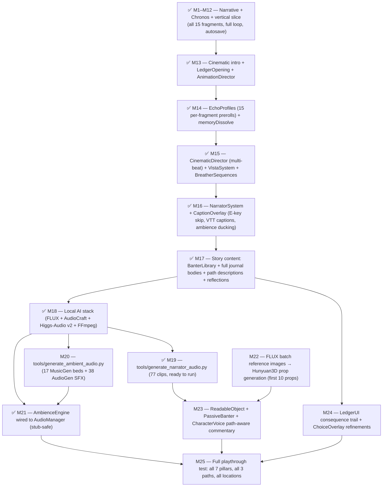

# Witness Interactive 3D — Master Design Document

- **Status:** Draft
- **Owners:** @royceshannon2
- **Last updated:** 2026-05-21

This document is the umbrella. It names what the project is, what exists today, what is missing, and which per-subsystem design doc owns each detail. It deliberately does **not** duplicate content from those docs — it links to them.

---

## 1. Vision

A first-person, photoreal, historically grounded interactive work set in the Bisesero Hills of Rwanda's Western Province. The player returns as a modern-day investigator (2026) to a grandparent's abandoned compound and, by touching environmental evidence, snaps into 1994 to re-live fragments of the Rwandan genocide from the grandparent's perspective. Progress is non-linear: players reconstruct a single night from three morally valid interpretations of the same evidence. The game never judges the interpretation — it only reveals what each entails.

Built on **Babylon.js 9** + **Havok Physics**, with assets generated locally on an RTX 5090 via **Hunyuan3D 2.1**, baked to 8K PBR, and delivered as Draco/KTX2-compressed `.glb`.

See: [`PRD.md`](PRD.md) for the full product vision and acceptance criteria.

---

## 2. Repository map

Complete inventory with honest status. Status values:

- **production** — meets quality bar, actively used
- **skeleton** — real code, correct shape, thin
- **prototype** — works but unacceptable for shipping
- **stub** — placeholder file, empty or near-empty
- **stale** — contradicts current direction, must be removed or rewritten
- **empty** — directory exists with no useful content

```
Witness-Interactive-3D/
├── CLAUDE.md                                       production
├── ARCHITECTURE.md                                 production   (2026-05-20)
├── SCALABILITY_PLAN.md                             production
├── .claude/rules/                                  production
│   ├── asset-pipeline.md
│   ├── babylon-patterns.md
│   ├── documentation.md
│   └── documentation-standards.md
├── audios/
│   ├── narrator/manifest.json                      production   (key→file map, 77 entries)
│   ├── narrator/*.wav                              missing      (M19 generation pending)
│   ├── ambience/                                   missing      (M20 pending)
│   └── sfx/                                        missing      (M20 pending)
│   └── [GDC game audio bundle]                    library      (pre-licensed SFX/music library)
├── model_cache/huggingface/                        production   (FLUX, AudioCraft, Higgs-Audio weights)
├── processed/                                      empty        (Hunyuan3D output lands here)
├── prompts/asset-templates/                        skeleton     (15 prompt templates, no ref images yet)
├── tools/
│   ├── asset_pipeline.py                           production   (orchestrator: stage 0→0.25→0.5→1→2→opt→reg)
│   ├── generate_asset.py                           production   (Hunyuan3D stage 1)
│   ├── generate_ref_image.py                       production   (FLUX stage 0)
│   ├── refine_ref_image.py                         production   (FLUX stage 0.25)
│   ├── generate_multi_views.py                     production   (Zero123++ stage 0.5)
│   ├── texture_asset.py                            production   (AI-projection + Blender PBR bake)
│   ├── optimize_asset.py                           production   (Draco + KTX2 + LOD)
│   ├── register_asset.py                           production   (writes docs/asset-index.md)
│   ├── export_babylon.py                           production   (copies to public/assets/)
│   ├── validate_fragments.py                       production   (exit 0, 15/15)
│   ├── generate_narrator_audio.py                  production   (M19; 77 clips; tokenizer fix applied 2026-05-21)
│   ├── generate_scene.py                           skeleton
│   ├── blender/bake_pbr.py                         production
│   ├── blender/material_families.py                production
│   ├── blender/render_validation.py                production
│   ├── HUNYUAN_RUNBOOK.md                          production
│   ├── COMFY_RUNBOOK.md                            production
│   ├── M18_INSTALL_RUNBOOK.md                      production   (AI stack install; complete)
│   └── example-manifest.json                       production
├── docs/
│   ├── design-docs/
│   │   ├── MASTER.md                               this doc
│   │   ├── MISSION_BLUEPRINT.md                    production
│   │   ├── AUDIO_ARCHITECTURE.md                   production
│   │   ├── NARRATIVE.md                            production
│   │   ├── WORLD.md                                production
│   │   ├── PUZZLE_DESIGN.md                        production
│   │   ├── CHRONOS_SWITCH.md                       production
│   │   ├── ASSET_PIPELINE.md                       production
│   │   ├── RENDERING.md                            production
│   │   ├── OPENING_SEQUENCE.md                     production
│   │   ├── PHASE1_ASSET_LIST.md                    production   (15 assets; none through Hunyuan yet)
│   │   └── 0000-design-doc-template.md             production
│   ├── decisions/
│   │   ├── CHANGELOG_DETAILED.md                   production   (21 entries)
│   │   ├── adrs/0000-template.md                   production
│   │   └── adrs/0001-narrative-edge-cases.md       production
│   ├── asset-index.md                              skeleton     (populated by register_asset.py)
│   └── reference/Documentation/                   production   (cloned Babylon.js docs)
└── witness-interactive-vite/
    ├── package.json                                production   (Babylon 9, Vite 8, TS 5.9)
    ├── index.html                                  production
    ├── src/
    │   ├── log.ts                                  production
    │   ├── bootstrap/
    │   │   ├── main.ts                             production   (full narrative wiring + autosave)
    │   │   ├── IntroSequence.ts                    production
    │   │   ├── LedgerOpening.ts                    production
    │   │   ├── ChoiceOverlay.ts                    production   (with path descriptions)
    │   │   ├── RemembranceSequence.ts              production
    │   │   └── BreatherSequences.ts                production
    │   ├── core/
    │   │   ├── TimeManager.ts                      production
    │   │   ├── LayerMasks.ts                       production
    │   │   ├── MemoryFragment.ts                   production
    │   │   ├── PastSceneController.ts              production
    │   │   ├── AnimationDirector.ts                production
    │   │   ├── EchoProfiles.ts                     production   (15 per-fragment profiles)
    │   │   ├── CinematicDirector.ts                production   (multi-beat sequencer)
    │   │   ├── VistaSystem.ts                      production
    │   │   └── index.ts                            production
    │   ├── engine/
    │   │   ├── SceneFactory.ts                     skeleton
    │   │   ├── RenderingPipeline.ts                production
    │   │   ├── Lighting.ts                         skeleton
    │   │   ├── Materials.ts                        skeleton
    │   │   ├── Physics.ts                          stub         (Havok not installed)
    │   │   ├── config.ts                           production
    │   │   └── index.ts                            production
    │   ├── world/
    │   │   ├── Terrain.ts                          skeleton
    │   │   ├── locations/
    │   │   │   ├── FamilyCompound.ts               prototype    (15 TODO(asset-pipeline) annotations)
    │   │   │   ├── LakeShore.ts                    prototype
    │   │   │   ├── Ravine.ts                       prototype
    │   │   │   └── index.ts                        production
    │   │   ├── vegetation/index.ts                 stub
    │   │   ├── structures/index.ts                 stub
    │   │   ├── props/index.ts                      stub
    │   │   └── index.ts                            production
    │   ├── narrative/
    │   │   ├── StateManager.ts                     skeleton
    │   │   ├── Actions.ts                          skeleton
    │   │   ├── NarrativeController.ts              skeleton
    │   │   ├── LedgerStore.ts                      production   (optional body field)
    │   │   ├── BanterLibrary.ts                    production   (50+4+4+3 lines, 3 descriptions, 16 entries)
    │   │   └── Graph.json                          production   (35 nodes, 4 acts, 3 paths)
    │   ├── interaction/
    │   │   ├── PlayerController.ts                 skeleton
    │   │   ├── InteractableRegistry.ts             production   (hasNearby())
    │   │   ├── InteractableHighlight.ts            production
    │   │   ├── Perspective.ts                      stub
    │   │   └── index.ts                            production
    │   ├── audio/
    │   │   ├── AudioManager.ts                     production
    │   │   ├── AmbienceEngine.ts                   production   (stub-safe, single-flight swap chain)
    │   │   ├── NarratorSystem.ts                   production   (stub-safe, E-key skip, ducking)
    │   │   └── index.ts                            production
    │   ├── ui/
    │   │   ├── HUD.ts                              production
    │   │   ├── LedgerUI.ts                         production   (body-text rendering)
    │   │   ├── CaptionOverlay.ts                   production
    │   │   └── index.ts                            production
    │   ├── io/
    │   │   ├── AssetLibrary.ts                     skeleton
    │   │   ├── SplatLibrary.ts                     skeleton
    │   │   ├── TilesetMount.ts                     skeleton
    │   │   ├── SaveSystem.ts                       skeleton
    │   │   ├── _3dTilesAdapter.ts                  skeleton
    │   │   └── index.ts                            production
    │   ├── mission/
    │   │   ├── MissionLoader.ts                    skeleton
    │   │   ├── Manifest.ts                         skeleton
    │   │   └── index.ts                            production
    │   └── performance/
    │       ├── PerformanceManager.ts               skeleton
    │       ├── SceneOptimizerFactory.ts            skeleton
    │       └── index.ts                            production
    └── style.css                                   production
```

---

## 3. Subsystem list

Each subsystem owns a design doc and will own a directory under `src/`. The master doc is the only place the full list lives; every other doc stays scoped to its one concern.

| Subsystem | Purpose | Design doc | Code home |
|---|---|---|---|
| **Narrative** | State, flags, branches, authored text, ledger | [`NARRATIVE.md`](NARRATIVE.md) + [`PUZZLE_DESIGN.md`](PUZZLE_DESIGN.md) | `src/narrative/` |
| **Chronos (Time)** | Present↔Past era switching, memory fragments, cinematic sequencer, vistas | [`CHRONOS_SWITCH.md`](CHRONOS_SWITCH.md) | `src/core/` |
| **World** | Terrain, locations (compound/cellar/lake/ravine/heights), vegetation, props | [`WORLD.md`](WORLD.md) | `src/world/` |
| **Rendering** | Scene, lighting, post-fx, materials | [`RENDERING.md`](RENDERING.md) | `src/engine/` |
| **Assets** | Hunyuan3D pipeline, bake, compress, load | [`ASSET_PIPELINE.md`](ASSET_PIPELINE.md) · [`.claude/rules/asset-pipeline.md`](../../.claude/rules/asset-pipeline.md) | `tools/`, `src/io/` |
| **Physics** | Havok integration | (section in RENDERING.md) | `src/engine/Physics.ts` |
| **Interaction** | Input, raycast, pickup, fragment triggers, highlight | (section in CHRONOS_SWITCH.md) | `src/interaction/` |
| **Audio** | Ambience beds, narrator queue, SFX, era crossfades | [`AUDIO_ARCHITECTURE.md`](AUDIO_ARCHITECTURE.md) | `src/audio/`, `tools/generate_*_audio.py` |
| **UI** | Ledger, HUD, captions, choice overlay, remembrance | (ARCHITECTURE.md §5.6, §5.8) | `src/ui/`, `src/bootstrap/` |
| **Bootstrap** | Engine + canvas lifecycle, mission wiring, cinematic sequences | (ARCHITECTURE.md §5.8) | `src/bootstrap/` |
| **Performance** | Profile detection, freeze pass, SceneOptimizer | (ARCHITECTURE.md §5.10, §6, §7) | `src/performance/` |

---

## 4. Target source layout

The full subsystem tree is now in place. See §2 (repository map) for the per-file status. Detailed module responsibilities, public APIs, and dependency arrows live in [`ARCHITECTURE.md`](../../ARCHITECTURE.md).

---

## 5. Current state, honestly

The project is **roughly 50% implemented** against the vision. The full narrative loop (all 4 Acts, all 3 paths, Remembrance, New Game+) runs end-to-end. All cinematic and audio infrastructure is in place. What remains is content generation (audio + 3D assets) and production-quality 3D environments.

**What is fully working (playable today):**
- Complete 35-node narrative graph with branching, flags, and save/load.
- All 15 Memory Fragments with per-fragment echo profiles, era transitions, and cinematic prerolls.
- Cinematic intro → LedgerOpening → Act 2 evidence loop → Act 3 ChoiceOverlay → all three path puzzles → RemembranceSequence. Full loop plays without errors.
- J-key ledger with full body text for all 16 entries. F5/F9 manual save/load. `?resume=1` autosave rehydration.
- Three breather sequences between acts. Vista system wired (no vistas registered yet — locations are primitives).
- Audio infrastructure: AmbienceEngine (stub-safe), NarratorSystem (stub-safe, E-key skip, ambience ducking), CaptionOverlay.
- "Archival Solemnity" UI design system: fully DOM-based HUD (compass, echo indicator, ledger badge, interaction prompt, toast), LedgerUI (grid + detail panel), CaptionOverlay (speaker name, styled captions), ChoiceOverlay (roman-numeral list, keyboard quick-select). No `@babylonjs/gui` dependency in any UI module.
- `npm run build` — clean TypeScript compile, zero errors.
- `tools/validate_fragments.py` — 15/15 pass, exit 0.

**What is authored but not yet generated:**
- 77 narrator WAV clips — `tools/generate_narrator_audio.py` is ready to run (M19).
- 17 ambient music beds + 38 SFX clips — `tools/generate_ambient_audio.py` not yet written (M20).
- `.vtt` caption files — planned alongside M19 audio.

**What is design-only (not yet built):**
- Bisesero Hills 3D environments. All five locations (`FamilyCompound`, `LakeShore`, `Ravine`, plus `Cellar` and `Heights` not yet created) are primitive scaffolds with `TODO(asset-pipeline)` annotations. No Hunyuan3D mesh has been generated for Phase 1 yet.
- Havok physics — not installed. `engine/Physics.ts` is a stub.
- `PassiveBanter` system (M23) — `BanterLibrary.ts` text is ready; the spatial trigger system is not.
- `CharacterVoice.ts` path-aware narrator variants (M23) — not built.
- `ReadableObject.ts` close-up prop interaction (M23) — not built.
- LedgerUI consequence trail + ChoiceOverlay refinements (M24) — partially done (descriptions wired; consequence trail not).
- Playwright integration tests — not started.

---

## 6. Gap matrix

Each subsystem rated across four gates. `—` = not applicable.

| Subsystem | Designed | Documented | Implemented | Tested |
|---|---|---|---|---|
| Narrative (state + events) | ✅ | ✅ | 🟡 skeleton (wired but thin) | ❌ |
| Narrative content (Graph.json) | ✅ | ✅ | ✅ (35 nodes, 4 acts, 3 paths) | 🟡 validate_fragments exit 0 |
| Story text (BanterLibrary) | ✅ | ✅ | ✅ (77 narrated lines authored) | — |
| LedgerStore + LedgerUI | ✅ | ✅ | ✅ (toast + body, autosave) | ❌ |
| Chronos Switch (TimeManager) | ✅ | ✅ | ✅ | ❌ |
| Memory Fragments (15) | ✅ | ✅ | ✅ (all 15 with EchoProfiles) | 🟡 validate_fragments exit 0 |
| CinematicDirector | ✅ | ✅ | ✅ (multi-beat, parallel, skip) | ❌ |
| VistaSystem | ✅ | ✅ | ✅ (wired; no vistas registered yet) | ❌ |
| BreatherSequences (3) | ✅ | ✅ | ✅ | ❌ |
| ChoiceOverlay (path descriptions) | ✅ | ✅ | ✅ | ❌ |
| RemembranceSequence | ✅ | ✅ | ✅ | ❌ |
| World — Bisesero locations | ✅ | ✅ | 🟡 primitive scaffolds, 3/5 locations | — |
| World — 3D assets (Phase 1) | ✅ | ✅ | ❌ (0/15 through Hunyuan) | — |
| Rendering pipeline | ✅ | ✅ | ✅ (memoryDissolve, fadeToEra, SSAO, ACES) | ❌ |
| Materials library | ✅ | ✅ | 🟡 skeleton | — |
| Physics (Havok) | ✅ | ✅ | ❌ (not installed) | ❌ |
| Asset pipeline tools | ✅ | ✅ | ✅ (stages 0→2, weights cached) | 🟡 stage 0.25 smoke test |
| Interaction / input | ✅ | ✅ | 🟡 skeleton + highlight | ❌ |
| Audio — infrastructure | ✅ | ✅ | ✅ (AmbienceEngine + NarratorSystem, stub-safe) | ❌ |
| Audio — narrator clips (77) | ✅ | ✅ | ❌ (M19 script ready, clips not generated) | — |
| Audio — ambient beds (17) | ✅ | ✅ | ❌ (M20 script not written) | — |
| Audio — SFX (38) | ✅ | ✅ | ❌ (M20 script not written) | — |
| PassiveBanter system | ✅ | 🟡 (plan only) | ❌ (M23) | ❌ |
| CharacterVoice (path-aware) | ✅ | 🟡 (plan only) | ❌ (M23) | ❌ |
| ReadableObject (prop close-up) | ✅ | 🟡 (plan only) | ❌ (M23) | ❌ |
| UI — HUD | ✅ | ✅ | ✅ | ❌ |
| UI — CaptionOverlay | ✅ | ✅ | ✅ | ❌ |
| Save/Load | ✅ | ✅ | 🟡 (localStorage autosave; SaveSystem skeleton) | ❌ |
| Performance profiles | ✅ | ✅ | 🟡 (SceneOptimizerFactory skeleton) | ❌ |
| Opening Sequence | ✅ | ✅ | ✅ (IntroSequence + LedgerOpening) | ❌ |

---

## 7. Work ordering

Completed milestones are marked ✅. Pending milestones are the active frontier.



**Active frontier:** M19 tokenizer schema bug fixed (2026-05-21) — run `tools/generate_narrator_audio.py` to generate the 77 narrator clips. M20 script (`tools/generate_ambient_audio.py`) needs to be written next. M22 (3D assets) unblocks M23 (passive world systems). M24 is pure code, unblocked now.

---

## 8. Documentation rules

From [`.claude/rules/documentation.md`](../../.claude/rules/documentation.md):

1. `ARCHITECTURE.md` is updated whenever a new service, schema, or API contract is introduced.
2. Every completed task appends a technical summary to `docs/decisions/CHANGELOG_DETAILED.md`.
3. Every new function/class has a docstring explaining its role in the larger architecture.
4. Diagrams are always Mermaid.

Design docs live under `docs/design-docs/`. ADRs (decisions with trade-offs that outlive a single task) live under `docs/decisions/adrs/`. Engineering-session notes live in `docs/mental-cache.md`. Auto-memory for Claude lives in `.claude/projects/witness-interactive/memory/` — not checked into design docs.

---

## 9. Glossary

Terms that show up across multiple docs. Definition lives here; other docs link back.

- **Act** — One of four narrative sections (Return, Evidence, Choice, Remembrance).
- **Bisesero** — The hills in Rwanda's Western Province where the game is set.
- **Branch** — A point in `Graph.json` where the player commits to one of multiple mutually-exclusive continuations.
- **Chronos Switch** — The mechanic that snaps the player between Present (2026) and Past (1994) eras.
- **Compound** — The grandparent's abandoned family home; the game's hub location.
- **Era** — One of two timeline states: `Present` (2026) or `Past` (1994).
- **Evidence** — Environmental artifact in Act 2 that suggests one of the three survival paths.
- **Flag** — A named boolean in `StateManager.progress.flagsSet`. Persisted across save/load.
- **Fragment** (Memory Fragment) — A Present-era world object that, when interacted with, triggers an era switch.
- **Ledger** — The grandfather's journal. The player's primary UI surface and the source of narrative text.
- **Letter** — The fragmented 1994 letter the grandchild carries. Drives Act 1 → Act 2 exploration.
- **Node** — A vertex in `Graph.json`. Types: `scene`, `puzzle`, `branch`, `event`, `ending`.
- **Path** — One of three branches from `act_3_the_choice`: Hider, Escapist, Observer (a.k.a. Silent).
- **Perspective mode** — Within Path A, a gameplay modifier: `Protector` (mobile) vs. `Hidden` (constrained).
- **Rugo** — A traditional Rwandan household compound; the building archetype used in the prototype.
- **Shepherd's Ledger** — The full title of the in-game narrative.

---

## 10. Unresolved questions

Things that must be decided before relevant work starts. Each should become an ADR when answered.

1. **Chronos Switch — snap vs. preserve camera?** On era change, does the camera teleport to a scripted anchor in the Past, or stay in place while the world transforms around the player? (Leaning snap. See `CHRONOS_SWITCH.md` when written.)
2. **Asset volume.** The target is four locations × two eras = 8 full environments. Is that in scope for v1, or does v1 ship with Compound only?
3. **Havok necessity.** `CLAUDE.md` mandates it. But if nothing in Acts 1–2 actually needs physics (no stacking, no debris simulation), is the cost worth the dependency footprint? Candidate ADR.
4. **Language / localization.** Is the ledger English-only, English + Kinyarwanda, or Kinyarwanda-first with English subtitles? Affects UI and audio scope.
5. **NPC authoring model.** `WORLD.md` says "no NPCs, only environmental storytelling," but the 1994 Past eras will plausibly need figures in the distance. Decide: silhouettes only, or full figures with animation?
6. **Target platforms.** Desktop browser only, or also VR (WebXR)? The Chronos Switch mechanic reads very differently in VR.

---

## 11. Where to go next

- Read [`PROTOTYPE_AUDIT.md`](../current-state/PROTOTYPE_AUDIT.md) before touching `main.ts`.
- Read [`NARRATIVE.md`](NARRATIVE.md) and [`PUZZLE_DESIGN.md`](PUZZLE_DESIGN.md) to understand the story content.
- Read [`WORLD.md`](WORLD.md) for the environmental target.
- Read [`CHRONOS_SWITCH.md`](CHRONOS_SWITCH.md) for the core mechanic spec (once written).
- Read [`ARCHITECTURE.md`](../../ARCHITECTURE.md) for module boundaries and dependency graph.
