# The Shepherd's Ledger: Complete Story Tree

## Narrative Overview
**Title**: The Shepherd's Ledger  
**Setting**: Bisesero Hills, Western Province, Rwanda  
**Time**: Modern day (2026) discovering events from June 1994  
**Mechanic**: Environmental discovery → Evidence gathering → Branching interpretation → Ending

Players reconstruct a single night in June 1994 by finding scattered evidence. Their interpretation of that evidence determines which of three narrative paths they follow, each revealing a different choice their grandfather made—and its consequences.

---

## Full Story Tree (Mermaid Diagram)

```mermaid
graph LR
    Start["🏠 Return to the Compound<br/>(Modern Day 2026)"]
    
    Start --> Explore["🔍 Explore the Ruins<br/>(Free Exploration)"]
    Explore --> FindJournal["📖 Discover the Ledger<br/>(Main Journal)"]
    
    FindJournal --> Choice{"⚖️ Interpret the Evidence<br/>(Which path led to survival?)"}
    
    Choice -->|Find: Hidden Cellar<br/>Food Stores, Sleeping Mats| PathA["🏥 THE HIDER<br/>(The Path of the Righteous)"]
    Choice -->|Find: Boat Paddle<br/>Lake Route Map| PathB["⛵ THE ESCAPE<br/>(The Path of the Survivor)"]
    Choice -->|Find: Observer's Notes<br/>Neutral Stance Evidence| PathC["🤐 THE SILENT<br/>(The Path of the Observer)"]
    
    PathA --> PuzzleA1["🧩 Puzzle: Reconstruct the Cellar<br/>(Piece together family accounts)"]
    PathB --> PuzzleB1["🧩 Puzzle: Trace the Lake Route<br/>(Find way stations, testimony)"]
    PathC --> PuzzleC1["🧩 Puzzle: Map the Witness<br/>(Locate vantage points, journal entries)"]
    
    PuzzleA1 --> ReflectA["💭 Reflection: The Burden of Hiding<br/>(How many? For how long? At what risk?)"]
    PuzzleB1 --> ReflectB["💭 Reflection: The Cost of Escape<br/>(Who got on the boat? Who didn't?)"]
    PuzzleC1 --> ReflectC["💭 Reflection: The Weight of Silence<br/>(Could you have done more?)"]
    
    ReflectA --> FinalA["📜 ENDING: The Ledger Revealed<br/>(Grandpa's final entry and legacy)"]
    ReflectB --> FinalB["📜 ENDING: The Ledger Revealed<br/>(Different final entry)"]
    ReflectC --> FinalC["📜 ENDING: The Ledger Revealed<br/>(Different final entry)"]
    
    FinalA --> Memory["🕯️ Remembrance<br/>(Modern perspective: what this means)"]
    FinalB --> Memory
    FinalC --> Memory
    
    style Start fill:#FFE6B8,stroke:#333
    style FindJournal fill:#D4A5A5,stroke:#333
    style Choice fill:#FFD700,stroke:#333,font-weight:bold
    style PathA fill:#A8D5BA,stroke:#333
    style PathB fill:#A8D5BA,stroke:#333
    style PathC fill:#A8D5BA,stroke:#333
    style PuzzleA1 fill:#D4A5A5,stroke:#333
    style PuzzleB1 fill:#D4A5A5,stroke:#333
    style PuzzleC1 fill:#D4A5A5,stroke:#333
    style Memory fill:#FFB6C1,stroke:#333
```



---

## Act Structure

### Act 1: Return (5-10 minutes)
**Goal**: Establish atmosphere, motivation, and begin exploration

**Scenes**:
- Player arrives at abandoned family compound (modern day)
- Audio narration: "Why did Grandpa never talk about this place?"
- First puzzle: Accessing the main house (overgrowth, decay)
- Discovery of the ledger's first page in the family shrine
- **End of Act 1**: Player understands the mission—find the ledger, understand the night

**Key Mechanics**:
- Free exploration introduced
- First evidence collection (photographs, names)
- Atmosphere establishment (mist, isolation, history)

**Narrative Flag**: `act_1_complete`

---

### Act 2: Evidence (15-25 minutes)
**Goal**: Gather evidence across all three possible paths before choosing

**Scenes**:
- **The Cellar** (accessible from well): Food stores, sleeping mats, journal entries about "keeping them safe"
- **The Lake Shore**: Rotting dock, boat paddle, maps with X marks (hiding spots across the water)
- **The Ravine**: Battle stones arranged in defensive patterns, observer's vantage point, dated journal entry "Staying neutral to protect them"
- **The Compound**: Family records, photographs (helping identify hidden neighbors, boat passengers, etc.)

**Exploration Style**:
- No NPCs; only environmental storytelling
- No dialogue; only primary sources (the ledger, artifacts, arranged objects)
- Player pieces together what happened through artifact logic

**Narrative Flags** (set as evidence is discovered):
- `found_cellar_evidence` → suggests hiding
- `found_boat_evidence` → suggests escape
- `found_observer_evidence` → suggests neutrality
- `all_evidence_found` → unlocks the choice point

**Act 2 Ends When**: Player has enough evidence to make an informed choice

---

### Act 3: The Choice (1-2 minutes)
**Goal**: The player explicitly interprets the evidence and commits to a path

**The Choice Point**:
A reflexive moment. The player stands in the compound with all three pieces of evidence around them. A prompt appears:

> *"Your grandfather survived these 100 days. But how? What do the ledger and artifacts reveal about his choice?"*

**Options**:
1. **"He hid people. I found the cellar."** → **PATH A: The Hider**
2. **"He helped people escape. I found the boat paddle."** → **PATH B: The Escapist**
3. **"He stayed neutral to survive. I found his observer's notes."** → **PATH C: The Silent**

Each choice locks the player into one narrative path. The other evidence fades from prominence (though still visible).

**Narrative Flags**:
- `path_hider_chosen` / `path_escapist_chosen` / `path_silent_chosen`
- The corresponding path's puzzles unlock
- The other paths' content becomes "what might have been"

---

### Act 3a: The Hider (Path A) - "The Righteous"
**Duration**: 15-20 minutes  
**Theme**: Immense risk, quiet heroism, the burden of knowing

**Puzzle Chain**:
1. **Cellar Reconstruction Puzzle**
   - Find scattered items that belonged to neighbors (a child's shoe, a woman's headscarf, a man's prayer beads)
   - Match them to names in the ledger and photographs
   - Piece together: How many people? For how long? What were the risks?
   - As you match items, the ledger updates with their stories

2. **The Evidence of Risk**
   - Find militia patrol routes (chalk marks on rocks)
   - Locate the cellar's vulnerability (a crack in the wall that could be spotted)
   - Discover that Grandpa had to leave the compound for supply runs (how did he get water without being caught?)
   - Realize the constant threat of discovery

3. **The Cost**
   - Find a letter from one of the hidden neighbors (post-1994)
   - They survived because of Grandpa's hiding place
   - But they never saw him again; he stayed behind to maintain the deception

**Environmental Storytelling**:
- The cellar becomes more vivid as you progress—you can almost see them there
- The stone walls seem both protective and confining
- Each discovered item has weight; you place them reverently

**Climactic Moment**:
- The final journal entry reveals: "I stayed so they could leave. If they find me here alone, they'll know someone was hidden. I will tell them nothing."
- You find evidence he was taken away
- But his neighbors survived

**Reflection Scene**:
- Player stands in the cellar
- Can they leave? Or do they stay longer, as Grandpa did?
- A moment of moral weight—the privilege of being able to leave at all

**Ending Flag**: `path_a_complete`

---

### Act 3b: The Escapist (Path B) - "The Survivor"
**Duration**: 15-20 minutes  
**Theme**: The harrowing journey, impossible choices, the moral cost of triage

**Puzzle Chain**:
1. **The Lake Route Puzzle**
   - The boat paddle and map with X marks indicate safe houses along the route
   - Piece together: Which villages had boats? Which were still safe? Where were the checkpoints?
   - Discover that the route relied on a network of people—fishermen, sympathizers, people risking their own lives

2. **The Selection Puzzle**
   - Find lists in the ledger: names grouped by category
   - Some names are circled (those who made it across)
   - Some names have lines through them (those who didn't)
   - A heart-wrenching realization: Grandpa had to choose who got on the boat
   - Piece together the logic—children first? Wounded first? Family first? Random?

3. **The Journey**
   - Find accounts from those who crossed: fragments of letters, pages from other journals
   - Retrace the route on the map, discovering the dangers
   - A militia checkpoint that survivors had to pass
   - A boat that "barely stayed afloat" with 40 people
   - The realization that at least one group didn't make it (the boat never returned for them)

4. **The Afterward**
   - Post-1994 letters: gratitude from those who survived
   - But also absence—no letter from one family
   - The ledger entry: "The boat reached Zaire. I came back for a second group, but the lake had changed hands. I could not go back."

**Environmental Storytelling**:
- The lake shore becomes increasingly intimate as you understand the crossing
- You can almost see people waiting for a boat that will never return
- The water—beautiful and deadly—becomes the central symbol

**Climactic Moment**:
- Player stands at the shore where the boats departed
- A final entry: "I carry their names with me."
- The ledger lists 87 names of people Grandpa helped cross
- And then: the blank space for those he couldn't save

**Reflection Scene**:
- Player at the water's edge
- The mist rolls in (like it did in 1994)
- A moment of grief for those who didn't make it
- And fragile gratitude for those who did

**Ending Flag**: `path_b_complete`

---

### Act 3c: The Silent (Path C) - "The Observer"
**Duration**: 15-20 minutes  
**Theme**: The burden of witness, powerlessness, complicity through inaction

**Puzzle Chain**:
1. **The Vantage Point Puzzle**
   - The ravine offers a perfect view of the valley below
   - Mark on a map: all the events Grandpa witnessed from that height
   - A militia column passes; he does nothing
   - Neighbors flee downhill; he watches
   - Each entry in the ledger ties to a location he could see from the ravine

2. **The Moral Inventory**
   - Find entries where Grandpa documented what he saw
   - But the ledger also reveals his paralysis: "I could not risk my family."
   - Discover that he knew where people were hiding (he could see them move at night)
   - But he told no one (a betrayal of silence)
   - He also warned no one of militia movements (another cost of silence)

3. **The Rationalization**
   - Letters addressed to himself, never sent
   - "If I hide people, we all die."
   - "If I escape, who will care for the others?"
   - "If I fight, I am dead within hours."
   - The ledger reveals a man trying to justify survival through inaction

4. **The Aftermath**
   - A visitor's account post-1994: "Your father was a good man, but he knew about us. He said nothing, but he saw us die."
   - The ledger's final entry: "I survived by being invisible. But invisibility is its own curse."
   - Post-genocide, Grandpa never integrated back into community; he lived as an outsider

**Environmental Storytelling**:
- The ravine becomes a place of isolation, not refuge
- The view of the valley is beautiful but distances the observer from the suffering below
- The wind carries sounds from below that Grandpa ignored
- The silence is deafening

**Climactic Moment**:
- Player stands at the observer's vantage point
- The ledger final entry: "I lived, but I cannot say I survived with honor."
- The entry ends with a question, not a statement: "Was it enough to remain? Was remaining itself a choice?"

**Reflection Scene**:
- Player overlooks the same valley Grandpa did
- The question lingers: In extremis, is silence survival or complicity?
- No easy answer—only the weight of a choice made in impossible circumstances

**Ending Flag**: `path_c_complete`

---

### Act 4: Remembrance (5 minutes)
**Goal**: Return to modern day; player makes meaning of what they've discovered

**All Paths Converge**:
- Player returns to the family compound (the starting point)
- Modern day voice-over (perhaps the player's own voice, or a family member's)
- Reflection on what Grandpa's choice meant, and what it means to the player in 2026

**The Final Ledger Entry**:
- The player reads the ledger's final page aloud (or silently)
- It's the same across all paths: Grandpa survived
- But what survival cost is unique to each path

**Reflection Options** (non-branching; player can choose):
- Place the ledger on the family shrine (honoring the past)
- Leave a note for future visitors (passing the story on)
- Photograph the ledger (preserving it digitally)
- Sit in silence (simply being present)

**Closing Voice**:
> "Your grandfather made a choice. All choices in genocide are terrible. But survivors carry the weight of their choices into the rest of their lives. Now you carry the weight of knowing."

**Final Flag**: `game_complete` + `memorialization_${path_completed}`

---

## State Management Summary

### Core Flags
```
act_1_complete
all_evidence_found

found_cellar_evidence
found_boat_evidence
found_observer_evidence

path_hider_chosen / path_escapist_chosen / path_silent_chosen

path_a_complete / path_b_complete / path_c_complete

game_complete
```

### Evidence Tracking
```json
{
  "discovered_items": [
    { "id": "item_shoe", "location": "cellar", "belongs_to": "unknown_child" },
    { "id": "boat_paddle", "location": "lake_shore", "significance": "escape_route" },
    ...
  ],
  "journal_pages_found": 23,
  "names_identified": 87,
  "choice_made": "path_hider" | "path_escapist" | "path_silent"
}
```

---

## Thematic Coherence

All three paths are **morally valid interpretations** of the same evidence:
- **The Hider**: Risk everything to protect others (and pay the ultimate price)
- **The Escapist**: Save who you can, even if you can't save everyone (live with the loss)
- **The Silent**: Preserve your family by staying invisible (live with the guilt)

No path is "correct." Each reveals different aspects of human choice in extremis.

**The game never judges the player's interpretation.** It only reveals what that interpretation entails.

---

## Technical Requirements

### Narrative System Integration
- **Graph.json**: All three paths must be defined with proper flag dependencies
- **StateManager**: Must track which evidence has been discovered
- **Actions**: Must trigger environmental responses as evidence is found (cellar deepens in visibility, boat becomes more detailed, etc.)
- **NarrativeController**: Must manage the choice point and path lock

### Environmental Design
- **Location Meshes**: Compound, cellar, lake shore, ravine, heights
- **Lod Levels**: Different detail as player discovers significance (pristine → worn → meaningful)
- **Asset Variation**: Evidence objects that update appearance/visibility based on discovery

### Audio Design
- **Ambient**: Wind, water, birds (varies by location and time)
- **Narrator**: Grandfather's voice reading ledger entries (minimal, respectful)
- **Diegetic**: Sounds of 1994 (distant violence, footsteps, water sounds) layered subtly

### UI Minimalism
- No quest markers
- No objective lists
- Only the ledger itself updates (pagination, new entries, illustrations)
- Player agency in interpretation is paramount
