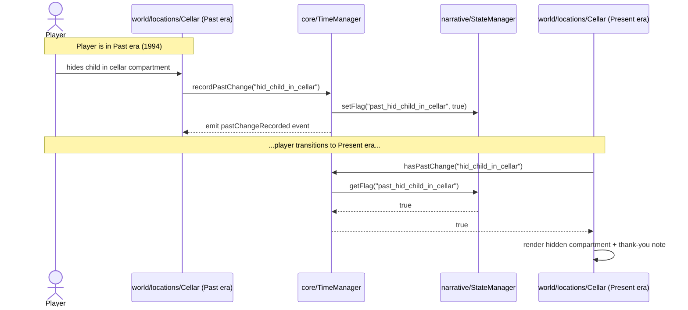

# Timeline Sync — Past ⇄ Present State Bridge

- **Status:** Accepted (v1 implementation landed 2026-04-17)
- **Owner:** @royceshannon2
- **Parent:** [`CHRONOS_SWITCH.md`](CHRONOS_SWITCH.md) · [`MASTER.md`](MASTER.md)
- **Code:** `witness-interactive-vite/src/core/TimeManager.ts`, `LayerMasks.ts`
- **Depends on:** `witness-interactive-vite/src/narrative/StateManager.ts`

This document specifies how changes made by the player in the **Past** (1994) era persist as game state readable when the player is in the **Present** (2026). It is the narrative load-bearing contract behind the Chronos Switch's intergenerational-consequence premise: the grandparent's choices in 1994 leave physical, discoverable traces for the grandchild in 2026.

---

## 1. Why this exists

The game's emotional core is **consequence across generations**. The player, as the grandchild, is not told what the grandparent did; they *infer* it by what the modern-day compound looks like, what artifacts it contains, what the neighbors' descendants say in letters. The Chronos Switch mechanic puts the player briefly in 1994 to *make* those choices, and the world in 2026 must reflect them.

Technically, this requires a one-way information channel:

> **Anything the player does in the Past must be queryable, by key, from the Present.**

The channel must:
- Survive save/load (the player may close the game between a Past choice and returning to the Present).
- Be observable (Present-era scene code subscribes and rebuilds when a new Past change is recorded).
- Be namespaced (so a generic narrative flag can't accidentally collide with an intergenerational one).
- Be trivially serializable (no object references, no dates, no DOM).

We get all four for free by piggybacking on the existing narrative `StateManager` and prefixing every recorded change with `past_`.

---

## 2. Design



The recording side is a thin pass-through: `TimeManager.recordPastChange(key, value?)` namespaces the key with `past_` and delegates to `globalState.setFlag`. The reading side is symmetric: `TimeManager.hasPastChange(key)` reads the same flag. No new storage is introduced — the `StateManager`'s existing `flagsSet: Record<string, boolean>` map holds everything, and its existing `serialize()`/`deserialize()` methods carry it across save/load.

---

## 3. API

All of the below are defined on the `TimeManager` class and re-exported from `src/core/`.

| Method | Purpose |
|---|---|
| `attach(camera)` | Bind a Babylon camera whose `layerMask` will be driven by era. Applies the current era's mask immediately. |
| `transition(target, duration?)` | Switch eras. Single-flight — overlapping calls are dropped. |
| `currentEra` (getter) | `"present"` or `"past"`. |
| `isTransitioning` (getter) | `true` during an in-flight `transition()`. |
| `recordPastChange(key, value?)` | Record a Past-era change. `key` is namespaced with `past_` and persisted in `StateManager`. |
| `hasPastChange(key)` | Read a recorded Past change. Returns `false` if never recorded. Safe from either era. |
| `getPastChanges()` | Snapshot of every recorded Past change as `{ key: boolean }` (without the `past_` prefix). |
| `subscribe(listener)` | Listen for `transitionStarted`, `transitionCompleted`, `pastChangeRecorded`. Returns an unsubscribe function. |

### Events

```typescript
type TimeEvent =
  | { type: "transitionStarted";   from: Era; to: Era }
  | { type: "transitionCompleted"; from: Era; to: Era }
  | { type: "pastChangeRecorded";  key: string; value: boolean };
```

---

## 4. Flag-naming convention

All Past-change flags share the prefix `past_` (exported as `PAST_FLAG_PREFIX`).

| Flag type | Prefix | Example |
|---|---|---|
| Past-era change (set by `recordPastChange`) | `past_` | `past_hid_child_in_cellar` |
| Puzzle completion (narrative) | *(none)* | `cellar_reconstruction_complete` |
| Path choice (narrative) | *(none)* | `path_hider_chosen` |
| Evidence discovered (narrative) | *(none)* | `found_cellar_evidence` |

**Rule:** any flag that the Present should read as a consequence of Past action **must** use the `past_` prefix. Any flag that tracks narrative-system progress independent of era **must not**.

**Key format:** short, underscored, verb-first, no prefix at the call site. `recordPastChange` adds the prefix.

- `recordPastChange("hid_child_in_cellar")` → `past_hid_child_in_cellar`
- `recordPastChange("boarded_boat_with_family")` → `past_boarded_boat_with_family`
- `recordPastChange("stayed_silent_at_ravine")` → `past_stayed_silent_at_ravine`

Name the *event* (what the player did), not the *outcome* (what the Present should show). The Present scene maps event → visual.

---

## 5. Typical usage patterns

### 5.1 Recording a choice in the Past

In a Past-era location module, when the player interacts with the choice-carrying object:

```typescript
import { timeManager } from "../../core";

// When the player activates the ceiling compartment in the 1994 rugo:
function onHidingSpotActivated() {
  timeManager.recordPastChange("hid_child_in_cellar");
}
```

### 5.2 Reading the consequence in the Present

In the Present-era twin of the same location, at build time *and* on subscribe:

```typescript
import { timeManager } from "../../core";

function buildPresentCellar(scene: Scene) {
  const compartment = createHiddenCompartment(scene);
  const note = createThankYouNote(scene);

  const render = () => {
    const shown = timeManager.hasPastChange("hid_child_in_cellar");
    compartment.setEnabled(shown);
    note.setEnabled(shown);
  };

  render();
  // Re-render if the player returns to the Past and records a new change.
  timeManager.subscribe((event) => {
    if (event.type === "pastChangeRecorded" && event.key === "hid_child_in_cellar") {
      render();
    }
  });
}
```

### 5.3 Debug / save-file inspection

```typescript
console.table(timeManager.getPastChanges());
// { hid_child_in_cellar: true, boarded_boat_with_family: false, ... }
```

---

## 6. Integration with save/load

No new code. `StateManager.serialize()` already captures every flag, including `past_*`. `StateManager.deserialize()` restores them. `TimeManager` itself holds no persistent state beyond the current era — which is intentionally *not* saved, because the save-file represents the player's narrative progress, not their current camera position.

On load, scenes should rebuild against the restored state by calling `hasPastChange` at build time. No explicit "replay" step is needed.

---

## 7. Non-goals

Things this system deliberately does **not** do:

- **Record the timing of a Past change.** Only the final boolean is retained. If "hid child, then changed mind, then hid them again" produces different consequences, represent each as a separate flag.
- **Support non-boolean values.** The flag map is `Record<string, boolean>`. Quantities, lists, or named choices should be represented as multiple booleans (`past_hid_one_family`, `past_hid_two_families`) or kept outside this system in a dedicated narrative store.
- **Gate recording by era.** `recordPastChange` is callable from either era. This is intentional — cutscenes and tutorial flows may preset state before the player has visited the Past. If a specific call site must enforce "must be in Past," gate at the caller with `timeManager.currentEra === "past"`.
- **Animate the transition.** The `duration` parameter is currently awaited but the mesh swap is instant. A post-fx crossfade will land with [`RENDERING.md`](RENDERING.md) when the pipeline is split per era.

---

## 8. Failure modes and mitigations

| Failure | Mitigation |
|---|---|
| A Present-era scene reads `hasPastChange` before it is recorded (expected path) → renders the "nothing happened" branch. | This is normal, not a failure. The same subscribe callback re-runs when the key is later set. |
| A typo in the flag key (`hid_childern_in_cellar`) silently reads/writes the wrong flag. | All flag keys must be defined as exported string constants in the location module that owns them. Never pass string literals to `recordPastChange`/`hasPastChange` at call sites outside the owning module. |
| Save file carries `past_` flags from an earlier game version with different semantics. | Each released version freezes its flag vocabulary. If semantics change, rename the flag (`past_hid_child_in_cellar_v2`) and migrate on load. |
| Concurrent `transition()` calls from two subsystems. | `isTransitioning` guard drops the second. Subsystems that care must `await` the first. |
| Camera not attached when `transition` is called. | Silent no-op on the mask side. The era state still updates and events still fire — attaching the camera later picks up the correct mask via `applyMask` in `attach()`. |

---

## 9. Open questions

Candidates for ADRs.

1. **Should `recordPastChange` reject calls made outside the Past era?** Strict mode would catch authoring bugs (accidentally recording in Present). Lenient mode (current) supports cutscenes that preset state. Decision deferred until we have at least one Past-era location wired up.
2. **Do we need per-path flag namespacing?** E.g., `past_hider_hid_child_in_cellar` vs. `past_escapist_hid_child_in_cellar`. If the three paths' Past-era scenes are fully independent, path prefixes are noise; if they share a compound geometry with path-specific variations, path prefixes may be load-bearing.
3. **Should the TimeManager accept a `StateManager` instance rather than importing the singleton?** Cleaner for tests. Trade-off: more ceremony at every call site. Currently uses the singleton per the existing narrative conventions.

---

## 10. Testing

Unit-testable without a Babylon scene. Example tests worth writing:

- `recordPastChange("x")` sets `globalState.flagsSet["past_x"] = true`.
- `hasPastChange("x")` returns `false` by default, `true` after record.
- `getPastChanges()` returns only `past_`-prefixed keys, with the prefix stripped.
- `transition("past")` while in "past" is a no-op (no events).
- Overlapping `transition()` calls: second call resolves without emitting events.
- `subscribe` / unsubscribe lifecycle — listener removed on return-value invocation.
- After `attach(camera)`, camera.layerMask matches the current era.

Integration tests requiring a Babylon `NullEngine` are out of scope for this doc — see [`ARCHITECTURE.md §6.4`](../../ARCHITECTURE.md#64-testing).

---

## 11. History

- **2026-04-17** — v1 specified and implemented. `src/core/TimeManager.ts`, `LayerMasks.ts`, `index.ts`. Tested via `tsc --noEmit` only; unit tests pending.
